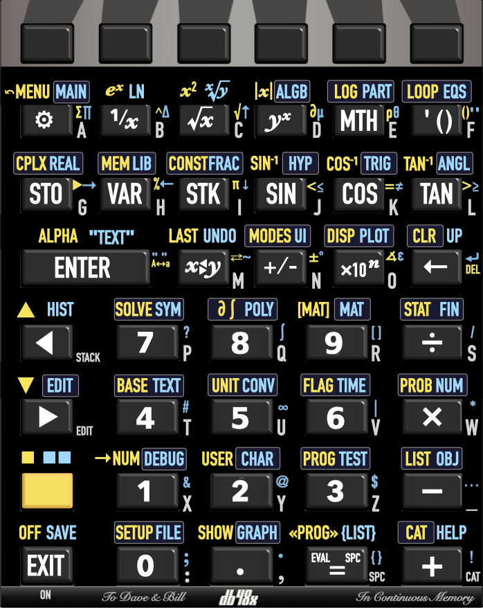
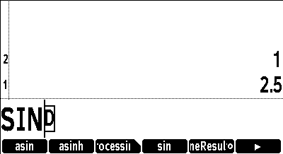
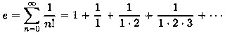

# Overview

## DB48X on DM42

The DB48X project intends to rebuild and improve the user experience of the
legendary HP48 family of calculators, notably their *"Reverse Polish Lisp"*
 [(RPL)](#Introduction-to-RPL)
language with its rich set of data types and built-in functions.

This project is presently targeting the **SwissMicro DM42 calculator**
and leveraging its built-in software platform, known as **DMCP**. This is
presumably the calculator you are currently running this software on.
You can also [try it in your browser](http://48calc.org).

## Table of contents

* [Using the on-line help](#help)
* [Quickstart guide](#quickstart-guide)
* [State of the project](#state-of-the-project)
* [Design overview](#design-overview)
* [Keyboard interaction](#keyboard-interaction)
* [Soft menus](#soft-menus)
* [Differences with other RPLs](#differences-with-other-RPLs)
* [Built-in help](#help)
* [Acknowledgements and credits](#acknowledgements-and-credits)
* [Release notes](#release-notes)
* [Performance](#performance-measurements)
* [Keyboard overlays](https://www.hpmuseum.org/forum/thread-20113.html)


## State of the project

This is currently **SEMI-STABLE** software, meaning that the implemented
features appear to work somewhat reliably, but that some features are still
being added with each new release. This is **NOT PRODUCTION READY** and should
not be used for any mission-critical computation.

At this point in time, you should only installing this if you are interested in
contributing to the project, whether it is in the form of code, feedback or
documentation changes. Please refer to the web site of the project on GitHub or
GitLab for details and updates. The best way to
[report an issue](https://github.com/c3d/db48x/issues),
[request an improvement](https://github.com/c3d/db48x/issues/new)
or [submit a proposed change](https://github.com/c3d/db48x/pulls) is
on the project's [GitHub page](https://github.com/c3d/db48x).

The [implementation status](#implementation-status) section categorizes all the
RPL commands in the HP50G and in DB48X into "implemented", "not implemented" and
"DB48X only" lists.

## Design overview

The objective is to re-create an RPL-like experience, but to optimize it for the
existing DM42 physical hardware.
Ideally, DB48X should be fully usable without a
keyboard overlay. though one is
[being worked on](https://github.com/c3d/db48x/blob/stable/Keyboard-Layout.png).

Compared to the original HP48, the DM42 has a much larger screen, but no
annunciators (it is a fully bitmap screen). It has a keyboard with dedicated
soft-menu (function) keys, but only one shift key (whereas the HP48 has two),
lacks a dedicated alpha key, does not provides left or right arrow keys (only up
and down), and has no space key (_SPC_ on the HP48).


## Keyboard interaction

The keyboard differences force us to revisit the user interaction with the
calculator compared to the HP48:

* When running DB48X on the DM42, the single yellow shift key cycles between
  three states, *Shift* (shown in the documentation as 🟨), *Right Shift* (shown
  in the documentation as 🟦), and no shift.  This double-shift shortcut appears
  necessary because RPL calculators like the HP48 have a rather full keyboard
  even with two shift keys.


* A first press on the shift key is shown as 🟨 in the documentation, and
  activates functions shown in yellow in the keyboard overlay. A second press is
  shown as 🟦 in the documentation, and activates functions shown in blue in the
  keyboard overlay. On the screen, the shift state is indicated in the header
  area. When a [soft menu](#soft-menus) is visible on the screen, the selected
  row of functions is highlighed.

In the rest of this document, the shift key is referred to as 🟨, and pressing
it twice is referred to as 🟦, irrespective of the appearance of the physical
shift key on your particular hardware. While running the firmware, this will display in the annunciator area as follows:


Other aspects of the keyboard interaction are fine-tuned for RPL usage:

* Since RPL uses alphabetic entry (also called *Alpha* mode) a lot more
  frequently than on RPN models like the HP41 or HP42, making it quickly
  accessible seems important, so there are
  [three distinct ways to activate it](#alpha-mode).

* The _▲_ and _▼_ keys move the cursor *left* and *right* while editing
  instead of *up* and *down*. These cursor movements are much more useful for a
  text-based program editing as found in RPL. In the rest of this document,
  they are described as _◀︎_ and _▶︎_ respectively.

* Using 🟨 _◀︎_ and 🟨 _▶︎_ moves the cursor up and down.  When not editing, _◀︎_
  and _▶︎_ behave like _▲_ and _▼_ on the HP48, i.e. _◀︎_ enters the *interactive
  stack* (not yet implemented) and _▶︎_ edits the object on the first level of
  the stack.

* Long-pressing arrow keys, the _←_ (also known as *Backspace*) or text entry
  keys in Alpha mode activates auto-repeat.

* Long-pressing keys that would directly trigger a function (e.g. _SIN_),
  including function keys associated with a soft-menu, will show up the
  [built-in help](#help) for the corresponding function.


### Alpha mode

Entering alphabetic characters is done using *Alpha* mode. These alphabetic
characters are labeled on the right of each key on the DM42's keyboard.

When *Alpha* mode is active, an _ABC_ indicator shows up in the annunciator area
at the top of the screen. For lowercase entry, the indicator changes to
_abc_.

There are three ways to enter *Alpha* mode:

* The first method is to use 🟨 _ENTER_ as indicated by the _ALPHA_ yellow label
  on the DM42 ENTER key. This cycles between *Alpha* _ABC_, *Lowercase* _abc_
  and *Normal* entry modes.

* The second method is to hold 🟨 for more than half a second. This cycles
  between *Alpha* _ABC_ and *Normal* entry modes, and cannot be used to type
  lowercase characters.

* The third method is to hold one of the arrow keys _◀︎_ or _▶︎_ *while* typing on
  the keyboard. This is called *transient alpha mode* because *Alpha* mode ends
  as soon as the arrow key is released. Using _◀︎_ enters uppercase characters,
  while _▶︎_ uses lowercase characters.

There is no equivalent of the HP48's "single-Alpha" mode. Alpha mode is either
_transient_ (when you hold one of the arrow keys) or _sticky_ (with 🟨 _ENTER_
or by holding 🟨).

Alpha mode is cancelled when pressing _ENTER_ or _EXIT_.

Since the DM42's alphabetic keys overlap with the numeric keys (unlike the
HP48), as well as with operations such as _×_ and _÷_, using 🟨 in Alpha mode
brings back numbers. This means 🟨 cannot be used for lowercase, but as
indicated above, there are two other methods to enter lowercase
characters.

Using 🟨 or 🟦 in combination with keys other than the numeric keypad
gives a variety of special characters.


### Key mapping

The layout of keys on DB48X was carefully chosen to offer a good compromise
between immediate applicability for calculations and giving access to numerous
advanced functions through menus.

DB48X keyboard overlays for DM-42 and DM-32 SwissMicros calculators are
[already available](https://www.hpmuseum.org/forum/thread-20113.html).



In the rest of this document, keys bindings will usually be described using the
alphabetic key, to make it easier to locate on the keyboard, followed by the
standard label on the DB48X layout. For example, the assignment for the `sin`
function will be described as _J_ (_SIN_). The shifted functions of the same key
will be described as 🟨 _J_ (_SIN⁻¹_) or 🟦 _J_ (_HYP_) respectively.

In some cases, the label between parentheses may refer to another calculator
model, which will be indicated as follows. For example, the _A_ key can be
described as _A_ (_⚙️_, DM-42 _Σ+_, DM-32 _√x_).

However, if you are using DB48X on a DM42, it is possible to do it without a
keyboard overlay, because great care was taken to have the DB48X keboard layout
remain close to that of the DM42, in order to preserve muscle memory. New
features were positioned on the keyboard at positions that are close to what is
familiar in the original DM42 firmware.

A few keys that have little use in RPL are reassigned to features that you
should be able to quickly remember. For example, the DM-42 _RCL_ key is used for
the DB48X _VAR_ key, which invokes the [VariablesMenu](#VariablesMenu).

Note that the _LOG_ and _e^x_ keys are swapped relative to the DM-42. The HP42
has _LOG_ and _LN_ with shifted _10^x_ and _e^x_. DB48X has _e^x_ and _LN_
with shifted _10^X_ and _LOG_, so that the more frequently used mathematical
functions are available without shifting. Note that in the future, full
keyboard remapping similar to the HP41 or HP48 will allow you to change that
if you prefer.


Here are a few of the interesting RPL-specific key mappings:

* _A_ (_⚙️_, DM-42 _Σ+_, DM-32 _√x_) is used to invoke a context-sensitive
  [ToolsMenu](#ToolsMenu), which select a softkey menu based on what is on the
  stack and other context.

* 🟨 _A_ (_←MENU_, DM-42 _Σ-_, DM-32 _x²_) selects the [LastMenu](#LastMenu)
  command, which displays the previously selected menu.

* 🟦 _A_ (_MAIN_, DM-32 _PARTS_) selects the [MainMenu](#MainMenu), a top-level
  menu giving indicrect access to all other menus and features in DB48X (see
  also the [Catalog](#Catalog) feature).

* _F_ (_' ()_, DM-42 _XEQ_, DM-32 _Σ+_) opens an algebraic expression, i.e. it
  shows `''` on the command-line and switches to equation entry. If already
  inside an equation, it inserts a pair of parentheses. This can be used to
  evaluate expressions in [algebraic mode](#algebraic-mode) instead of
  RPN.

* 🟨 _G_ (_CPLX_, DM-42 _COMPLEX_, DM-32 _CMPLX_) lets you work with complex
  numbers. It opens the [ComplexMenu](#ComplexMenu), which can be used to enter
  complex numbers in rectangular or polar form, and perform common operations on
  these numbers. The same menu can be accessed without shift using _A_ (_⚙️_)
  when there is a complex number on the stack.

* _H_ (_VAR_, DM-42 and DM-32 _RCL_) opens the [VariablesMenu](#VariablesMenu)
  showing user variables in the current directory.

* _I_ (_STK_, DM-42 and DM-32 _R↓_) will open the [StackMenu](#StackMenu),
  giving access to stack operations.

* 🟨 _I_ (_CONST_, DM-42 _π_, DM-32 _HYP_) shows a
  [ConstantsMenu](#ConstantsMenu) giving access to various constants. You can
  provide your own constants in a `config/constants.csv` file on disk.

* _M_ (_X⇆Y_) executes the RPL [Swap](#swap) function

* 🟨 _M_ (_LAST_, DM-42 _LAST x_, DM-32 _MEM_) is [LastArg](#LastArguments),
  which recalls the arguments of the last command.

* 🟦 _M_ (_Undo_, DM-32 _X⇆_) restores the previous state of the stack. This is
  like `Last Stack` on the HP48, but on DB48X, it is a real command that can be
  used in programs.

* _N_ (_+/-_) executes the equivalent RPL `Negate` function. While editing, it
  changes the sign of the current number on the command-line.

* _O_ (_×10ⁿ_, _EEX_ or _E_ depending on keyboard labeling, referred to as
  _×10ⁿ_ in the rest of this document) is used to enter the exponent of a number
  in scientific notation. However, when not entering or editing values, it
  invokes the [Cycle](#Cycle) command, which cycles between various
  representations of a number, for example polar and rectangular for a complex
  number, or fraction and decimal for a decimal number.

* _EXIT_ (DM-32 _ON_) corresponds to what the HP48 manual calls _Attn_, and
  typically cancels the current activity. It can also be used to interrupt a
  running program.

* 🟨 _EXIT_ (_OFF_) shuts down the calculator. The state of the calculator is
  preserved.

* 🟦 _EXIT_ (_SAVE_) saves the current state of the calculator to disk. This
  state can be transferred to another machine, and survives system reset or
  firmware upgrades.

* 🟨 _0_ (_SETUP_) shows the firmware's [SystemMenu](#SystemMenu), for example
  to load the original DM-42 or DM-32 program, activate USB disk, and to access
  some calculator preferences.

* The _R/S_ keys inserts a space in the editor, an `=` sign inside equations,
 and maps to [Evaluate](#evaluate) otherwise.

* 🟨 _R/S_ (_«PROG»_, DM-42 and DM-32 _PRGM_) inserts the delimiters for an RPL
  program, `«` and `»`, while 🟦 _R/S_ (_{LIST}_) inserts the list delimiters,
  `{` and `}`.

* 🟨 _+_ (_CAT_, DM-42 _CATALOG_, DM-32 _LBL_) shows a complete
  context-sensitive [catalog](#Catalog) of all available functions, and
  enables auto-completion using the soft-menu keys. Note that the `+` key alone
  (without shift) activates the catalog while in *Alpha* mode. When inside text,
  the catalog presents alternates for the character at the left of the cursor,
  providing a convenient way to select diacritics and accents..

* 🟦 _+_ (_HELP_, DM-32 _RTN_) activates the context-sensitive help system.


## Soft menus

The DM42 has 6 dedicated soft-menu keys at the top of the keyboard. Most of the
advanced features of DB48X can be accessed through these soft menus. Soft menu
keys have no label on the physical calculator, but in this documentation, they
may sometimes be referred to as _F1_ through _F6_.

All built-in soft-key menus are named, with names ending in [Menu](#Menu). For
example, the [VariablesMenu](#VariablesMenu) is the menu listing global
variables in the current directory. Unlike HP RPL calculators, menus cannot be
accessed by number, but they can be accessed by name. In a future version of the
firmware, a [Menu](#Menu) special variable will return the name of the current
menu. The [LastMenu](#LastMenu) command selects the previous menu.

Menus are organized internally as a hierarchy, where menus can refer to other
menus. A special menu, [MainMenu](#MainMenu), accessible via the 🟦 _A_,
contains all other menus.

Menus can contain up to 18 entries at once, 6 being directly accessible, 6
more being shown when using the 🟨 key, and 6 more with 🟦. Three rows of
functions are shown on screen, with the active row highlighted.

A long press on a function key invokes the on-line help for the associated
function.

When a menu contains more than 18 entries, then the _F6_ function key turns into
a `▶︎`, and 🟨 _F6_ turns into `◀`︎. These keys can be used to
navigate across the available menu entries. This replaces the _NXT_ and _PREV_
keys on HP calculators.

The [VariablesMenu](#VariablesMenu) is used to access global varibales. It is
invoked using the _H_ key, which is labeled _RCL_ on SwissMicros hardware. This
menu is special in the sense that:

* Selecting an entry *evaluates* that menu entry, for example to run a program

* The 🟨 function *recalls* its name without evaluating it.

* The 🟦 function *stores* into the variable.


## Differences with other RPLs

Multiple implementations of RPL exist, most of them from Hewlett-Packard.
A good reference to understand the differences between the various existing
implementations from HP is the
[HP50G Advanced User's Reference Manual](https://www.hpcalc.org/details/7141).

There are a number of intentional differences in design between DB48X and the
HP48, HP49 or HP50G's implementations of RPL. There are also a number of
unintentional differences, since the implementation is completely new.

### User interface

* DB48X features an extensive built-in help system, which you are presently
  using. Information for that help system is stored using a regular *markdown*
  file named `/help/db48x.md`, stored in the calculator's flash storage.

* DB48X features auto-completion for commands while typing, through
  the  _CAT_ key (a [Catalog](#Catalog) of all commands).

* Many RPL words exist in short and long form, and a user preference selects how
  a program shows. For example, the [Negate](#negate) command, which the HP48
  calls `NEG`, can display, based on user preferences, as `NEG`, `neg`, `Neg` or
  `Negate`. In the help, it will be shown as **Negate (NEG)**.

* The DB48X dialect of RPL is not case sensitive, but it is case-respecting.
  For example, if your preference is to display built-in functions in long form,
  typing `inv` or `INV` will show up as `Invert` in the resulting program.
  This means that the space of "reserved words" is larger in DB48X than in other
  RPL implementations. Notably, on HP's implementations, `DUP` is a keyword but
  you can use `DuP` as a valid variable name. This is not possible in DB48X.

* The saving of the stack arguments for the `LastArg` command is controled
  independently by two distinct settings, `SaveLastArg` and
  `SaveLastArgInPrograms`. The first one controls if `LastArg` is saved for
  interactive operations, and is enabled by default. The second one controls if
  `LastArg` is saved before executing commands while running a program or
  evaluating an expression, and is disabled by default. This impacts commands
  that evaluate programs, such as `ROOT`. On the HP48, `LastArg` after running
  `ROOT` interactively gives arguments used by some operation within `ROOT`,
  whereas on DB48X with the default settings, it returns the arguments to
  `ROOT`.

* When parsing the `Σ` (`sum`) function (as well as the `∏` (`product`)
  function which the HP calculators do not have), all arguments are separated by
  semi-colons like for all other functions. HP calculators have a special syntax
  in that case, where an `=` sign separates the index and its initial value. In
  other words, where an HP calculator would show `Σ(i=1;10;i^2)`, which
  corresponds to the 4-argument sequence `i 1 10 'i^2' Σ`, the DB48X
  implementation shows and requires the `Σ(i;1;10;i^2)` syntax. Note that an `=`
  sign may appear inside an expression, but it always denotes equality.


### Evaluation

* Local names are evaluated on DB48X, unlike in the HP versions of RPL. This
  makes it easier to use local subprograms in larger programs as if they were
  normal operations. In the less frequent case where you do not want evaluation,
  you need to use `RCL` like for global variables.

* Lists do not evaluate as programs by default, like on the HP28, but unlike on
  the HP48 and later HP models. This can be controlled using the `ListEvaluation` setting. Note that a list can be converted to a program using the `Cycle`
  command, which makes it easy to build programs from lists.

* The `case` statement can contain `when` clauses as a shortcut for the frequent
  combination of duplicating the value and testing against a reference. For
  example, `case dup "A" = then "Alpha" end` can be replaced with `case "A" when
  "Alpha" end`.

* There are no _compiled local variables_. The a program like `→ ←x « Prog »`
  might perform incorrectly if `Prog` attempts to access `←x`. Compiled local
  variables are a rather obscure feature with a very limited use, and might be
  replaced with true closures (which have a well-defined meaning) if there is
  enough demand.


### Numbers

* DB48X has several separate representations for numbers: integers, fractions
  and decimal. Notably, it keeps integer values and fractions in exact form for
  as long as possible to optimize both performance and memory usage.
  This is closer to the HP50G in exact mode than to the HP48. Like
  the HP50G, DB48X will distinguish `1` (an integer) from `1.` (a decimal
  value), and the `TYPE` command will return distinct values.

* Integer and fraction arithmetic can be performed with arbitrary
  precision, similar to the HP50G. The `MaxNumberBits` setting controls how much
  memory can be used for integer arithmetic.

* DB48X has true fractions. From a user's perspective, this is somewhat similar
  to fractions on the HP50G, except that fractions are first-class numbers,
  whereas the HP50G treats them like expressions. On the HP50G, `1 3 / TYPE`
  returns `9.`, like for `'A + B'`. On DB48X, the `TYPE` for fractions is
  different than for expressions. Fractions can be shown either as
  `MixedFractions` or `ImproperFractions`.

* On HP50G, decimal numbers often outperform integers or fractions, and
  benchmark code will contain `1.` instead of `1` for that reason. On DB48X,
  arithmetic on integers and fractions is generally faster.

* Like the HP Prime, DB48X displays a leading zero for decimal values, whereas
  HP RPL calculators do not. For example, it will display `0.5` and not `.5`.

* DB48X has two distinct representations for complex numbers, polar and
  rectangular, and transparently converts between the two formats as needed.
  The polar representation internally uses fractions of pi for the
  angle, which allows exact computations. By contrast, HP RPL implementations
  always represent complex numbers in rectangular form internally, possibly
  converting it to polar form at display time.

* DB48X features arbitrary-precision decimal floating-point. The `Precision`
  command (in the `DisplayModesMenu`) can be used to select the precision for
  numerical operations. In addition, it supports 32-bit and 64-bit
  hardware-accelerated binary floating-point.

* Based numbers with an explicit base, like `#123h` keep their base, which makes
  it possible to show on stack binary and decimal numbers side by side. Mixed
  operations convert to the base in stack level X, so that `#10d #A0h +`
  evaluates as `#AAh`. Based numbers without an explicit base change base
  depending on the [Base](#base) setting, much like based numbers on the HP48,
  but with the option to any base between 2 and 36. In addition to the
  HP-compatible trailing letter syntax (e.g. `#1Ah`), the base can be given
  before the number (e.g. `16#1A`), which works for all supported bases.

### Representation of objects

* The storage of data in memory uses a denser format than on the HP48.
  Therefore, objects will almost always use less space on DB48X. Notably, the
  most frequently used functions and data types consume only one byte on DB48X,
  as opposed to 5 nibbles (2.5 bytes) on the HP48. A number like `123` consumes
  2 bytes on DB48X vs. 7 on the HP50 and 10.5 on the HP48.

* Numerical equality can be tested with `=`,  whereas object equality is tested
  using `==`. For example, `0=0.0` is true, but `0==0.0` is false, because `0`
  is an integer whereas `0.0` is a floating-point.

* Because of differences in internal representation that would require expensive
  computations to mimic the HP50G behaviour with limited benefit, `Size` returns
  1 for integers, algebraic expressions and unit objects.

* The [`Type`](#type) command can return HP-compatible values that are sometimes
  imprecise (e.g. it cannot distinguish between polar and rectangular complex
  values), or numerical values that distinguish all the types in DB48X. This is
  controlled by the [`CompatibleTypes`](#compatibletypes) setting.  The
  `TypeName` command is a DB48X-only extension that returns more precise textual
  information, and should be preferred both for readability and future
  compatibility.

* DB48X has a dedicated data type to represent multi-variate polynomials, in
  addition to the classical RPL-based algebraic expressions.


### Alignment with SwissMicros calculators

* DB48X will borrow to the DM-42 the idea of _special variables_ for settings,
  which are variables with a special meaning. For example, the `Precision`
  special variable is the current operating precision for floating point, in
  number of digits. While there is a `Precision` command that sets the value, it
  is also possible to use `'Precision' STO` to set it, and `'Precision' RCL` to
  fetch the current value. This does not imply that there is an internal
  `Precision` variable somewhere. This applies to all settings and
  flags. Additionally, binary settings can be set with `SF` and `CF`, and
  queried with `SF?` and `CF?`. For example, `'HideDate' CF` will clear the
  `HideDate` flag, meaning that the date will show in the header.

* The DB48X also provides full-screen setup menus, taking advantage of the DM42
  existing system menus. It is likely that the same menu objects used for
  softkey menus will be able to control system menus, with a different function
  to start the interaction.

* The whole banking and flash access storage mechanism of the HP48 will be
  replaced with a system that works well with FAT USB storage. It should be
  possible to directly use a part of the flash storage to store RPL programs,
  either in source or compiled form. As an example, using a text argument to
  `STO` and `RCL` accesses files on the USB disk, e.g. `1 "FOO.TXT" STO` stores
  the text representation of `1` in a file named `DATA/FOO.TXT` on the USB
  flash storage.

### List operation differences

The application of a same operation on arrays or matrices has never been very
consistent nor logical across RPL models from HP.

* On HP48 and HP50, `{ 1 2 3 } 4 +` gives `{1 2 3 4}`. However, `{ 1 2 3} 4 *`
  gives a type error on the HP48 but applies the operation to list elements on
  the HP50, yielding `{ 4 8 12}`.

* For arrays, `[ 1 2 3 ] 4 +` fails on both the HP48 and HP50, but
  `[ 1 2 3 ] 4 *` works.

* The HP50 has a `MAP` function, which works both for list and matrices.
  `[ 1 2 3 ] « 3 + »` will return `[ 4 5 6 ]`, and `{ 1 2 3 } « 3 * »` will
  return `{ 3 6 9 }`. That function has no direct equivalent on the HP48.

DB48X considers lists as bags of items and treat them as a whole when it makes
sense, whereas arrays are focusing more on the values they contain, and will
operate on these items when it makes sense. Therefore:

* `{ 1 2 3 } 4 +` gives `{ 1 2 3 4 }`, `{ 1 2 3 } 2 -` gives `{ 1 3 }` (not yet
  implemented), and `{ 1 2 3 } 3 ×` gives `{ 1 2 3 1 2 3 1 2 3 }`. The `÷`
  operator is equivalent to the `ListDivide` function, and partitions a list in
  chunks of the given size and returns the number of partitions so generated
  (the last partition being possibly shorter), i.e. `{ 1 2 3 4 5 } 2 ÷` will
  generate `{1 2} {3 4} {5} 3` on the stack (this is not yet implemented).

* `[ 1 2 3 ] 4 +` gives `[ 5 6 7 ]`, `[ 1 2 3 ] 2 -` gives `[ -1 0 1 ]`,
  `[ 1 2 3 ] 3 ×` gives `[ 3 6 9 ]` and `[ 1 2 3 ] 5 ÷` gives
  `[ 1/5 2/5 3/5 ]`.

* Two lists can be compared using lexicographic order. This also applies to the
  `Min` and `Max` functions, which compares the entire lists, whereas on HP50G,
  it compares element by element (element-wise comparison applies to arrays).

* The `|` operator to apply variables to an expression can be used without
  parentheses and chained. For example, `'A+B|A=X|B=Y+Z|Z=42'` evaluates as
  `'X+Y+42'`. This differs from the way the HP50G evaluates it, where the last
  substitution `Z=42` would not be applied since `Z` was not part of the
  original expression. In other words, on HP50G, `'A+B|(A=X;B=Y+Z;Z=42)'`
  evaluates as `'X+Y+Z'`, not as `'X+Y+42'`.The HP-style parenthesized notation
  is accepted, but is converted to the DB48X sequence of `|` form during
  parsing.


### Vectors and matrices differences

* On DB48X, vectors like `[ 1 2 3 ]` are very similar to lists. The primary
  difference is the behavior in the presence of arithmetic operators.
  On lists, addition is concatenation, e.g. `{ 1 2 3} { 4 5 6} +` is
  `{ 1 2 3 4 5 6 }`, whereas on vectors represents vector addition, e.g.
  `[1 2 3] [4 5 6] +` is `[5 7 9]`. However, unlike on the HP original
  implementation, a vector can contain any type of object, so that you can
  do `[ "ABC" "DEF" ] [ "GHI" "JKL" ] +` and obtain `[ "ABCGHI" "DEFJKL" ]`.

* Size enforcement on vectors only happens _during these operations_, not while
  you enter vectors from the command line. It is legal in DB48X to have a
  non-rectangular array like `[[1 2 3] [4 5]]`, or even an array with mixed
  objects like `[ "ABC" 3 ]`. Size or type errors on such objects may occur
  if/when arithmetic operations are performed.

* In particular, a matrix is nothing but a vector of vectors. DB48X also
  supports arrays with dimensions higher than 2, like `[[[1 2 3]]]`.

* As a consequence, The `GET` and `GETI` functions work differently on
  matrices. Consider a matrix like `[[ 7 8 9 ][ 4 5 6 ][ 1 2 3 ]]`. On the HP48,
  running `1 GET` on this object gives `7`, and the valid range of index values
  is 1 through 9. On DB48X, that object is considered as an array of vectors, so
  `1 GET` returns `[7 8 9]`.  This is intentional. The behavior of `{ 1 1 } GET`
  is identical on both platforms, and is extended to multi-dimensional arrays,
  so that `[[[4 5 6]]] { 1 1 2 } GET` returns `5`.

* Matrices and vectors can contain integer values or fractions. This is closer
  to the HP50G implementation than the HP48's. In some cases, this leads to
  different results between the implementations. If you compute the inverse of
  `[[1 2 3][4 5 6][7 8 9]` on the HP48, you get a matrix with large values, and
  the HP48 finds a small, but non-zero determinant for that matrix. The HP50G
  produces a matrix with infinities. DB48X by default produces a `Divide by
  zero` error.

* DB48X accept matrices and vectors as input to algebraic functions, and returns
  a matrix or vector with the function applied to all elements. For example,
  `[a b c] sin ` returns `[ 'sin a' 'sin b' 'sin c' ]`.

* Similarly, DB48X accept operations between a constant and a vector or matrix.
  This applies the same binary operation to all components of the vector or
  matrix. `[ a b c ] x +` returns `[ 'a+x' 'b+x' 'c+x' ]`. Consistent with that
  logic, `inv` works on vectors, and inverts each component, so that
  `[1 2 3] inv` gives `[1/1 1/2 1/3]`.

* The `Min` and `Max` operations on arrays apply element by element, in a way
  similar to how these operations apply to lists on the HP50G (which seems to
  be undocumented).


### Mathematics

* The `Σ` operation behaves differently between the HP48 and the HP50. On the
  HP48, `I A B 'I^3' Σ` gives an expression, `Σ(I=A;B;I^3)`, and an empty range
  like `I 10 1 'I^3' Σ` gives `0` as a value. On the HP50, this sum is
  simplified as a polynomial expression, so that you get a negative value if
  `A>B`. The HP50G behaviour seems surprising and undesirable. DB48X follows the
  HP48 approach.

* The `↑Match` and `↓Match` operations return the number of replacement
  performed, not just a binary `0` or `1` value. In addition, the patterns can
  identify specific kinds of values based on the first letter of the pattern
  variable name, e.g. `i` or `j` for positive integers, or `u` and `v` for
  unique terms, i.e. terms that are only matched once in the expression.

* When differentiating a user-defined function, HP calculators would replace `F`
  with `d1F`. The HP50G advanced reference manual suggests it should be `derF`.
  Thanks to Unicode support, DB48X will instead use `F′` as the name
  for the derivative function, making it closer to the standard mathematical
  notation. If `F` has multiple parameters, then the partial derivative relative
  to the first argument will be denoted as `F′₁`, the partial derivative
  relative to the second argument will be denoted as `F′₂` and so on.

* For built-in functions that have no known derivative, such as `GAMMA`, the
  HP50G would generate `d1GAMMA`, whereas DB48X will generate an
  `Unknown derivative` error.

* HP calculators would also accept `d1` for standard functions, which is only
  the name of the derivative relative to the first argument, but does not
  actually compute a partial derivative. For example, `d1SIN(2*X)` gives
  `COS(2*X)`, whereas `∂X(SIN(2*X))` evaluates as `2*COS(2*X)`. DB48X does not
  recognize this `dn` notation.

* The behaviour of the HP derivative function `∂` depends on whether it is in an
  algebraic object (stepwise differentiation) or whether it is used in stack
  syntax (full differentiation). The DB48X variant always perform full
  differentiation irrespective of the syntax used.

* The _HP50G advanced reference manual_ indicates that `∂` substitutes the value
  of global variables. For example, if `Y` contains `X+3*X^2`, `'Y' 'X' ∂` is
  expected to return `1+6*X`. It actually returns `0`, unless you evaluate `Y`
  first. DB48X matches the actual behaviour of the HP50G and not the documented
  one.


### Unicode support

DB48X has almost complete support for Unicode, and stores text internally using
the UTF-8 encoding. The built-in font has minor deviations in appearance for a
few RPL-specific glyphs.

Overall, a text file produced by DB48X should appear reliably in your
favorite text editor, which should normally be GNU Emacs. This is notably the
case for state files with extension `.48S` which you can find in the `STATE`
directory on the calculator.

The `Size` operation when applying to text counts the number of Unicode
characters, not the number of bytes. The number of bytes can be computed using
the `Bytes` command.

The `Num` and `Chr` commands (also spelled `Char→Code` and `Code→Char`) deal
with Unicode codepoints, and do not use the special HP characters codes. In
addition, `Num` return `-1` for an empty string, not `0`. `0` is only returned
for a string that begins with a `NUL` codepoint.

The `Code→Char` command can also be spelled as `Code→Text`, and take a list of
Unicode codepoints as input. Conversely, `Text→Code` will generate a list of all
the codepoints in a text.

## Help

The DB48X project includes an extensive built-in help, which you are presently
reading. This help is stored as a `help/db48x.md` file on the calculator. You
can also read it from a web browser directly on the GitHub page of the project.

The `Help` command makes it possible to access the built-in help in a contextual
way. It is bound to 🟦 _+_. If the first level of the stack contains a text
corresponding to a valid help topic, this topic will be shown in the help
viewer. Otherwise, a help topic corresponding to the type of data in the stack
will be selected.

The DB48X help viewer works roughly similarly to the DM42's, but with history
tracking and the ability to directly access help about a given function by
holding a key for more than half a second.

To navigate the help on the calculator, use the following keys:

* The soft menu keys at the top of the keyboard, references as _F1_ through
  _F6_, correspond to the functions shown in the six labels at the bottom of the
  screen.

* While the help is shown, the keys _◀︎_ and _▶︎_ on the keyboard scroll
  through the text.

* The _F1_ key returns to the [Home](#overview) (overview).

* The _F2_ and _F3_ keys (labels `Page▲` and `Page▼`) scroll the text one full
  page at a time.

* The _F4_ and _F5_ keys (labels `Link▲` and `Link▼`) select the previous and
  next link respectively. The keys _÷_ and _9_ also select the previous
  link, while the keys _×_ and _3_ can also be used to select the next link.

* The _F6_ key correspond to the `←Menu` label, and returns one step back in
  the help history. The _←_ key achieves the same effect.

* To follow a highlighted link, click on the _ENTER_ key.


## Acknowledgements and credits

DB48X is Free Software, see the LICENSE file for details.
You can obtain the source code for this software at the following URL:
https://github.com/c3d/db48x.


### Authors

This software is (C) 2022-2023 Christophe de Dinechin and the DB48X team.

Additional contributors to the project include:

* Camille Wormser (complex number fixes)
* Jeff, aka spiff72 (keyboard overlay)
* Conrado Seibel (help file fix)
* Kjell Christenson (simulator fix)
* Václav Kadlčík (documentation fix)
* Franco Trimboli (WASM port)

The authors would like to acknowledge

* [Hewlett and Packard](#hewlett-and-packard)
* [The Maubert Team](#the-maubert-team)
* [Museum of HP calculators](#hp-museum)
* [HPCalc](#hpcalc)
* [The newRPL project](#newrpl-project)
* [The WP43 and C47 projects](#wp43-and-c47-projects)
* [SwissMicro's DMCP](#swissmicros-dmcp)

This work was placed by Christophe de Dinechin under the patronage of
[Carlo Acutis](http://www.miracolieucaristici.org/en/Liste/list.html)


### Hewlett and Packard

Hand-held scientific calculators changed forever when Hewlett and Packard asked
their engineers to design and produce the HP35, then again when their company
introduced the first programmable hand-held calculator with the HP65, and
finally when they introduced the RPL programming language with the HP28.

Christophe de Dinechin, the primary author of DB48X, was lucky enough to meet
both Hewlett and Packard in person, and this was a truly inspiring experience.
Launching the Silicon Valley is certainly no small achievement, but this pales
in comparison to bringing RPN and RPL to the world.


### The Maubert Team

Back in the late 1980s and early 1990s, a team of young students with a passion
for HP calculators began meeting on a regular basis at or around a particular
electronics shop in Paris called "Maubert Electronique", exchanging
tips about how to program the HP28 or HP48 in assembly language or where to get
precious technical documentation.

It started with Paul Courbis, who carefully reverse-engineered and documented
[the internals of RPL calculators](https://literature.hpcalc.org/items/1584),
encouraging his readers to boldly cut open these wonderful little machines
to solder IR receivers acting as makeshift PC connection tools, or to waste
countless hours debugging [video games](https://www.hpcalc.org/hp48/games).

There were more serious efforts as well, notably the
[HP48 Metakernel](https://www.hpcalc.org/hp48/apps/mk/), which completely
reinvented the HP48 user interface, making it both much faster and better.  It
is fair to see DB48X as a distant descendent from such efforts. The Metakernel
was the work of many now well-known names in the HP community, such as Cyrille
de Brébisson, Jean-Yves Avenard, Gerald Squelart and Étienne de Foras. Many of
these early heroes would go on to actually change the [history of
Hewlett-Packard calculators](https://www.hpcalc.org/goodbyeaco.php) for the
better.

The original author of DB48X, Christophe de Dinechin, was part of this loose
team, focusing on [cross-development tools](https://github.com/c3d/HPDS),
which he used at the time to write several games for the HP48, notably
[PacMan](https://www.hpcalc.org/details/553) or
[Lemmings](https://www.hpcalc.org/details/530) clones. If DB48X exists, it's
largely because of that community.


### HP Museum

The [HP Museum](https://www.hpmuseum.org) not only extensively documents the
history of RPN and RPL calculators, it also provides a
[very active forum](https://www.hpmuseum.org/forum/) for calculator enthusiasts
all over the world.


### HPCalc

Much of the work from [early enthusiasts](#the-maubert-team) can still be found
on [hpcalc.org](https://www.hpcalc.org) to this day.

Back in the 1990s, long before Internet was widely available, HP48 programs were
busily swapped over floppy disks, or propagated from machine to machine using
the built-in infrared ports. This may have been the first case of large-scale
viral distribution of software. This is probably the reason why all this
software. which originated from all over the world, can still be downloaded
and used today.


### newRPL project

[newRPL](https://newrpl.wiki.hpgcc3.org/doku.php) is a project initiated by
Claudio Lapilli to implement a native version of RPL, initially targeting
ARM-based HP calculators such as the HP50G.

DB48X inherits many ideas from newRPL, including, but not limited to:

* Implementing RPL natively for ARM CPUs
* Adding indicators in the cursor to indicate current status
* Integrating a catalog of functions to the command line

A first iteration of DB48X started as a
[branch of newRPL](https://github.com/c3d/db48x/), although the
current implementation had to restart from scratch due to heavy space
constraints on the DM42.


### WP43 and C47 projects

The DB48X took several ideas and some inspiration from the
[WP43](https://gitlab.com/rpncalculators/wp43) and
[C47](https://47calc.com) projects.

Walter Bonin initiated the WP43 firwmare for the DM42 as a "superset of the
legendary HP42S RPN Scientific".

C47 (initially called C43) is a variant of that firmware initiated by Jaco
Mostert, which focuses on compatibility with the existing DM42, notably with
respect to keyboard layout.

DB48X borrowed at least the following from these projects:

* The very idea of writing a new firmware for the DM42
* The idea of converting standard Unicode TrueType fonts into bitmaps
  (with some additional contributions from newRPL)
* How to recompute the CRC for QSPI images so that the DM42 loads them,
  thanks to Ben Titmus
* At least some aspects of the double-shift logic and three-level menus
* The original keyboard layout template and styling, with special thanks
  to DA MacDonald.


### SwissMicros DMCP

[SwissMicros](https://www.swissmicros.com/products) offers a range of
RPN calculators that emulate well-known models from Hewlett-Packard.
This includes the [DM42](https://www.swissmicros.com/product/dm42),
which is currently the primary target for the DB48X firmware.

Special thanks and kudos to Michael Steinmann and his team for keeping
the shining spirit of HP RPN calculators alive.

The DM42 version of the DB48X software relies on
[SwissMicro's DMCP SDK](https://github.com/swissmicros/SDKdemo), which
is released under the following BSD 3-Clause License:

Copyright (c) 2015-2022, SwissMicros
All rights reserved.

Redistribution and use in source and binary forms, with or without
modification, are permitted provided that the following conditions are met:

* Redistributions of source code must retain the above copyright notice, this
  list of conditions and the following disclaimer.

* Redistributions in binary form must reproduce the above copyright notice,
  this list of conditions and the following disclaimer in the documentation
  and/or other materials provided with the distribution.

* Neither the name of the copyright holder nor the names of its
  contributors may be used to endorse or promote products derived from
  this software without specific prior written permission.

THIS SOFTWARE IS PROVIDED BY THE COPYRIGHT HOLDERS AND CONTRIBUTORS "AS IS"
AND ANY EXPRESS OR IMPLIED WARRANTIES, INCLUDING, BUT NOT LIMITED TO, THE
IMPLIED WARRANTIES OF MERCHANTABILITY AND FITNESS FOR A PARTICULAR PURPOSE ARE
DISCLAIMED. IN NO EVENT SHALL THE COPYRIGHT HOLDER OR CONTRIBUTORS BE LIABLE
FOR ANY DIRECT, INDIRECT, INCIDENTAL, SPECIAL, EXEMPLARY, OR CONSEQUENTIAL
DAMAGES (INCLUDING, BUT NOT LIMITED TO, PROCUREMENT OF SUBSTITUTE GOODS OR
SERVICES; LOSS OF USE, DATA, OR PROFITS; OR BUSINESS INTERRUPTION) HOWEVER
CAUSED AND ON ANY THEORY OF LIABILITY, WHETHER IN CONTRACT, STRICT LIABILITY,
OR TORT (INCLUDING NEGLIGENCE OR OTHERWISE) ARISING IN ANY WAY OUT OF THE USE
OF THIS SOFTWARE, EVEN IF ADVISED OF THE POSSIBILITY OF SUCH DAMAGE.
# Introduction to RPL

The original RPL (*Reverse Polish Lisp*) programming language was designed and
implemented by Hewlett Packard for their calculators from the mid-1980s until
2015 (the year the HP50g was discontinued). It is based on older calculators
that used RPN (*Reverse Polish Notation*). Whereas RPN had a limited stack size of
4, RPL has a stack size only limited by memory and also incorporates
programmatic concepts from the Lisp programming language.

The first implementation of RPL accessible by the user was on the HP28C, circa
1987, which had an HP Saturn processor. More recent implementations (e.g., HP49,
HP50g) run through a Saturn emulation layer on an ARM based processor. These
ARM-based HP calculators would be good targets for a long-term port of DB48X.

DB48X is a fresh implementation of RPL on ARM, initially targetting the
SwissMicros DM42 calculator. This has [implications on the design](#design-overview)
of this particular implementation of RPL.

## The RPL stack

The RPL stack can grow arbitrarily in size.

By convention, and following RPN usage, this document gives the names `X`, `Y`,
`Z` and `T` to the first four levels of the stack. This is used to describe the
operations on the stack with synthetic stack diagrams showing the state of the
stack before and after the operation.

For example, the addition of two objects in levels 1 and 2 with the result
deposited in stack level 1 can be described in synthetic form using the
following stack diagram:

`Y` `X` ▶ `Y+X`

The duplication operation `Duplicate` (`DUP`) can be described in synthetic form
using the following synthetic stack diagram:

`X` ▶ `X` `X`


## Algebraic mode

Unlike earlier RPN calculators from Hewlett-Packard, RPL calculators from HP
includes complete support for algebraic objects written using the standard
precedence rules in mathematics. This gives you the best of both worlds,
i.e. the keyboard efficiency of RPN, requiring less keystrokes for a given
operation, as well as the mathematical readability of the algebraic
notation. Better yet, it is possible and easy to build an algebraic expression
from RPN keystrokes. These nice properties are also true for DB48X.

In RPL, algebraic expressions are placed between ticks. For
example, `'2+3×5'` will evaluate as `17`: the multiplication `3×5`, giving `15`,
is performed before the addition `2+15`, which gives `17`. An algebraic
expression can also be symbolic and contain unevaluated variables. For example,
`2+x` is a valid algebraic operation. If, having this expression on the stack,
you type `3` and then hit the `×` key, you will end up with `(2+x)×3`, showing
how the algebraic expression was built from RPN keystrokes.

Algebraic expressions are not evaluated automatically. The _R/S_ key (bound to
the [Evaluate](#evaluate) function) will compute their value as needed. On the
DB48X keyboard overlay, this key is also marked as `=` for that reason.

## Rich data types

Since introducing the first scientific pocket calculator, the HP-35, in 1972,
and with it the reverse polish notation (RPN), Hewlett-Packard perfected its
line-up for decades. This led to such powerhouses pocket computers such as as
the HP-41C series, or tiny wonders of pocket efficiency such as the HP-15C. Many
of these calculators, including the models we just cited, were capable of
advanced mathematics, including dealing with complex numbers, matrix operations,
root finding or numeric integration.

Then in 1986, everything changed with the HP-28C, which introduced a new user
interface called RPL. While the most evidently visible change was an unlimited
stack, what instantly made it both more powerful and easier to use than all its
RPN predecessors was the introduction of [data types](#types). Every value
on the stack, instead of having to be a number, could be a text, a name or an
equation. This made operations completely uniform irrespective of the data being
operated on. The same `+` operation that adds numbers can also add complex
numbers, vectors, matrices, or concatenate text. The exact same logic applies in
all case. This solved a decade-long struggle to extend the capabilities of
pocket calculators.

For example, whereas the HP-41C had some support for text, with an "Alpha" mode
and an alpha register, text operations were following their own logic, with for
example `ARCL` and `ASTO` dealing with at most 6 characters at a time, because
they were artificially fitted in a register designed to hold a numerical value.
Dealing with complex numbers on the HP-41C was
[similarly clunky](https://coertvonk.com/sw/hp41/complex-arithmetic-xmem-4426).
Even the HP-15C, which had built-in support for complex numbers, remained a bit
awkward to use in "complex mode" because its display could only show one half of
a complex number, e.g. the real or imaginary part. Similarly, matrix or
statistic operations had non-obvious interactions with numbered data registers.

All this was solved with RPL, because now a complex number, a matrix or a text
would occupy a single entry on the stack. So whereas adding two integers would
require a sequence like `1 ENTER 2 +` like in RPN, a very similar sequence would
add two texts: `"ABC" ENTER "DEF" +`, and the exact same logic would also add
two vectors in `[1 2 3] ENTER [4 5 6] +`.

DB48X adopts this extremely powerful idea, with a focus on making it as
efficient as possible for interactive calculations as well as for custom
programmed solution.
# Quickstart guide

This quickstart guide will rapidly give you an overview of the capabilities of
DB48X, and show you how to use it efficiently. Make sure that you have
[installed the latest version](#installation).

The _ON_ / _EXIT_ button is at the bottom left of the calculator. It can be used
to power the calculator on, but also to exit operations, for example aborting a
data entry.

DB48X is a RPL calculator, which means that:

* It inherits the stack-based "reverse polish" approach to operations that has
  been a central feature of practically all Hewlett-Packard scientific
  calculators since the HP-35. You enter arguments to a functions by pushing
  them on the stack, and the operation removes its arguments from the stack
  before putting its result(s). Unlike earlier HP calculators, the RPL stack is
  practically unlimited.


* Unlike simpler calculators, it uses a _command line_ for data entry, with
  advanced text editing capabilities, and a rich text-based command
  language. One way to access the hundreds of available commands is by simply
  typing their name.




[](https://www.youtube.com/watch?v=kzkjE8BZW10&list=PLz1qkflzABy-Cs1R07zGB8A9K5Yjolmlf "Long demo of v0.7.0")


## Arithmetic operations

Let's compute the area of a room made of a main section that is 6 meters by 8.3
meters, with an additional smaller section that is 3.5 meters by 2.8.

A first way to do it is to use the reverse polish stack-based approach, by
typing the following sequence of keys: _6_, _ENTER_, _8_, _._, _3_, _×_, _3_,
_._, _5_, _ENTER_, _2_, _._, _8_, _×_, _+_. The result, `59.6`, shows on the
stack. Prior to pressing the _+_ key, the intermediate results for the two
multiplications, `49.8` and `9.8`, could be seen on the stack.

<video src="https://github.com/c3d/db48x/assets/1695924/e185f3e8-dd36-4beb-a6c5-03bf489d91a7"></video>

RPL also supports the standard algebraic notation. Begin the computation with
the _'()_ key. The editor contains quotes, `''` with the cursor between
them. The cursor shows the latter `A`, indicating algebraic entry. Type _6_,
_×_, _8_, _._, _3_, _+_, _3_, _._, _5_, _×_, _2_, _._, _8_. At this point,
the text editor should show the whole expression, `'6·8.3+3.5·2.8'`
or `'6×8.3+3.5×2.8'`. Press `ENTER` and the expression shows up on the
stack. Hitting the _=_ / _EVAL_ / _SPC_ key (located between the _._ and _+_
keys) evaluates the expression, to get the result `59.6`.

<video src="https://github.com/c3d/db48x/assets/1695924/ba81f9f0-ec4d-4619-bf95-c56c14210fc3"></video>

Algebraic and reverse-polish computations are equivalent, and can be mixed and
matched during computations. Using one or the other is stricly a matter of
preference. Algebraic data entry makes it easier to view the entire
expression. Reverse-polish makes it easier to see intermediate results.


## Fractions

Let us now compute how many pies we need to feed 22 kids if we divide each pie
in 8 slices. Using the RPL approach, we would type _2_, _2_, _ENTER_, _8_,
_÷_. Using the algebraic notation, we would type _'()_, _2_, _2_, _÷_, _8_,
_ENTER_ and then use the _=_ to perform the computation.

<video src="https://github.com/c3d/db48x/assets/1695924/89ebbf7a-f331-4729-a1b9-1527287daa3e"></video>

With the default settings, you should see a mixed fraction, `2 ³/₄`. Unlike many
calculators, DB48X by default perform exact computations on fractions instead of
using approximate decimal numbers.

You can convert that fraction to a decimal value and back using the `Cycle`
command, which is bound to the _×10ⁿ_ key. A first press will show `2.75`, and a
second press will show the value again as fraction `2 ³/₄`.


## Mathematical functions

DB48X features a number of mathematical functions. Some of the functions are
directly available on the keyboard.

We can compute the length of the diagonal of a rectangle with sides 2m and 3m
using the Pythagorean theorem, and display it in millimeters.

<video src="https://github.com/c3d/db48x/assets/1695924/899ad5f3-fd0b-4695-86bb-0b682a191422"></video>

In RPL, we can type the following sequence: _2_, _x²_ (🟨 _C_), _3_, _x²_,
_+_, _√x_ (_C_), _1_, _0_, _0_, _0_, _×_. The decimal result,
`3 605.55127 546`, is shown on the stack. The digits in the whole part of the
decimal number are grouped 3 by 3, while the digits in the fractional part are
grouped 5 by 5.

In algebraic mode, we can type the following sequence:
_'()_, _1_, _0_, _0_, _0_, _×_, _√x_,
_2_, _x²_ (🟨 _C_), _+_, _3_, _x²_, _ENTER_. The mathematical
expresssion shows up on the stack graphically. It can then be evaluated using
the _=_ key, and shows the same result as for RPL mode.


## Mixing algebraic and reverse-polish operations

In the algebraic expression, we have multiplied by 1000 first, whereas in the
RPL case, we multiplied by 1000 last. We can also multiply by 1000 last in
algebraic mode. There are at least two ways to do it.

<video src="https://github.com/c3d/db48x/assets/1695924/88cb7865-87cb-427e-b18b-33086bcbabd5"></video>

A first method is to use the arrow key to exit the parentheses around the
argument of the square root function, as follows: _'()_, _√x_,
_2_, _x²_, _+_, _3_, _x²_, _▶︎_, _×_, _1_, _0_, _0_, _0_,
_ENTER_. The expression with the multiplication is then shown on the stack, and
can then be evaluated with the _=_ key.

A second method is to mix and match algebraic and RPL, by typing
the following sequence: _'()_, _√x_, _2_, _x²_, _+_,
_3_, _x²_, _ENTER_. At this point, the expression without the
multiplication is on the stack. We can then multiply it by 1000 by typing
_1_, _0_, _0_, _0_, _×_. The expression with the multiplication is then shown on
the stack, and can then be evaluated with the _=_ key.


## Trigonometric functions

Consider that we need to build a plank ramp. We can ask a number of questions,
like:

* If the plank is 5 meters in length, and the slope is 10 degrees, how high
  will it reach?

* If we need to reach 60 cm above ground, what is the required slope?

<video src="https://github.com/c3d/db48x/assets/1695924/a90b32c4-a903-4421-a768-c6b6b2afddec"></video>

In RPL, can answer the first question by typing _1_, _0_, _SIN_, _5_,
_×_. The result is shown in scientific format as `8.68240 88833 5×₁₀⁻¹`.
In algebraic mode, we would type _'()_, _5_, _×_, _SIN_, _1_, _0_, _ENTER_
and then evaluating the expression with _=_. This shows the same result.

We can answer the second question using RPL by typing _6_, _0_, _ENTER_, _5_,
_ENTER_, _1_, _0_, _0_, _×_, _÷_, _sin⁻¹_ (🟨 _J_). The result is shown as
`6.89210 25793 5 °`. This is an example of *unit object*: the value is
associated with a unit, in that case the `°` symbol indicating that we use
degrees. DB48X supports three other angle modes, radians, grads and fractions of
pi (piradians).

Answering the same question using algebraic mode introduces a new little
keyboard trick. Type _'()_,  _sin⁻¹_, _6_, _0_, _÷_, _'()_,
 _5_, _×_, _1_, _0_, _0_, _ENTER_, and then evaluating the expression with the
 _=_ key. Observe how the second use of the _'()_ key, which inserts parentheses
 when used inside an expression.


## Selecting display modes

The scientific notation may not be the most readable in that case. How do we
display this result with three digits? We will use a *menu* for that. Menus are
an essential component of the DB48X user interface.

<video src="https://github.com/c3d/db48x/assets/1695924/be997041-74f9-489b-9583-b94036b9dc33"></video>

Let us type 🟨 _O_ (_Disp_). This shows the `DisplayModesMenu`. The menu
occupies three rows at the bottom of the screen, with six columns. Menus can
give a quick access to 18 functions directly, six more with a single shift 🟨,
and yet another six with the second shift 🟦. Hitting the shift key 🟨
repeatedly will highlight the different rows of the menu.

On the lower row of the menu, the second entry from the left is labeled `Fix`.
The `Fix` display mode shows a fixed number of digits after the decimal
separator. There are other modes, `Sci` to display in scientific notation, `Eng`
to display with engineering multiples (the exponent is a multiple of three), and
`Sig` to display at most a given number of digits.

We can type _3_, _F2_, where _F2_ is the second key from the left on the top row
of the keyboard. This activates the `Fix 3` mode, which shows three digits after
the decimal separator. The display changes to `0.868` for the answer to the
first question, and `6.892 °` for the answer to the second question.


## Displaying the on-line help for a function

Since the number of available commands in DB48X is quite high, it is useful to
be able to consult the built-in help. In order to get help on a command, simply
hold the corresponding key until the help shows up. For instance, to get
[help about the command](#std) under the `Std` label, simply hold the _F1_ key.

This also works for normal keyboard operations. For instance, if you hold the
_SIN_ key, you will get the [help about the sine command](#sin).

<video src="https://github.com/c3d/db48x/assets/1695924/55d312a4-3977-421e-9cdf-65d8b5ff5036"></video>

You should refer to the on-line help whenever you have a question about a
specific command.


## Angle operations

The _sin⁻¹_ command we used previously returns an *angle* which was shown in
degrees, the default angle mode for DB48X. When applied to angles, the `Cycle`
command on the _×10ⁿ_ key cycles between various angle units: degrees, radians,
grads and pi-radians, i.e. a number of radians shown as a multiple of π.

<video src="https://github.com/c3d/db48x/assets/1695924/5d23f388-b034-45cd-9d4d-7685b7f211f0"></video>

The function also alternates between decimal and fractional representations of
angles.

In order to access angle-related functions, we can use the Tools key _⚙️_ which
invokes the `ToolsMenu` command. That command picks up a menu that is suited for
the value on the stack. For angles, this shows the `AnglesMenu`, which can be
used to perform angle conversions directly.

We can select the `→Deg` command to convert an angle to degrees by hitting the
🟨 _F1_ key while the `AnglesMenu` is active, and similarly for `→Rad` with
🟨 _F2_, and so on. To convert the angle to a Degrees/Minutes/Seconds (DMS)
representation, we can select the `→DMS` using the 🟦 _F1_ key, since that
function is on the second level of the menu.

There is a quick way to manually enter angles in DMS format by using the _._
more than once during data entry. For example, to enter 10°20′30″, you simply
need to type _1_, _0_, _._, _2_, _0_, _._, _3_, _0_, _ENTER_.

On the command-line, this shows up as `10°20′30_hms`. Once you hit the _ENTER_
key, this shows on the stack as `10°20′30″`.

Using _._ more while on the command-line lets you add fractions of a second, for
example _1_, _0_, _._, _2_, _0_, _._, _3_, _0_, _._, _4_, _0_, _._, _5_, _0_,
_ENTER_, which will show on the stack as `10°20′30″4/5`.

You can add or subtract angles directly using normal arithmetic functions. For
example, hitting the _+_ key will add angles, correctly adjusting the angle
units as necessary.


## Complex number operations

DB48X support complex numbers both in rectangular and polar (phasor) form.
For example, in our effort to build a plank ramp, we may need more than one
plank. How far and how high can you reach if you have a 5 meter plank with a
slope of 10 degrees, followed by a 3 meters plank with a slope of 30 degrees?

<video src="https://github.com/c3d/db48x/assets/1695924/a17d5404-ad05-4a4d-8c62-069f327b3428"></video>

We can add two complex numbers in phasor form to answer that question.
In order to enter the complex number representing the first plank, we need the
`ComplexMenu`, which is activated with the _CPLX_ key (🟨 _G_). The _F1_ key
will be used to enter complex numbers in rectangular form, and the _F2_ key to
enter complex numbers in polar form.

To solve our problem, we simply need to enter _CMPLX_ (🟨 _G_), then _5_, _F2_,
_1_, _0_, _ENTER_ to enter the first complex number. The stack shows the complex
value as `5∡10°`. We can enter the second complex number using _3_, _F2_, _3_,
_0_, and add the two values using the _+_ key. The result shows as
`7.522+2.368ⅈ`, which means that we can reach about 7.5 meters ahead and 2.3
meters above ground.


## Unit conversions

If you are living in the United States, having the results in meters might not
be convenient. You can use the DB48X built-in units in order to convert the
result above into feet, yards or inches.

<video src="https://github.com/c3d/db48x/assets/1695924/1fd54b22-5d1e-42bc-ac3a-2be5770422cf"></video>

Select the `UnitMenu` with 🟨 _5_. This shows a catalog of unit categories. We
can select the `Length` category using the _F4_ key. In order to indicate that
our result is in meters, we select the `m` unit by hitting _F1_. Our result now
shows as `7.522+2.368ⅈ m` We can then convert that result in yards by selecting
the `→yd` command with the 🟨 _F2_ key.

You can convert to other units in the `Length` units menu the same way. This
menu is too large to fit on the screen, so the _F6_ key can be use to select the
next page in the menu with more units, such as `in` or `mm`. Note that DB48X
does not have a `NXT` key unlike HP calculators. Instead, when necessary, the
`NXT` and `PREV` features appear in the menu itself as _F6_ and 🟨 _F6_.


## Operations on whole numbers

[](https://www.youtube.com/watch?v=tT5az2CIcnk&list=PLz1qkflzABy-Cs1R07zGB8A9K5Yjolmlf)


### Entering whole numbers

### Arithmetic on integers

### Changing the sign of a number with +/-

### Exact division

### Computing on large numbers: 2^40, 25!

### Separators to make large numbers more readable

### Built-in functions: example of 1/x


## Using the shift key

### Primary function: 1/x

### First shifted function: y^x and square

### Second shifted function: Help

### The shift annunciator


## Invoking the on-line Help

### Long-press on a function key

### Moving up and down

### Following links

### Navigating back to a previous topic

### Exiting the on-line help

### Contextual help


## The annunciator area

### Battery level

### USB vs. battery power

### Showing or hiding the date and time

### Current state file name

### Future direction


## Decimal values

### Entering a decimal number

### Entering a number in scientific notation with _×10ⁿ_

### Arithmetic on decimal values

### Arithmetic on fractions

### Cycling between decimal and fraction with _×10ⁿ_

### Separators for the fractional part

### Live separators during number editing


## Soft keys and menus

### Soft keys

### The DISP menu

### Effect of shift state on the menu

### Submenus

### Menu history (Last Menu)


## Displaying decimal values

### Standard display mode

### FIX display mode

### Switching to scientific mode

### Digits to show for small values

### SCI display mode

### ENG display mode

### SIG display mode

### Emulating HP48 standard display


## Scientific functions

### Square and power

### Square root and xroot

### Exponential and Log

### Exponential and log in base 10

### DM42 layout difference: EXP LN instead of LOG LN

### Trigonometric functions and their inverse

### Functions in menus: example of hyperbolic functions


## Using an infinite stack

### Showing multiple stack levels

### Result vs. other levels

### When a result is too large


### An example of complicated calculation - The Mach number benchmark

### How to proceeed with that computation

### Correcting an error in the middle

### Saving results for later with Duplicate

### Dropping results and cleaning up with Drop

### LastArg to recall last arguments

### Undo to restore previous stack state


## The command line

### Editing an object on the stack with Right key

### Moving left and right on the command line

### Repeating keys: Insert, left, right, delete

### Inserting characters in the middle

### Deleting characters left and right

### Space key on R/S

### Command line: entering three numbers at once


## The editor menu

### Selecting the editor menu

### Moving word by word

### Moving to beginning and end

### Selecting text

### Cut, copy and paste

### Incremental search

### Search and replace


## Command line history

### Recalling a previous command line

### Optimization of command-line space

### Exiting the command line

## Entering letters and symbols

### Alpha mode with Shift Enter

### Alpha mode with Long Shift

### Transient Alpha mode, upper and lowercase

### Shift on digits and operations while in Alpha mode

### Shifted characters

### 2nd shifted characters

### White cursor for Alpha mode

### C and L cursor indicators in text


## Entering names

### Executing a command by typing its name

### Catalog with + key

### Auto-completion

### Example: VERSION

### What happens if the name is not a command


## Multi-line text editor

### Multi-line Text editor

### Up and down by shifting

### Repeat up and down by holding key


## Entering text

### Entering text with 2nd shift ENTER

### The C and L cursors

### Mixed operations, e.g. adding text

### Multiplying text by a number


## Entering an algebraic expression

### The `' ()` key

### Entering an expression

### Evaluating an expression with `=`

### Cursor in algebraic mode

### Comparing the `sin` key in direct and algebraic mode

### Entering parentheses

### Automatic elimination of parentheses

### Symbolic algebraic expressions

### Performing RPN operations on algebraic expressions

### Automatic simplification of `0+x`, `1*x`, etc.


## The Tools menu

### Tools menu on empty stack

### Tools menu for a decimal value

### Tools menu for an integer

### Tools menu for a text

### Tools menu for an expression


## Computations on complex numbers

### The complex menu

### Entering numbers in rectangular form

### Entering numbers in polar form

### Switching between polar and rectangular with Cycle key

### Arithmetic on complex numbers

### Exact angles and exact computations: 2<45 * 3<90 ^ 8

### Functions on complex numbers, e.g. `sin` and `log`.

### Effect of angle mode on display in polar form


## Computations on vectors

### Entering a vector

### The M cursor

### Adding and subtracting vectors

### Component-wise multiplication and division

### Operations between vector and a constant

### Component-wise functions: 1/x

### The tools menu on vectors

### Computing the norm of a vector

### The Matrix menu


## Computations on matrices

### Entering a matrix

### Adding and subtracting matrices

### Multiplication and division by a constant

### Multiplying square matrices

### Multiplying a matrix and a vector

### Computing a determinant

### Computing an inverse with 1/x


## Advanced matrix operations

### Matrix of complex numbers

### Symbolic matrix

### Inverse and determinant of 2x2 symbolic matrix


## Entering data in lists

### Entering a list

### Adding elements to a list

### Applying a function to a list

### Repeating a list (multiply)

### Lists containing lists


## Computations with based numbers

### Entering based numbers

### Entering hexadecimal directly with A-F

### Logical operations

### Setting the word size

### Changing to common bases (2, 8, 10, 16)

### Changing to an arbitray base

### Entering number in arbitrary base

### The tools menu on based number

### Binary operations

### Emulating a 16-bit or 256-bit CPU

### The Cycle key on based numbers

### Adding a suffix to force a base (DM32 only)


## Unit objects

### Entering a value with a unit

### The units menus

### Applying a unit

### Converting to a unit

### Dividing by a unit


## Entering a program

### Computing a VAT

### Evaluating a program with `Evaluate`

### Modifying a program with LastArg

### Modifying a program with Undo

### Modifying a program with command-line history

### The three roles of the R/S key: Space, =, EVAL


## Storing values in global variables

### Storing a value in a new variable 'VATRate'

### Evaluating a variable

### Case insensitivity

### Naming a variable on the command line

### Using quotes to avoid evaluation

### Overwriting a variable value

### Expressions containing variables


## Storing and modifying programs

### Creating a new `VAT` command

### Evaluating a program by name

### Evaluting a program from variables menu

### Taking input and computing output


## The variables menu

### Showing the variables menu

### Evaluating a variable with F1

### Recalling a variable with shift F1

### Storing in an existing variable with xshift F1

### Rationale for the difference with HP48

### Using variables menu while editing a program


## Menus with too many entries

### Adding more variables overflows

### Going from 6 to 7 entries

### No next key, using F6 and shift F6 for next and previous


## Saving your state to disk

### The system menu

### Saving the calculator state

### Restoring another state

### Merging states

### Returning to the calculator

### Saving state quickly with xshift-EXIT


## Plotting a function

### Plotting a wave function sin(x * a) * cos(x * b)

### Plotting a polar function

### Plotting a parameteric function

### Drawing two functions on the same screen

### Changing line width

### Changing line patterm


## The numerical solver

### Solving an equation

### Expressions that must be zero

### Equations A=B

### Solving for different variables


## Numerical integration

### Integrating x^2 from 0 to 1 (exact results)

### What happens with 0.0 to 1.0

### Integration 1/x from 2 to 22

### Comparing with LN(2) - LN(2)


## Symbolic expression manipulation

### Collecting terms

### Expanding terms

### General expression rewriting facility


## Local variables

### Why use local variables

### Inserting local variables in a program

### Inserting local variables in equations


## Localized number display preferences

### Changing the decimal separator

### Changing the spacing for numbers

### Changing the character used for spacing


## User interface preferences

### Square and rounded menu styles

### 3-level, 1-level and flat menu styles

### Changing result font size

### Changing stack font size

### Changing editor font size

### Changing multi-line editor font size


## Comparisons and tests

### Truth: True, False, 0, 1

### Equality tests

### Differences between = and ==

### Relational operators

### Logical operations (AND, OR, NOT)


## More sophisticated programming

### Testing with IF THEN ELSE END

### Conditional expression with IFTE

### Counted loop with START NEXT

### Stepping loop with START STEP

### Named loop with FOR NEXT

### Named loop with FOR STEP

### WHILE conditional loop

### UNTIL conditional loop


## Enjoy the calculator!


<!-- ====================================================================== -->
<!--                                                                        -->
<!--   Installation guide                                                   -->
<!--                                                                        -->
<!-- ====================================================================== -->

## Installation

[](https://www.youtube.com/watch?v=rVWy4N0lBOI&list=PLz1qkflzABy-Cs1R07zGB8A9K5Yjolmlf)


### Downloading the software

You can download pre-built versions of the firmware from the releases page of
the project (https://github.com/c3d/db48x/releases), or alternatively,
you can download the source code and build it yourself.

The pre-built firmware for the DM-42 is split into two components, `db48x.pgm`
and `db48x_qspi.bin`. The built-in help is stored in a file called `db48x.md`.


In addition, a file called `Demo.48s` contains a few sample RPL programs to
illustrate the capabilities of this new firmware, two comma-separated values
files `units.csv` and `constants.csv`, which define the units and constants
respectively.

### Connecting the calculator to a computer

The DM-42 calculator connects to your computer using a standard micro-USB cable.


### System menu

The `Setup` menu is displayed by using 🟨 _0_. This key combination is the same
on the stock DM42 firmware and on the new DB48X firmware, and it contains
similar entries. However, the setup menu entries are not necessarily in the same
order.

On the stock firmware, you need to successively select:

* `System`

* `Enter System Menu`

* `Reset to DMCP menu`

On the DB48X firmware, the required options are both directly available from the
`Setup` menu.


### Exposing internal storage as a USB disk

The `Activate USB Disk` option enables the calculator's USB disk mode, and
exposes 6MB of its internal storage as a regular flash disk that you can access
from your computer as an external disk.


### Copying DB48X installation files

The files should be copied as follows:

* `db48x.pgm` and `db48x_qspi.bin` in the root directory of the calculator's USB
  disk.

* `db48x.md` should be placed in a directory called `help`.


* `units.csv` and `constants.csv` should be placed in a directory called
  `config`. You can customize these files to add your own [units](#units) and
  [constants](#constants).


### Copying DM42 installation files

Refer to the SwissMicros installation instructions to install or reinstall the
original calculator firmware.


### Installing the DB48X QSPI file

To install the QSPI file, [select the system menu](#system-menu) and then select
the `Load QSPI from FAT` menu entry.

The `QSPI` in the menu label refers to the file ending with `_qspi.bin`. When
upgrading, you should load the new QSPI file first, and only then load the
program file.


### Installing the DB48X program file

To install the program file file, [select the system menu](#system-menu) and
then select the `Load program` menu entry.

After loading the DB48X program, the firmware loaded asks you to press a key,
and the new firmware automatically runs.


## Switching between DM42 and DB48X

Early releases of the DB48X firmware produced a QSPI image file that was capable
of running the stock DM42 program file. Unfortunately, this is no longer the
case due to space constraints.

Unfortunately, the installation procedure for the QSPI file erases the file
from the flash storage. This makes it relatively inconvenient to switch back and
forth between DB48X and original firmware, since that requires copying the
`_qspi.bin` file from your computer every time.


### Saving and restoring DB48X state

The DB48X `Setup` menu is displayed by using 🟨 _0_. It contains a `State` menu
entry to manage the DB48X state, which includes variables, programs and
preferences.

The `State` submenu includes the following options:

* `Load state`
* `Save state`
* `Clear state`
* `Merge state`
* `Activate USB Disk`
* `Show Disk Info`
# Types

DB48X, [like HP RPL](#rich-data-types), supports a wide variety of data types.


## Integers

The DB48X version of RPL distinguishes between integer values, like `123`, and
[decimal values](#decimal-numbers), like `123.` Integer values are represented
internally in a compact and efficient format, saving memory and making
computations faster. All values between -127 and 127 can be stored in two bytes.
All values between -16383 and 16383 in three bytes.

Integers can be [as large as memory permits](#big-integers).


## Big integers

The DB48X version of RPL can perform computations on arbitrarily large integers,
limited only by available memory, enabling for example the exact computation of
`100!` and making it possible to address problems that require exact integer
computations, like exploring the Syracuse conjecture.


## Decimal numbers

Decimal numbers are used to represent values with a fractional part.
DB48X supports three decimal numbers, using the 32-bit, 64-bit and 128-bit
[binary decimal representation](#intel-decimal-floating-point-math).
In memory, all decimal numbers use one additional byte: a 32-bit decimal number
uses 5 bytes, a 128-bit binary decimal number uses 17 bytes.

The 32-bit format offers a 7 digits mantissa and has a maximum exponent
of 96. The 64-bit format offers a 16 digits mantissa and has a maximum
exponent of 384. The 128-bit format offers a 34 digits mantissa and a maximum
exponent of 6144.

The [Precision](#precision) command selects the default precision.

Note that a future implementation of DB48X is expected to feature
variable-precision decimal numbers similar to [newRPL](#newRPL-project).


## Based numbers

Based numbers are used to perform computations in any base. The most common
bases used in computer science, 2, 8, 10 and 16, have special shortcuts.
The [Bases Menu](#bases-menu) list operations on based numbers.

Like integers, based numbers can be [arbitrary large](#big-integers).
However, operations on based numbers can be truncated to a specific number of
bits using the [WordSize](#wordsize) setting. This makes it possible to perform
computations simulating a 16-bit or 256-bit processor.


## Boolean values

DB48X has two boolean values, `True` and `False`. These values are typically
returned by operations such as tests that return a truth value.

In addition, numerical values are interpreted as being `False` if the value is
0, and `True` otherwise. This applies to conditional tests, conditional loops,
and other operations that consume a truth value.

## Complex numbers

Complex numbers can be represented in rectangular form or polar form.
The rectangular form will show as something like `2+3ⅈ` on the display, where
`2` is the real part and `3` is the imaginary part. The polar form will show as
something like `1∡90°` on the display, where `1` is the modulus and `90°` is the
argument. The two forms can be mixed and matched in operations. The calculator
typically selects the most efficient form for a given operation.

Available operations on complex numbers include basic arithmetic, trigonometric,
logarithms, exponential and hyperbolic functions, as well as a few specific
functions such as [conj](#conj) or [arg](#arg). These functions are available in
the [Complex Menu](#complex-menu).


## Expressions

Algebraic expressions and equations are represented between quotes, for example
`X+1` or `A+B=C`. Many functions such as circular functions, exponential, logs
or hyperbolic functions can apply to algebraic expressions.

An expression that contains an equal sign, e.g. `sin X + 1 = cos X`, is called
an *equation*. It can be given as an argument to the solver.


## Lists

Lists are sequence of items between curly braces, such as `{ 1 'A' "Hello" }`.
They can contain an arbitrary number of elements, and can be nested.

Operations such as `sin` apply to all elements on a list.


## Vectors and matrices

Vector and matrices represent tables of numbers, and are represented between
square brackets, for example `[1 2 3]` for a vector and `[[1 2] [3 4]` for a 2x2
matrix.

Vector and matrices follow their own arithmetic rules. Vectors are
one-dimensional, matrices are two-dimensional. DB48X also supports tables with a
higher number of dimensions, but only offers limited operations on them.

DB48X implements vector addition, subtraction, multiplication and division,
which apply component-wise. Multiplication and division are an extension
compared to the HP48.

DB48X also implements matrix addition, subtraction, multiplication and
division. Like on the HP48, the division of matrix `A` by matrix `B` is
interpreted as left-multiplying `A` by the inverse of `B`.

As another extension, algebraic functions such as `sin` apply to all elements in
a vector or matrix in turn.


## Units

Unit objects represent values with an associated unit. They are represented
using the `_` operator, e.g. `1_km/s`, although on display this operator is
shown as a thin space, e.g. `1 km/s`.

Units as implemented in DB48X are modernized compared to what the HP48
implements, and differ from the HP RPL implementation in the following ways:

* Add [recent SI prefixes](https://www.nist.gov/pml/owm/metric-si-prefixes),
  Z (zetta), Y (yotta), R (ronna) and Q (quetta) for large scale,
  z (zepto), y (yocto), r (ronto) and q (quecto) for small scale.

* Take into account the impact on unit conversions of the
  [revised 2023 definition of the foot](https://www.nist.gov/pml/us-surveyfoot/revised-unit-conversion-factors).

* Use exact (fraction-based) conversions wherever possible. This notably matters
  for the conversions of pre-2023 US Survey units, where the ratio is
  `1_ft = 1200/3937_m`, which is not well represented using decimal values.

* Add computer-related units, like the `byte`, the `bit`, the `baud`, as well
  as a menu supporting these units.

* In order to support the computer-related units better, also recognize the
  [power-of-two variants](https://en.wikipedia.org/wiki/Kilobyte),
  e.g. `1_kiB` is `1024_B`. Also recogize the `K` prefix in addition to `k`.

### Units file

The built-in units can be overriden by your own set of units, which is defined
in a CSV file called `config/units.csv` in the calculator. CSV stands for "Comma
separated values, and is a common interchange format for spreadsheet data.

Here is an example of file that would let you have a units menu called `Money`
to convert between various monetary units:

```
"Money"
"USD", "1_USD"
"EUR", "1.07_USD"
"GBP", "1.24_USD"
"CAD", "0.73_USD"
"AUD", "0.65_USD"
"CHF", "1.11_USD"
```

* All values must be placed between quotes. Separators between text values are
  mostly ignored.

* Rows in a file containing a single value denote unit menus, unless the value
  begins with an `=` sign.

* Rows in a file containing two ore more values denote unit menu entries, which
  will be added to the previous menu.

* The first column in these rows give the name of the unit as shown in the menu.

* The second column in these rows gives the definition of the unit.

* The definition should be reduced to `=` if the first column contains what
  would be a valid unit expression. For example, to place `km/h` in a menu, use
  `"km/h", "="` since `km` can be deduced from existing unit `m` using the
  standard "kilo" unit prefix, and `h` is an existing unit.

A unit where the value is `1` of the same unit is a base unit. This is the case
for `USD` in the example above, which is considered the base units for monetary
exchanges. Units that refer to the same base unit can be converted with one
another. For example, you can convert between `GBP` and `AUD` because they both
have the same `USD` base unit.

The commands `ShowBuiltinUnits` and `HideBuiltinUnits` indicate if the built-in
uits should be shown after the units loaded from the file. The default is that
when a units file is present, the built-in units are hidden. This only affects
the menus. Built-in units can always be used in expressions if they are typed
manually. However, units loaded from file will be looked up first, so that a
built-in unit can be overriden by the units file, which can be useful if a
definition changes like the US Survey foot changed on January 1st, 2023.

If you build a units file, it is recommended that you do not exceed 17 unit
submenus so that all unit categories fit on a single screen.


### Cycle command customization

The menu name `"=Cycle"` is reserved to define sequences of units that the
`Cycle` command (bound to the _×10ⁿ_ key) will recognize as special. For
example, you can ensure that `mm` and `in` convert to one another as follows:

```
"=Cycle"
"in", "mm"
"mm", "in"
"USD", "EUR"
"EUR", "CHF"
"CHF", "USD"
```

If you do provide a `Cycle` customization for a unit, other normal behaviours of
the `Cycle` command for units are disabled, notably conversion between various
relevant scales and conversion between fractions and decimal. To force a
particular conversion to happen in decimal, you can override the definition of
the corresponding unit in the units file, for example:

```
"in",   "25.4_mm"
```


## Constants

Constant objects represent named values like Euler's constant `e`, the ratio
between circumference and diameter of a circle `π`, or the speed of light `c`.
They are represented by a name, and have an associated value.

Like units, there are some built-in constants, and additional constants can be
provided by a `config/constants.csv` file, which has the same format as
for the units file.

On the command-line, constant names are prefixed with _CST_, which is a way to
distinguish them from normal symbols.

You can edit the constants catalog by recalling its content on the stack using
`"config:equations.csv" RCL`, editing the values, and then storing the content
back to disk using `"config:equations.csv" STO`.


## Infinite results

Some operations such as `1/0` or `tan 90 °` are said to produce an
*infinite result*. Like HP calculators, DB48X can either generate an error or
produce a special result in these cases.

* If the `InfinityValue` (-22) flag is clear, corresponding to the
  `InfinityError` setting, then the operation generates a
  `Division by zero` error. Note that the text of the error is different than
  for Hewlett-Packard calculators, which generate an `Infinite result` error.

* If the `InfinityValue` flag is set and `NumericalConstants` (-2) flag
  is clear, corresponding to the `SymbolicConstants` setting, then the operation
  generates the `∞` (infinity) constant with the appropriate sign for the
  result, and the `InfiniteResultIndicator` (-26) flag is set.

* If the `InfinityValue` flag is set and `NumericalConstants` flag is set,
  then the operation generates the numerical value associated to the `∞`
  constant with the appropriate sign for the result, and set the
  `InfiniteResultIndicator` flag.

By default, the numerical value of the `∞` constant is set to `9.99999E999999`,
which is significantly smaller than what would actually cause a numerical
[overflow](#overflow-and-underflow), but is easy to read. This value can be
changed in the `config/constants.csv` file.


## Overflow and underflow

There is a maximum representable value for [decimal numbers](#decimal-numbers).
This value is significantly larger than on HP calculators. Whereas HP RPL
implementations could not represent decimal numbers with an exponent bigger than
499 or smaller than -499, DB48X supports exponents ranging from -2^60 to 2^60
(±1 152 921 504 606 846 976).

An *overflow* happens if the result would have an exponent higher than the
maximum. An *underflow* happens if the result would have an exponent lower than
the minimum. Like HP calculators, DB48X can either generate an error or
produce a special result in these cases.

* If the `UnderflowValue` (-20) or `OverflowValue` (-21) is clear,
  corresponding to the `UnderflowError` or `OverflowError`
  setting, then the operation generates a `Positive numerical underflow`,
  `Negative numerical underflow` or `Numerical overflow` error depending on the
  computation. Note that the text of the error is different than for
  Hewlett-Packard calculators, which generate an `Overflow`, `Positive
  Underflow` or `Negative Underflow` error.

* If the `UnderflowValue` or `OverflowValue` is set,
  and `NumericalConstants` (-2) flag is clear, corresponding to the
  `SymbolicConstants` setting, then overflowing operations generate the `∞`
  (infinity) constant with the appropriate sign for the result, and underflowing
  operations generate a zero value. The operation also sets the
  `NegativeUnderflowIndicator` (-23), `PositiveOverflowIndicator` (-24) or
  `OverflowIndicator` (-25) flag.

* If the `UnderflowValue` or `OverflowValue` is set, and
  `NumericalConstants` flag is set, then overflowing operations generate the
  numerical value associated to the  `∞` constant, and underflowing operations
  generate a zero value. The operation also sets the
  `NegativeUnderflowIndicator` (-23), `PositiveOverflowIndicator` (-24) or
  `OverflowIndicator` (-25) flag.


## Undefined

Some operations such as `0/0` are *undefined*, meaning that there isn't a single
possible answer.

If the `UndefinedValue` flag is set, such operations return the constant
`?`, and further operations on the value will keep returning the same undefined
result.

If the `UndefinedValue` flag is is clear, which corresponds to `UndefinedError`
being set, such operations will generate an `Undefined operation` error.


## Library

The `Library` is a catalog of frequently used and rarely modified objects that
are stored on disk in the `config/library.csv` file.

You can edit it by recalling its content on the stack using
`"config:library.csv" RCL`, editing the values, and then storing the content
back to disk using `"config:library.csv" STO`.


## Equations Library

The equations library is a catalog of common equations that are stored on disk
in the `config/equations.csv` file.

You can edit it by recalling its content on the stack using
`"config:equations.csv" RCL`, editing the values, and then storing the content
back to disk using `"config:equations.csv" STO`.
# Release notes

## Release 0.8.1 "Sale" - Multi-equation solver

### Features

* Multiple-equation solver (HP's MES), solves for variables one at a time
* The `|` operator (aka `where`) applies to library equations
* The `|` operator respects variables with units in expressions
* simulator: Add support for copy and paste (to/from simulator)
* Add support for cylindrical and spherical 2D and 3D vectors
* Positional graphic combination operations (e.g. `GraphicRatio`)
* Switch to Greek or Cyrillic keyboard maps based on character menu
* Add EDIT menu commands to transient alpha (e.g. ▶F3 is Word→)
* Index the  help file for performance (about 5x faster on DM42)
* Accept verbatim code and RPL code snippets in the help file
* Parse and show help topics taking all aliases into account
* Convert lists and equations to RPL programs with `→Program`


### Bug fixes

* Show tagged values for vectors and matrices
* Update the target global variable after running `root`
* Show all variables in the `SolvingMenu` (with a settings to control it)
* Unit-related commands accept tagged objects and expression-enclosed units
* Add angular units (e.g. radians) in angular equations
* Correct unit for `V` in `Cantilever Shear` (was `n` instead of `N`)
* `Purge` now correctly restores UI patterns settings
* Add missing font parameter to `→Grob` (HP calculator compatibility)
* Include equations and xlibs to list of symbolic objects
* Fix precision loss for `atan`, `acos` and `asin` for some values
* Add angles for `atan2` when using hardware-accelerated floating-point
* Remove spaces and separators in the names of library equations
* keyboard: Replace ASN with ->NUM
* Preserve trailing decimal separator in `FIX` mode with `NoTrailingDecimal`
* Fix backspace and delete operation around number separators
* Fix the definition of `cosh` for complex values (was computing `sinh`)
* Accept uppercase and lowercase `.48s` when saving/restoring state
* Accept both `Ω` or `Ω` as spellings for Ohm (different Unicode)
* Only update the state file when disk operations are successful


### Improvements

* Add `arcsin`, `arccos` and `arctan` spellings
* solver: Reorganize solver code
* documentation: Udpate equation documentation with examples
* Save UI patterns as hexadecimal numbers (also in `Modes` command)
* Use only tabs in library.csv
* Keep cursor at end of buffer when moving through history with word right
* Clear selection when BSP is used with a non-empty selection
* Ensure `debug_printf` always refreshes the screen
* Switch to binary search for command parsing (~100x faster)
* Rename some statistical functions for consistency
* Fix the list of authors in the online help
* doc: Update performance data


## Release 0.8.0 "Gabriel" - Symbolic operations, equations and library

This release adds symbolic integration, differentiation and equation
solving, delivers an extensive equation library, and improves the
library feature to enable large library objects to be defined in
separate files and optimize execution speed for library items.
It also improves the rendering of complex equations and fixes a number
of crashes or user-interface problems.

### Features

* Symbolic integration, `Primitive` command, `'∫X(sin(X))'` syntax
  `'∫X(sin(2*X+3)-X)'` evaluates as `'-cos(2*X+3)/2-x²/2'`
* Symbolic differentiation, `Derivative` command, `∂X(sin(X))` syntax
  `'∂X(sin(2*X+3)-X)'` evaluates as `'2·cos(2*X+3)-1'`
* Symbolic equation resolution, `ISOL` (`Isolate`) command
  '`sin(2*X+3)=A' 'X' ISOL` gives `'X=(sin⁻¹ A+2*i1*π-3)/2'`
* Apply arithmetic and functions on both sides of equations like `A=B`
  `'A=B' sin 1 +` results in `'sin A+1=sin B+1'`
* Add possibility to define library objects in separate files
  The various demos from previous releases are now also in the library
* commands: Add `→Prog` command to convert expressions to RPL programs
  `'sin(2*X-Y)' →Prog` gives `« 2 X × Y - sin »`
* Accelerate evaluation of library entries
  Invoking a library object is as fast as if it was on the stack.
  Notice that this is faster than global objects that require lookup.
* Add ``Obj→` support for user-defined function calls
  `'F(A;B;C)' Obj→ DROP Obj→ ` gives `[F A B C]`.
  The first call to `Obj→` expands the expression, leaving an isolated
  function call on the stack, which the second `Obj→` expands.
* Automatically convert polynomial objects to expressions when needed
* Many improvements to the equation library contributed by Jean Wilson
* Document the equation library variables in the help file
* Add classical/relativistic Kinetic Energy comparison demo
  This was suggested by Jean Wilson as an illustration
* parser: Parse and convert HP syntax for `|`
  Typing `'A(X;Y)|(X=1;Y=2)'` converts to `'A(X;Y)|X=1|Y=2'`

### Bug fixes

* Improve graphical rendering of some complex expressions
* Render `sqrt` as `√` and not `squareroot` in HP compatibility mode
* Do not draw parentheses around `|x|` when rendering `abs`
* Redefine `rpm` as `turn/min` (unit consistency of rotational speed)
* Avoid crash in `for` loop if termination condition fails to evaluate
* Fix rendering and saving of directories
* Do not leave incorrect stack content when running `Obj→` on text
* Make size consistent in vectors containing tagged objects
* Accept tagged objects as input in algebraic functions
* Avoid parsing error for `1,234` when `.` is the decimal separator
* Debug output related to expressions is no longer labelled "equations"
* Fix unit error in Drift Speed & Current Density
* Cut the size of the build version ID to avoid DMCP buffer overflows
* Avoid possible corruption when an error occurs in a program
* Improve error messages for file errors, e.g. when loading a state
* Move cursor at correct position after numbers when entering units
* Reject multiple consecutive units, e.g. `1_m_s`
* Fix issue where we insert `=` incorrectly on the command line
* Address simulator warning about potential buffer overflow

### Improvements

* tests: Add tests for the newly added library entries
* primitive: Add test suite for symbolic integration
* tests: Add test suite for symbolic differentiation
* Factor out code to expand objects on the stack
* `make install` now Installs from distribution files
* demo: Reorganize demo files as directories
* tests: Add test for `Obj→` on various object types
* tests: Factor out code checking state of the complete stack
* tests: Avoid emitting something that looks like compilation errors
* Update demo file
* Improve definition of atomic mass unit, add `Da` (Dalton) alias
* expressions: Optimize the way to split an equation
* tests: Adjust tests after changes in `SymbolicMenu`


## Release 0.7.18 "Who" - Subst, Where, Apply

This release implements the `Apply`, `Subst` and `|` (`Where`) commands.

### Features

* ui: Allow Shift-SPC to enter `=` in an expression
* Implement `subst` and `where`
* Implement the `Apply` command
* Implement the `EQNLIB` command
* Add `CONSTANTS` as a way to select mathematical constants menu
* Add `CONLIB` as an alias for `ConstantsMenu`.

### Bug fixes

* solver: Adjust detection of "epsilon" for large values
* ttf2font: Flip x coordinates for dense fonts

### Improvements

* doc: List commands that will never be implemented


## Release 0.7.17 "Open" - DoSubs, DoList, entering units

This release adds `DoSubs`, `DoList`, `NSub` and `EndSub` commands, and fixes
related issues that were found with the associated examples in teh HP50G
Advanced Reference Manual.


### Features

* lists: Implement `DoList`, `DoSubs`, `NSub` and `EndSub`
* units: Add usual "big" units to `Computing` units menu (e.g. KB, MB)
* graphics: Add `Freeze` command
* ui: Make it easier to enter units
* expressions: Accept algebraic forms for `integrate` and `root`
* expressions: Graphical rendering of integrals

### Bug fixes

* case: Preserve the code for the default case (which was lost before)
* parser: Parse arg-less alegbraic commmands such as `NSub`
* equations: Fix syntax errors in built-in equations, e.g. missing parentheses
* equations: Replace variables that match DB48X command names, e.g. `Re`
* equations: Replace imperial units with SI units, e.g. `in` with `cm`
* units: Reject user-defined functions in unit expressions
* constants: Fix definition for the `qε0` constant

### Improvements

* Update help about equations with some additional material
* tests: Run through all the builtin equations
* ui: Do not insert an extra space before parentheses in equation
* simulator: Add macOS icons for DB48X and DB50X
* font: Record saved font with `v` update


## Release 0.7.16 "Clean" - New commands

The focus of this release is on new commands, notably for matrix and vector
operations. This release also ships with a DM48X-specific keymap, which fixes a
problem with teh file selector on the DM32. The equation library has been extended with numerous equations, but they are not fully validated yet.

### Features

* `con`, `idn` and `ranm` matrix generation commands
* `Array→` and `→Array` commands to convert array to/from stack
* `dot` product and `cross` product commands for vectors
* `DispXY` styled text rendering command
* `DupDup` command duplicating top item twice
* Add a large number of equations to equation library

### Bug fixes

* Fix `decimal::to_bignum` for small magnitudes
* Return angle unit for `atan2` and `arg` commands
* The `for` loop on lists no longer ends leaving the debugger active
* Interactive stack `DropN` command returns to level 1
* Fix file selector's "New file" on DM32 so that ENTER terminates it
* A few fixes in equations in the equation library


### Improvements

* Improve graphical rendering of expressions such as multiplication operators
* doc: Update status
* font: Fix `v` glyph vertical placement, add dot and cross glyphs
* ttf2font: Add additional verbose info about source data
* Add `CONSTANTS` as an alias for `ConstantsMenu`
* Replace documentation references to `EEX` with `×10ⁿ`
* Optimize parsing of real numbers in parentheses


## Release 0.7.15 "Teaching" - Bug fixes notably on iOS

This release mostly focuses on issues exposed by the iOS releases.
It's a bug-fixes only release.

### Bug fixes

* ios: Fix a screen refresh bug delaying the display of computation results
* ios: Increase user-accesssible memory for DB50X to match the DM32
* files: Avoid opening two files when a loaded file contains units/constants
* units: Restrict unit expressions further, e.g. forbid `1_km^s`
* build: Do not add unwanted macOS-specific files in release tar files
* build: Remove irrelevant help file from releae tar file
* constants: Fix numerical value for G constant
* tests: Rename `M` demo helper to `D`, since we use `M` in symbolic tests
* makefile: Add `mv` echo to targets doing image comparison
* units: Use pi constant in definition of radians unit
* parser: Detect syntax error on `(inv(x))` in non-expression mode
* units: Avoid infinite loop for bad unit exponents
* files: Avoid crash in `file_closer` if file does not exist
* tests: Add DMS/HMS operations to math demo
* tests: Add keyboard shortcuts to launch the demos


## Release 0.7.14 "Kids" - Equation-related bug fixes

This release fixes a number of issues that were discovered primarily through the
Columns and Beams equations.


### Features

* trigonometrics: Add conversion from non-standard angles, so that `cos(1_turn)`
  gives the correct result.
* debug: Debug on error with `DebugOnError` and `KillOnError` settings. This
  makes it easier to debug an RPL program, by making it possible to single-step
  around the instruction that generated the error.
* tests: Add three 30 second demo of DB48X features. These are to generate
  marketing videos for the iPhone version on the Apple store (to be done).


### Bug fixes:

* ui: Keep a GC pointer in `draw_object` to avoid a memory crash
* equations: Add missing units in some equations, e.g. `I` and `A` in second
  equation of Coilumns and Beams
* equations: Add explicit `radian` unit in Eccentric Columns `cos`, which
  ensures we get the correct result from the HP50G manual even when in Degrees
  mode.
* units: Correctly factor out non-integral powers, so that we can compute
  `1/sqrt(epsilon_0*mu_0)` and get the correct result.
* catalog: Display commands that begin with selection first, so that `FORE`
  shows `Foreground` before `AlphaForeground`.
* stats: When computing a sum, evaluate the expression on all terms. The result
  for `Variance` with single variables was wrong because the first term was
  computed incorrectly due to a misguided optimization.
* graphics: Error out in `RGBPattern` for negative input. The negative values
  were generating an error, but it was not reported, so the next command was
  likely to report it.
* help: Render shift keys correctly in the color version. The bitmap was
  interpreted as containing color data. Colorize it instead.

### Improvement

* ui: Select orange as background color during search. The previous setting of
  showing seardch using white foreground on a white background was probably
  pushing the notion of "blind search" a bit too far.


## Release 0.7.13 "Murderers" - Solver improvements

This releases focuses on improvements to the solver, with the completion of the
Columns and Beams section from the HP50G equation library.

### Features

* equations: Add remaining equations from "Columns and Beams"
* loops: For loops on lists and arrays
* menus: Add `R→D`, `D→R`, `→Polar` and `→Rectangular`
* menus: Automatically select tools menu for library equations
* units: Allow `ubase` to work on expressions
* units: Graphic rendering of units


### Bug fixes

* 48calc.org: Fix mouse click position
* `#ABC #DEF -` now correctly produces a based number with >64-bit wordsize
* conditionals: Parse and evaluate `IFTE` correctly
* equations: Fix Elastic Buckling
* files: Avoid crash in `file_closer` if file was not open
* istack: Enable Swap feature on top two levels
* menu: Update SolvingMenu when updating VariablesMenu
* parser: Deal with negation more "normally", parse `-a²` correctly
* solver: Compute units correctly for inputs
* solver: Do not change unit when storing in a solver variable
* solver: Emit correct error message in `EvalEq` if missing variables
* solver: Preserve errors reported by underlying function
* units: Do not evaluate/render units with names
* units: No longer read variables `m` and `s` while processing `1_m/s`
* units: Simplify units that convert to real numbers


### Improvements

* Update .gitignore
* build: Add BMP files to the distribution
* complex: Optimize exit conditions for parentheses
* solver: Add test for equation library
* solver: Add tests for solving with units
* solver: Improve behaviour of `EvalEq`
* solver: Keep units and constants as-is in equation
* solver: Make precision relative to equation sides magnitude
* stack: Show vectors vertically by default
* ui: Do not persistently hide stack with current equation
* units: Keep power integral, i.e. avoid getting `1_m^2.0/s`
* units: Strip tags from unit conversion functions
* units: The `EvalEq` command should not evaluate dates
* wasm: Add logos to the repository


## Release 0.7.12 "Multiply" - Multiple equations

This release focuses on the equation solver, notably in interaction with the
equation library. The goal is to get one step closer to the equation library in
the HP50G, including the ability to have graphical illustration and multiple
equations.

### Features

* doc: Add documentation for the equation library
* doc: Add images from HP50G equation library (to be used later)
* doc: Some help for the elastic buckling equations.
* equations: Accept lists of equations in library
* help: Add documentation for the various constants
* help: Do not exit help when opening URLs or missing topics
* lists: Add a setting to evaluate list as programs
* menu: Add menu entries for solver imprecision and iterations
* solver: Add support for multiple equation solving
* ui: Add settings to hide/show empty menus and clear menu on EXIT
* units: Add flow units (per user request) in Fluid section of units


### Bug fixes

* blitter: Adjust the right margin
* blitter: Base horizontal adjust on scanline, not width
* characters: Display correct content for built-in menus
* constants: Close current file while parsing values
* constants: Update some outdated values
* doc: Show help for equations and constants
* help: Do not try to load PNG images
* rewrites: Avoid contradictory rules when reordering constants
* solver: Work correctly with units (when in variables but not equation)

### Improvements

* build: Shorten the size of the version abbrev
* config: Use config files only for user configuration
* doc: Record performance data about unit conversion
* help: Avoid slowing down when scrolling through pages of help
* help: Record position for history even without a `\n`
* simulator: Add tweak to show RPL object details
* tests: Increase wait time for tests with blinking cursor
* units: Do not simplify while in unit mode


## Release 0.7.11 "Rest" - Refine interactive stack, graphics in help

This release is a refinement minor release. The primary focus is the interactive
stack, which now lets you edit items, sort either according to memory
representation or by value, display information about objects, and jump directly
to a given stack level using digits.

The simple random number generator implemented in 0.7.10 was replaced with an
additive congruential random number generator (ACORN), which can be configured
in number of bits and number of iterations. A side effect is that there is now
regression testing for single-variable statistics.

The history feature was also improved by automatically enabling the `EditMenu`
when selecting history, and then having the (unshifted) word left and word right
commands automatically cycle through history if used at beginning or end of the
editing buffer.

### Features

* help: Add ability to display BMP images in help files
* images: Convert help images to BMP
* ui: Add `Edit` feature to interactive stack
* ui: Add history menu entries to `EditMenu`
* ui: Accept `UNDO` while in interactive stack mode
* ui: Have word previous/next cycle through history
* ui: Accept digits to select stack level in interactive stack
* random: ACORN random number generator

### Bug fixes

* editor: Fix spacing after number followed by `-` sign
* ui: Do not set the `editing` field from interactive stack
* ui: Replace interactive stack "Edit" with "Echo"
* ui: Block user input while using interactive stack
* ui: Do not draw menu markers when displaying interactive stack
* runtime: Avoid crash running above allocated memory in `move_globals`


### Improvements

* ui: Reorganize code handling interactive stack keys
* help: Adjust help area to new height for menus


## Release 0.7.10 "Hospitality" - Interactive stack

This release primarily adds the "interactive stack" feature of HP calculators.

### Features

* stack: Interactive stack and associated menu
* functions: Very basic random number generator
* demo: Add `CountPrimes` and `RandomPlot` examples

### Bug fixes

* menus: Do not execute if-then-else and similar
* expressions: Avoid error testing for zero/one in power operator
* condidionals: Avoid infinite loop evaluating condition
* menu: Insert `iferr-then-else` correctly from menu
* constants: Skip menu entries

### Improvements

* menus: Reorganize stack menu to put `Dup` and `Drop` on first page
* menu: Add error functions to `Debug` menu


## Release 0.7.9 "Just Asleep" - Online WASM simulator

This release includes a number of bug fixes, facilitates build from scratch by
third-parties, and delivers a WASM-based simulator that runs on the
https://48calc.org web site.

## Features

* menu: Add `Purge` to the `ClearThingsMenu`
* purge: Add support for lists
* units: Accept units for `sqrt`, `cbrt` and `xroot`
* wasm: Add variant for `48calc.org`
* wasm: Implement WASM support

## Bug fixes

* complex: Give `Syntax error` for phasor without an angle
* dms/hms: Parse empty numbers in DMS entry
* dms/hms: Protect display against bad input
* editor: Make sure we reposition after shift-up and shift-down
* parser: Parse degrees as an angle unit in phasors
* simulator: Avoid high CPU usage when a timer is active
* simulator: Use the correct color for firmware text
* ui: Compute the correct refresh rate even when nothing is displayed
* ui: Create a non-empty dirty rectangle when clearing annunciators
* ui: Do not refresh beyond LCD size
* ui: Ensure we redraw the shift region to clear busy
* units: Disable simplification during unit definition evaluation

## Improvements

* build: Fix the clean build
* object: Remove defaults for `as_uint32` and similar
* parser: Cache parser::length when possible
* parser: Merge the `parser::end` and `parser::length` fields
* parser: Optimize integer parsing early exit
* simulator: Avoid `Cancel` in file save dialog
* simulator: Use `https` as a protocol for git submodules
* tests: Add support for degrees sign
* tests: Add test for polar angle conversion.
* units: Add `factoring` variable to limit simplifications
* wasm: Add link to deployed WASM simulator in the README
* wasm: Add script to add COOP / COEP headers
* wasm: Run the RPL thread in a separate thread


## Release 0.7.8 "Mustard" - Constants in equations

This release keeps marching towards full support for an equation library.
The primary focus was support for constants in equations, including constants
with units like the speed of light, as well as fixing various user-reported
issues.


## Features

* cycle: Apply to value of tagged object
* equations: Add units to built-in equations
* equations: Adjust menu label to remove units
* equations: Strip units but not constants when rendering
* expressions: Treat `2X` as an implicit product
* solver: Strip units from constants
* units: Unit prefix should preserve the tag

## Bug fixes

* clearlcd: Fix erasure of screen when not in graphics mode
* constants: Count number of menu entries correctly for builtin menus
* decimal: Accept leading `.` or `,` for decimal values
* expressions: Parse negation after parentheses
* sum: Do not accept a non-name in a sum or product
* type: Return a type value for decimals
* ui: Fix insertion/editing of infix with alphabetic names
* units: Do not read units from variable if they exist
* xroot: Reverse `xroot` arguments in algebraic parsing

## Improvements

* editor: Shuft-up returns to beginning of line if on first row
* errors: Add `error_save` class, use it in `constant::value`
* expressions: Use the `SaveAutoSimplify` class in `simplify_products`
* units: Split `Eng` to `Elec` and `Visc`


## Release 0.7.7 "Forgiving" - Units in equations

This release keeps marching towards full support for an equation library.
The primary focus was support for units in equations.


### New features

* solver: Accept equations in solver menu
* solver: Add shortcut to solve an equation from the library
* solver: Display the current equation above the stack
* solver: Solve expressions containing units
* solver: Add units for solver variables when entering them
* equations: Add option to list variables with units
* programs: Enforce numerical values for solver / plotter
* constants: Implement programmatic lookup
* fonts: Add support for fixed-width digits
* keyboard: Interpret `ASN` as `AsNumber` (convert to decimal)
* complex: Allow insertion of angle while entering phasors
* complex: Implement auto-complex promotion
* graph: Render abs(X) with bars (e.g. |X|)
* functions: Automatic simplification of expressions


### Bug fixes

* arithmetic: Avoid null-dereference in complex operations
* help: Close help file if topic not found
* solver: Do not store tag for tagged values
* graph: Gracefully fallback if fraction integral part does not render
* units: Avoid null-dereference if unit simplification fails
* units: Count parentheses while parsing units
* put: Fix null-dereference checking the index
* fractions: Do not render two negative signs in graphical mode


### Improvements

* cycle: Update behaviour for several data types
* menu: Replace `abs` with `|z|` in complex menu
* ui: Micro-optimization to avoid reading object type twice
* parser: Accelerate and improve object parsing
* recorder: Add recorder entries for evaluation
* build: Remove any leftover references to Intel decimal library
* tests: Add `▶` entry in tests
* tests: Increase default wait time to 1000ms
* tests: do not error out if `teval` takes less than 100ms
* equations: Rename `PerfectGas` equation to `IdealGas`
* menus: Adjust size of menus to make descenders visible
* solver: Replace `SolverPrecision` with `SolverImprecision`


## Release 0.7.6 "United" - Equation Solving Menu

This release is primarily about implementing a dynamic solving menu that makes
it easier to solve equations with multiple variables. This is roughly equivalent
to the "Solve Equation" application in the HP50G.

### New features

* solver: Implement solving menu
* tag: Graphic rendering for tagged objects
* lists: Implement `lname` and `xvars` commands
* arithmetic: Implement `div2` command
* variables: Implement `vars` and `tvars` commands

### Bug fixes

* render: Avoid errors while rendering / graphing
* expressions: Avoid consuming stack levels for invalid expressions
* symbols: Avoid ignoring the list of bad characters in symbols
* command: Fix for `x!` parsing
* stack: Correctly set clipping for stack index
* doc: Fix typo in release note

### Improvements

* menus: Add `PixOn`, `PixOff`, `Pix?` and `PixC?` to `GraphicsMenu`


## Release 0.7.5 "Perfect Joy" - Polynomials and symbolic rewrites

This release contains a lot of groundwork in preparation for future work on
symbolic expressions, symbolic solving and symbolic integration, as well as to
improve compatibility with HP calculators. In particular, `rewrite` has been
replaced with the HP equivalents, `↑Match` and `↓Match`, allowing top-down and
bottom-up replacement, as well as support for conditions. Also, these commands
return the number of replacements performed instead of just `0` or `1`.

THe other major user-visible new feature is the addition of a polynomials data
type, which does not exist on HP calculators, exposing polynomial features in a
way that is more consistent with the spirit of RPL. For example, Euclidean
division of polynomials can be achieved using the regular `/` operation on
polynomials instead of requiring a dedicated `DIV2` command.


### New features

* Support for polynomials as a data type, including Euclidean division
* Arithmetic operations on polynomials, including `sq` and `cubed`
* Conversion functions `→Poly` and `Poly→` to convert to and from polynomials
* Optional case-sensitive symbol matching
* Algebra configuration directory (like `CASDIR` on HP calculators)
* rewrites: Replace `rewrite` command with HP-compatible `↑Match` and `↓Match`
* rewrites: Add `ExplicitWildcards` option to match HP syntax (`&A`)
* rewrites: Add rules to expand powers
* rewrites: Add support for conditions when matching patterns
* rewrites: Add support for step-by-step rewrites
* rewrites: Add support for bottom-up rewrites
* flags: `Purge` now resets system flags to default value


### Bug fixes

* editor: Fix unresponsive keys after using `EXIT` key while searching
* complex: Avoid emitting syntax errors while parsing
* rewrites: Avoid potential garbage collection corruption problem
* rewrites: Disable auto-simplification during rewrites
* rewrites: Factor out rewrite loop
* expressions: Encode expressions with type ID >= 128 correctly
* arithmetic: Add space around `mod` and `rem` in rendering
* graph: Do not add parentheses for `X*(Y/Z)`
* functions: Make percentage operations binary functions
* functions: Turn `min` and `max` into algebraic functions
* cycle: For expressions, cycle graphic/text rendering correctly
* menus: Replace `EquationsMenu` with `ExpressionMenu` in other menus
* ui: Insert space when inserting array inside function


### Improvements

* menus: Updates to `PolynomialMenu` to enter polynomials and for conversions
* menus: Add product and sum to symbolic and algebra menus
* menus: Make `ToolsMenu` select `SymbolicMenu` for symbols
* expressions: Reorganize the code for rewrites
* rewrites: Add recorders for rewrites that are actually done
* tests: Some adjustments on color images
* rewrites: Convert algebraics into expression as needed
* complex: Parse `3i` and `i3` in addition to `i`
* tests: Add support for more characters
* simulator: Separator color and dm32 support
* graph: Add space when rendering simple function
* keyboard: Updated SVG files with latest menu labeling changes


## Release 0.7.4 "Flesh" - Polishing and refinements

This release is mostly about polishing various aspects of the
implementation to make it more convenient and more efficient. It also
adds user-defined functions parsing and evaluation, pixel-manipulation
commands, bit operations on binary numbers, memory operations like
`sto+` or `incr`, loading and saving BMP files, color support in the
simulator, and more.


### New features

* editor: Implement configurable word wrapping
* expressions: Add code for n-ary functions like `sum`
* expressions: Parse user-function calls like `F(1;2;3;4)`
* expressions: Ensure funcall objects are evaluated immediately
* functions: Add `sum` and `product` functions
* functions: Add combinations and permutations
* functions: Implement number rounding operations (`rnd` and `trnc`)
* graph: Add graphical rendering for `cbrt` (cube root) and `xroot`
* graph: Graphical rendering of combinations, permutations
* graph: Graphical rendering of sum and product
* graphics: Add `pixon`, `pixoff` and `pix?` commands
* graphics: Store and recall BMP files with `sto` and `rcl`
* graphics: `ToGrob` command converting object to graphic
* logical: Add `SetBit`, `ClearBit` and `FlipBit` commands
* memory: Implement the `Clone` (`NewOb`) function
* menus: Add `log2` and `exp2` to `ExpLogMenu`
* menus: Place `ListMenu` as a keyboard-accessible menu
* parsing: Parse n-ary functions
* program: Add vertical program rendering mode
* stack: Display error message emitted during stack rendering
* ui: Add colorization parameters for the user interface
* ui: Add some colorization
* variables: Add `Sto+`, `Rcl+` and other variable arithmetic
* variables: Implement `Increment` and `Decrement`


### Bug fixes

* decimal: Fix precision when computing gamma/lgamma
* decimal: Fix rounding bug when rounding increases exponent
* doc: Add missing dependencies on Fedora (submitted by @vkadlcik)
* files: Do not error when opening constants/equation/library files
* files: Open only one configuration file at a time
* graphics: Fix bug drawing a line of width 0
* graphics: Use foreground color for parenthese and ratio
* lists: Separate list sum/product from regular sum/product
* renderer: Make sure `printf` respects target buffer size
* simulator: process double-clicks correctly (submitted by @kjellc)
* tests: Change the height of ignored header


### Improvements

* command: Factor out arity for all commands
* constants: Report parse error location for invalid constants
* demo: Add HP-48 style slow walk to `Walk` demo
* demo: Modernize the code a little
* demo: Modify performance benchmarks to use `TEval`
* demo: Replace imaginary unit constant
* doc: Remove reference to Intel Decimal Library
* files: Convert all file names to lowercase (Linux support)
* functions: Make it possible to interrupt a running sum/product
* graph: Improve rendering of `exp`, `exp2`, `exp10`
* graphics: Separate color conversion step
* help: Do not display command name while editing
* ids: Make room for a few additional 1-byte commands
* locals: Document the absence of compiled local variables
* makefile: Add configuration files to the release `.tgz` file
* parsing: Make the error message for sub-expressions more local
* readme: Remove reference to DM42 from top-level readme
* simulator: Avoid crash rendering %t in recorder
* simulator: Convert simulator code to support color
* simulator: Replicate open files limitations
* simulator: Separate db50x and db48x builds
* tests: Add colorized images to testing
* tests: Avoid occasional errors on some long-running tests
* ui: Define cursor position in `SelfInsert` with `\t`
* ui: Ignore EXIT, BSP and ENTER keys when clearing error


## Release 0.7.3 "Perfume" - Mostly bug fixes

This release is mostly about bug fixes, improving the build on simulator, and accelerating the test suite while keeping it stable.

### New features

* simulator: Add F8 key to save state in the simulator
* errors: Add a beep when an error is shown
* linux: Add `-s` option for screen scaling (when Qt gets scaling wrong)
* equations: Get library equation value for plotter, solver and integrator
* characters: Add constant, equation and lib markers to RPL menu
* characters: Add music-related characters and character menu
* commands: Add missing stack commands (nip, pick3, ndupn, unrot, unpick)


### Bug fixes

* variables: Clone purged objects on stack after `Purge`
* units: unit * symbolic is preserved as is (e.g. `'A'_m`)
* compare: Enforce the `NumericalResults` flag for comparisons
* constants: Fix parsing of constants, equations and library items
* sto: Repair `file exists` error storing to a source file
* simulator: Do not try to create directory if it exists
* Report file errors, e.g. permissions or I/O errors
* equations: Mark `c` and `R` as constants in equations
* simulator: Double clicks are now considered as virtual keyboard touches
* ui: Emit only one beep, not two, for a syntax error on the command line
* ui: Avoid rare null-dereference crash when menu label is not set
* complex: Report a syntax error if the second half is empty
* utf8: Do not accept constant/equation/library codepoint in names
* units: Multiplying by `1_m` is OK even with algebraic
* tests: Avoid case where CLEAR does not clear errors
* audio: Improve audio reliability on the simulator
* linux: Rewrite the audio-generation code to avoid crashes
* linux: Avoid infinite recursion in the tests
* linux: Fix warnings about unused variables
* linux: Avoid warnings about null pointer in strcmp
* linux: Avoid build error due to bad `ularge` overload in settings
* linux: Fix type issue for the Insert function (reported as a warning)
* linux: Remove warning about mixing enums and integers
* linux: Avoid error on printf format
* linux: Avoid warnings about type qualifiers
* linux: Remove warnings about incompatible function casts
* linux: Address warnings about missing initializers
* linux: Fix warning about prinf formats
* linux: Address warning about signed vs unsigned
* linux: Remove warning about fall-through switch statement
* linux: Remove warnings about unused arguments
* tests: Repair several tests that were unstable due to scrolling images
* tests: Increase memory size to avoid occasional out of memory failures
* object: Make `as_uint32` and `as_uint64` consistent for negative input


### Improvements

* ui: Emulate HP48/HP50G behavior for errors (do not require key to continue)
* simulator: Add I/O wrapper around file state save/restore
* dmcp: Remove double return in the code
* simulator: Accept numeric keys in DMCP menus
* doc: Add Kjell Christenson to list of authors
* tests: Run command-line tests silently
* tests: Clear settings the fast way for quick tests
* dmcp: Do not treat the buzzer as a recorder error (avoid message noise)
* simulator: Ensure error messages show up in a recorder dump
* tests: Increase memory size to avoid failing tests
* tests: Increase delay waiting for function plots to appear
* tests: Refactor test suite interaction with RPL thread to accelerate it
* tests: Add a delay before launching the test thread to load initial state
* tests: Add missing reference picture for `char-menu`


## Release 0.7.2 "Light" - Libraries, Characters menu

This release introduces four relatively significant features:

1. An Equation Library
2. A more general Library
3. Character menus
4. A character modification catalog

There are also a number of bug fixes and improvements.


### Features

* The *Equation Library* is similar in principle to what is found in the HP50G.
  It is intended to store equations covering a variety of topics.
  The Equation Library is accessible using the _EQS_ key (🟦 _'()'_).
  It is presently only very sparsely populated, but a future release should
  add the equations listed in Chapter 5 of the *HP50G Advanced User's Reference
  Manual*. Elements of the Equation Library appear as named *Equation Objects*.
  The Equation Library is configured by file `config/equations.csv`.

* The *Library* is similar to the Equation Library, but for all kinds of objects
  such as programs or code snippets. The Library is accessible using the _LIB_
  key (🟦 _VAR_). It can be used to customize your calculator, and is intended
  to play the roles of the `CST` variable (quick access to common features)
  and Library Objects / XLIB (external extensions to RPL). Elements of the
  Library appear as named *Library Objects*.
  The Library is configured by file `config/library.csv`.

* The *Characters Menu* lets you enter Unicode characters easily, by presenting
  various classes of characters, such as `RPL`, `Greek` or `Punct`.
  The Characters Menus is accessible using the _CHAR_ key (🟦 _2_).
  It can be used to enter international characters (e.g. Greek or Cyrillic), as
  well as special characters such as arrows or blocks.
  The Characters Menu is configured by file `config/characters.csv`.

* The *Characters Catalog* appears when the `Catalog` is active and the cursor
  is inside some text object. It gives you access to characters that are
  visually close to the character on the left of the cursor. For example, after
  typing `A`, the presented choices include `À`, `a` or `α`.
  The Characters Catalog is configured by file `config/characters.csv`.

* compare: Add comparisons for `true` and `false` values

* Add `TEVAL` command (timed evaluation)


### Bug fixes

* Do not add unnecessary parentheses in ratios, e.g. `(A+B)/(X-Y)`
* Make sure we can save back the configuration files correctly
* Improve access path checks to accept `config:constants.csv`.
* Avoid syntax error in `1/(1+x)` due to `1/` being seen as a fraction
* unitfile: Remove slight risk of bad menu display after garbage collection
* date/time: Make sure we save the stack and last args for `Date`, `Time`, ...
* parser: Skip spacing when parsing numbers (to parse back `→Text` result)
* time: Fix rendering of DMS time in lists, matrices, vectors
* catalog: Fix a subtle bug on DM32 leading to a crash using the catalog


### Improvements

* constants: Get values of special `π` and `e` by name
* constants: Add prefix in editor to identify constants, equations and xlib
* constants: Represent constants with an index for memory and performance
* constants: Parse units containing text
* constants: Allow `RCL` to recall a constant value
* units: Direct insertion of units after numbers
* menu: Update `Roll` and `RollDown` menu entries
* show: Show all decimals for decimal values
* help: Display the correct on-line help topic for constants
* catalog: Use less memory for the sorted IDs
* integrate: Use numerical computations for faster convergence
* locals: Improve error message for bad locals
* graph: Improve graphical rendering of constants (bold) and equations
* graph: Do not add unnecessary parentheses in ratios
* tests: Add tests for characters menu/catalog
* tests: Fix the `.` vs `0.` test
* ui: Do not enter DMS inside text
* tests: Display disabled tests in gray
* catalog: Keep a single spelling, e.g. no `add` duplicates
* tests: Add extra delay in the wait for update
* makefile: Add dependency of 'all' to the decimal constants
* save: Improve rendering control when saving files
* stack: Do not save stack in plot, integration or solver
* debug: Disable debugging when launching a program from function key
* simulator: Avoid piling up QT draw requests
* doc: Update performance numbers for 1M loops
* simulator: Add sound support
* simulator: Lazy screen refresh
* dmcp: Add UI refresh callback
* simulator: Move QT-dependent code out of dmcp.cpp
* Add reduced font
* runtime: Various changes to isolate QT build from the rest


## Release 0.7.1 "Whip" - Bug fixes

Inserting variables, constants or units in a program was broken.
Also a few less critical fixes.

### Bug fixes

* decimal: Apply `MinimumSignificantDigits` to `Sig` modes
* tests: Fix missing `]` at end of vector
* ui: Insert commands for unit conversions, constants and variables
* tests: Adjust help screen snapshot for authors
* menus: Do not clip text for hierarchical menus
* constants: Do not use units that don't parse correctly
* dmcp: Day of week convention adjustment
* help: Fix YouTube video preview


## Release 0.7.0 "Temple" - Graphics Equation Rendering

This release introduces a few major improvements, including graphical
rendering of equations and matrices, the `Show` command to display
large objects full-screen, customizable constants, and date-related
operations.

### New features

* Graphical rendering of equations, fractions, matrices, vectors and
  lists. In graphical rendering mode, variables are showin in italics.
* Constants in the `ConstantsMenu`, split into categories, and loading
  from an optional `config/constants.csv` file, in a way
  similar to what existed for units.
* Inverse trigonometric functions (`asin`, `acos` and `atan`) now
  produce unit objects with the current angle mode as a unit. This can
  be configured by the `SetAngleUnits` / `NoAngleUnits` flags.
* `Cycle` (_×10ⁿ_ key) now cycles between angle units.
* `R→D` and `D→R` commands to convert between degree and radian in a
  purely numerical way (no unit). This is for compatibility with HP.
* Add `→Deg`, `→Rad`, `→Grad`, `→πr` commands, which convert a number
  to the target unit using current angle mode, and convert an angle to
  the target angle unit.
* Conversion from DMS to HMS and from HMS to DMS
* Rendering of dates: `19681205_date` renders as `Fri 5/Dec/1968`,
  with a format configuration using the same flags as for the header.
  Note that the date format is `YYYYMMDD`, _not_ the same as on HP
  calculators. This allows `YYYYMMDD.hhmmss` for dates with time.
* `Date` and `Time` command to return the current date and time.
  Additionally, `DateTime` returns both date and time, and
  `ChronoTime` returns the time with 1/100s precision.
* `→Date` and `→Time` commands to set the system date and time
* `Date+`, `DDays` and date arithmetic using `+` or `-`, using day
  units for the results. As an extension relative to HP calculators,
  these will accept fractional days, or other time units. For example,
  adding `1000000_s` to `19681205_date` generates a date with time
  result, `Tue 16/Dec/1968, 13:46:40`
* `JulianDayNumber` and `DateFromJulianDayNumber` commands to convert
  between dates and Julian day numbers. These commands also accept
  fractional input.
* `Show` command showing a full-screen graphical rendering of the
  result on the stack. The resut is size-adjusted. For example, you
  can display all digits in `200!`. If the result does not fit on the
  screen, you can scroll using the _◀︎_ and _▶︎_, as well as _8_, _6_,
  _4_ and _2_. The maximum pixel size for `Show` is set by `MaxW`
  (default is the width of the LCD), the maximum height is set by
  `MaxH` (default is 2048 pixels).
* `AutoScaleStack` and `NoAutoScaleStack` settings to automatically
  adjust the font size for the stack elements.
* Support for system flags -20 to -26 (infinite results, overflow and
  underflow).


### Bug fixes

* simulator: Adjust DMCP month off-by-one error
* Repair insertion of `while` loops and similar commands on the
  command line
* Use stack format when drawing an object with `DrawText` (`DISP`)
* Arithmetic on unit objects no longer auto-simplifies, e.g.
  `1_s 1_s -` returns `0_s` and not `0`.
* Perform computations for `→Q` using integer values, which avoids an
  issue where increasing the number of iterations with an unachievable
  precision could prodduce `1/1` as the fractional result.
* Repair auto-simplification for `i*i=-1`
* Display a negative mixed fraction as `-1 1/3` and not `1 -1/3`.
* Do not insert `()` after a multiplication in algebraic mode
* Accept units and tagged objects in `PolarToReal` and `RealToPolar`
* Accept angle units as input for `→DMS`
* Off-by-one clipping error in header, erasing the shift annunciator
* Fix help for `FC?` (incorrectly stating that it tested for flat set)
* Lookup units and constants in a case sensitive way
* Fix labels for `ExpFit` and `LinFit` in `RegressionMenu`.


### Improvements

* tests: Adjust tests to match bugs fixed in v0.6.5
* dms: Accept entering minutes without third dot, e.g. `1.2.3 ENTER`
* menus: Split the Time, Date and Alarm menus
* Split rendered objects at space boundaries. This notably ensures
  that large numbers are split at digit grouping boundaries, and makes
  it possible to display larger programs on the stack. The rendering
  of programs and matrices/vectors/lists has also been fine-tuned.
* The "white circle" glyph has a thicker border, makes it more
  readable in menus.
* doc: Update the list of unimplemented features
* menus: Draw a white circle for disabled flags, and allow the menu
  function to toggle the flag. This made it possible to reduce the
  number of menu entries for flag-heavy menus.
* Mixed fractions are now the default, as opposed to improper
  fractions
* doc: Improve the quickstart guide
* doc: Improve the documentation for sin, cos and tan
* tests: Make it possible to interrupt a running test
* help: Skip HTML tags, e.g. <video>
* simulator: Add screenshot capability, and reduce window height
* menus: `ToolsMenu` selects time, date or angle menu based on units


## Release 0.6.5 "Testimony": Small bug fixes

This release does not contain much because FOSDEM took a lot of energy.

## New features

* menu: Connect `ceil` and `floor` functions
* Add real to polar conversions
* units: Add `dms` unit to angles menu

## Bug fixes

* decimal: Compute `ln(0.002)` correctly
* integer: Do not parse degree sign if in a complex
* units: Fix parsing of angle units
* font: Add radian glyph


## Release 0.6.4 "Healing": Testing and fixes

This release focuses on heavy testing of the new variable-precision
decimal stack. Adding tests also means finding bugs.

Another significant change is support for fixed-precision
hardware-accelerated floating point, using 32-bit and 64-bit IEEE754
binary floating-point representation. Since this uses a binary format,
some decimal values do not map to decimal correctly. For example,
displaying 1.2 with a large number of decimals will show residue,
because 1.2 does not have an exact (zero-terminated) representation in
binary.

### New features:

* plotting: Make refresh rate configurable
* menu: Add `/` key to `FractionsMenu`
* hwfp: Add support for hardware-accelerated floating-point
* menus: Add hardware floating-point flag to `MathModesMenu`
* ui: Allow multiple uses of `.` to insert DMS separators
* HMS: Editing of HMS values in HMS format

### Bug fixes:

* stats: Fix crash on `variance` with single-column statistics
* algebraic: Clear error before evaluating the function
* functions: Correctly emit a type error for non-algebraics
* ui: Make sure we save stack if closing the editor
* logical: Fix mask for rotate left with 64-bit size
* logical: Make sure we save args for single-argument logicals
* flags: Update flags on `FlipFlag`, consume them from `BinaryToFlags`
* stack: Show multi-line objects correctly
* lists: Returns `Bad argument value` for index with bad arguments
* lists: Return an empty list for tail of empty list
* arithmetic: `→Frac` should not error on integers
* power: Do not shut down during `WAIT` if on USB power

### Improvements:

* menu: Shorten the labels `→QIter` and `→QPrec` to avoid scrolling
* stack: Avoid running same code twice on simulator
* ids: Add aliases for hardware floating point
* functions: Optimize abs and neg
* ui: Replace calls to `rt.insert` with calls to `insert`
* menu: Reorganize fractions menu
* dms: Do the DMS conversion using fractions
* list: Adjust multi-line rendering
* copyright: Update copyright to 2024
* text: Return null text when indexing past end of text

### Testing:

* tests: Increase the delay for help to draw
* tests: Add tests for hardware-accelerated floating-point
* tests: Add shifts and rotate tests
* tests: Check flag functions
* tests: Test DMS and HMS operations
* tests: Add test for `integrate` using decimal values
* tests: Test multi-line stack display
* tests: Add tests for `GETI`
* tests: Min and max commands
* tests: Repair last regression test
* tests: Check behaviour of 0^0
* tests: Avoid string overflow in case of very long message


## Release 0.6.3 "Come and See": Repair test suite

The focus of this release was to reactivate the test suite and fix the
problems that were found activating it.

### New features:

* HMS and DMS operations
* unit: Rendering of `dms` and `hms` units
* Allow `·` as a multiplication sign in equations
* ui: Display 'E' cursor inside parentheses
* graphics: Accept based integers as position for `DrawText`
* complex: Add setting to switch between `2+3i` and `2+i3`.

### Bug fixes:

* decimal: Fix precision loss for addition with carry
* Base: limit range of bases to 2-36
* files: Do not add a trailing zero when reading a text file
* decimal: Adjust `MinimumSignificantDigits` behaviour
* units: Do not auto-simplify `1.0` during conversion
* decimal: Normalize parsed numbers
* solver: Fix sign error in epsilon exponent for solve/integrate
* parser: Accept `x!` as input
* simulator: Avoid faulty break-through in switch statement
* complex: Make tag higher-priority than complex
* editor: Adjust cursor and select correctly during replace
* decimal: Fix display of 0.2 in NoTrailingDecimal mode
* complex: Save `this` in a GC pointer when it can move
* arithmetic: Do not fail because of surrounding error
* decimal: Clamp int32 conversions from decimal
* commands: Parse `exp10` correctly in expressions
* decimal: Avoid infinite loop computing `expm1`
* ids: Do not allow parsing of structures
* dmcp: Make sure the tests don't block on `wait_for_key`
* decimal: Use correct angle unit for negative gamma values

### Improvements:

* settings: Add classes that save/restore a given setting
* Add `XSHIFT` to shift to XSHIFT state directly
* Add NOSHIFT constant to simplify test writing
* ui: Add a variant of `close_editor` without trailing zero
* decimal: Cache gamma_ck values (accelerate gamma and lgamma)
* Replace magic constant `-1` with `EXIT_PGM`
* doc: Record performance data for 1000 iterations of SumTest
* decimal: Add tracing for gamma / lgamma function

### New tests:

* Add tests for arithmetic truncation on short bitsizes
* Add tests for on-line help
* Add test for plotting flags
* Add test for Unicode to text conversions
* Add test for rectangular complex display options
* Add tests for plot scaling functions
* Add tests for the sorting functions
* Add test for parsing text with quotes inside
* Add test for file-based `STO` and `RCL`
* Add test for 2^256 computation (buf #460)
* Fix indentation of `[PASS]` or `[FAIL]` for UTF8 characters
* Add tests for units and conversions
* Add a keyboard test checking the single-colon insert in text
* Add test for i*i=-1 auto-simplification
* Add basic test for numerical integration
* Add test for fraction formats
* Add solver test
* Add missing tests
* Add test for immediate `STO` (#390)
* Add tests for the `Cycle` command
* Add test for catalog feature
* Add test for "smart" keyboard shortcuts introduced in 0.4.6
* Add regression test for #371
* Add tests for editor operations
* Test stack operations
* Add test for `GXor`, `GOr` and `GAnd`
* Add test for `ResetModes`
* Add plotting test for every decimal function
* Add image checking for graphical tests
* Add tests for graphic and text drawing commands
* Make it possible to individually run tests.
* Add plotting tests
* Add test parsing the various spellings for commands

## Release 0.6.2 "Kephas": Restoring the test suite

The focus of this release was to complete the transition to the
variable-precision decimal code. The full regression test suite was
restored, with only two tests still failing (complex `asin` and
`asinh`). The two missing functions, `Gamma` and `LogGamma`, were
implemented. This also exposed many bugs that were fixed.

### New features:

* `NumberedVariables` setting to allow `0 STO` to ease RPN transcoding (#690)
* `ClearStack` (CLEAR) command
* Variable-precision `gamma` and `lgamma` functions (#710)

### Bug fixes:

* Do not leave bad expression on stack after error (#663)
* Reject unit conversion between undefined units (#664)
* Accept names of menus on the command line (#669)
* tests: CLEAR clears stack and errors (#672)
* The `:` characters now starts a tag on empty command line (#673)
* Do not evaluate tagged objects too early (#674)
* test: Entry and editing of equations (#677)
* test: `type` returns negative values in "detailed" mode (#678)
* Run loop end pointer not GC-adjusted for last allocated object (#679)
* Do not erase alpha indicator when clearing busy cursor (#680)
* Do not emit trailing space when rounding `1.999` to `2.` (#687)
* Allow expression rewrites to deal with `pow` (#694)
* Reject `«` character in symbols and commands (#695)
* Rendering of spacing for decimal numbers (#699)
* Improve precision of `atan` function
* Rendering of `+` and `-` operators in compatibility modes (#700)
* Rounding of decimal numbers no longer generates bad characters (#702)
* No longer error out rendering symbolic complex (#703)
* Parse complex numbers correctly inside equations (#704)
* Ensure `sqrt(-1)` has a zero real part (#705)
* Do not drop last digit of decimal subtraction (#706)
* Evaluate expressions during expression pattern matching (#708)
* `LastMenu` executes immediately while editing (#711)
* Add back missing angle glyphs in font (#712)
* Return correct angle quadrant for `atan2` (#715)
* `Get` no longer rejects arrays as index values (#718)
* `Get` returns correct error for bad argument types (#718)

### Improvements:

* Update `.gitignore` entry
* Automated testing of setting flags (#657)
* Automated testing of non-flag settings (#670)
* Test fixed-base based numbers using HP-compatible lowercase notation (#675)
* Test fraction rendering using fancy digits (#676)
* Add test for "compatible" variant of `type` command (#678)
* test: Recover from error during data entry (#681)
* Increase default `MaxNumberBits` to 4096 (#686)
* tests: Add test for cube root of -8 (#685)
* tests: Data entry for `Σ`, `∏` and `∆` (#689)
* Restrict `STO` to names, natural numbers and specific IDs (#688)
* doc: Document flas file access for `STO` and `RCL` (#691)
* list: Optimize iterators to avoid copies (#692)
* tests: spacing-independent testing of structure rendering (#693)
* tests: adjust test suite for variable-precision decimals (#696)
* tests: Automatically exit if `-T` option is given (#697)
* tests: Check we don't accept `.` as meaning `0.` for RPL compatibility
* Add `modulus` alias back for `abs` (#707)
* Improve convergence speed and accuracy for logarithms
* Add `decimal::make` to minimize risk of sign errors
* Display stack level at top of stack level, not bottom (#709)
* Improve complex `sqrt` accuracy on real axis (#714)
* tests: Test decimal functions at full 34 digits precision (#716)
* Complex `sqrt` and `cbrt` with full precision (#717)
* tests: Take into account additional expression simplifications

## Release 0.6.1 "Happy New Year": Quick bug fixes

A few quick bug fixes that make DB48X a bit more usable.

### New features

* Setting to display `2+i3` instead of `2+3i` (#660)
* HMS and DMS operations (#654)
* Special `1_dms` and `1_hms` units rendering in DMS / HMS (#650)

### Bug fixes

* Improve behavior of `+/-` key while editing (#658)
* Do not accept base 37 (#656)
* Insert `for` statement in program instead of executing it (#655)
* Hide trailing decimal separator for decimals with integer values (#653)
* Fix display of `19.8` with `0 FIX` (#652)
* Implement true decimal to integer conversion (#648)

### Improvements

* doc: Record performance data for 0.6.0
* doc: Udpate status file

## Release 0.6.0 "Christmas": Introducing variable precision

This release was a bit longer in coming than earlier ones, because we are about
to reach the limits of what can fit on a DM42. This release uses 711228 bytes
out of the 716800 (99.2%).

Without the Intel Decimal Library code, we use only 282980 bytes. This means
that the Intel Decimal Library code uses 60.2% of the total code space. Being
able to move further requires a rather radical rethinking of the project, where
we replace the Intel Decimal Library with size-optimized decimal code.

As a result, release 0.6.0 introduces a new table-free and variable-precision
implementation of decimal computations. In this release, most operations are
implemented, but some features are still missing (e.g. Gamma function). This
release will be simultaneous with 0.5.2, which is functionally equivalent but
still uses the Intel Decimal library. The new implementation is much more
compact, allowing us to return to normal optimizations for the DM42 and regain
some of the lost performance. On the other hand, having to switch to a table
free implementation means that it's significantly slower than the Intel Decimal
Library. The upside of course is that you can compute with decimal numbers that
have up to 9999 digits, and a decimal exponent that can be up to 2^60
(1 152 921 504 606 846 976).


### New features

Variable precision decimal floating point implementation for arithmetic,
trigonometrics, logs, exponential and integer factorial. Other functions may
still return "unimplemented error".

### Bug fixes

None. If anything, this release introduces bugs in computations and performance
regressions. However, it frees *a lot* of space for further DM42 development.

### Improvements

The `Precision` setting now sets the number of digits with a granularity of one,
between 3 and 9999. Ideal use of memory is with multiples of 12 digits, e.g. 12,
24 or 36 digits, where decimal packing does not cause lost bits.

Performance on the DM42 is somewhat improved, since it is now possible to return
to a higher level of optimization.

### Regressions

In addition to lower performance and unimplemented functions, this version no
longer builds a compatible QSPI. This means that returning to the DM42 requires
flashing *both* the QSPI and the PGM file.


## Release 0.5.2 "Christmas Eve": Reaching hard limits on the DM42

This release was a bit longer in coming than earlier ones, because we are about
to reach the limits of what can fit on a DM42. This release uses 711228 bytes
out of the 716800 (99.2%).

Without the Intel Decimal Library code, we use only 282980 bytes. This means
that the Intel Decimal Library code uses 60.2% of the total code space. Being
able to move further requires a rather radical rethinking of the project, where
we replace the Intel Decimal Library with size-optimized decimal code.

As a result, release 0.5.2 will be the last one using the Intel Decimal Library,
and is release in parallel with 0.6.0, which switches to a table-free and
variable-precisions implementation of decimal code that uses much less code
space. The two releases should otherwise be functionally identical

### New features

* Shift and rotate instructions (#622)
* Add `CompatibleTypes` and `DetsailedTypes` setting to control `Type` results
* Recognize HP-compatible negative values for flags, e.g. `-64 SF` (#625)
* Add settings to control multiline result and stack display (#634)

### Bug fixes

* Truncate to `WordSize` the small results of binary operations (#624)
* Fix day-of-week shortcut in simulator
* Avoid double-evaluation of immediate commands when there is no help
* Generate an error when selecting base 1 (#628)
* Avoid `Number too big` error on based nunbers
* Correctly garbage-collect menu entries (#630)
* Select default settings that allow solver to find solutions (#627)
* Fix display of decimal numbers (broken by multi-line display)
* Fix rendering of menu entries for `Fix`, `Std`, etc
* Detect non-finite results in arithmetic, e.g. `(-8)^0.3`m (#635, #639)
* Fix range-checking for `Dig` to allow `-1` value
* Accept large values for `Fix`, `Sci` and `Eng` (for variable precision)
* Restore missing last entry in built-in units menu (#638)
* Accept `Hz` and non-primary units as input for `ConvertToUnitPrefix` (#640)
* Fix LEB128 encoding for signed value 64 and similar (#642)
* Do not parse `IfThenElse` as a command
* Do not consider `E` as a digit in decimal numbers (#643)
* Do not parse `min` as a function in units, but as minute (#644)

### Improvements

* Add `OnesComplement` flag for binary operation (not used yet)
* Add `ComplexResults` (-103) flag (not used yet)
* Accept negative values for `B→R` (according to `WordSize`)
* Add documentation for `STO` and `RCL` accessing flash storage
* Mention `True` and `False` in documentation
* Rename `MaxBigNumBits` to `MaxNumberBits`
* Return HP-compatible values from `Type` function
* Minor optimization of flags implementation
* Catalog auto-completion now suggests all possible spellings (#626)
* Add aliases for `CubeRoot` and `Hypothenuse`
* Align based number promotion rules to HP calculators (#629)
* Expand the range of garbage collector integrity check on simulator
* Show command according to preferences in error messages (#633)
* Avoid crash in `debug_printf` if used before font initialization
* Update performance data in documentation
* Add ability to disable any reference to Intel Decimal Floating-point library
* Simplify C++ notations for safe pointers (`+x` and `operartor bool()`)
* Fix link to old `db48x` project in `README.md`


## Release 0.5.1 "Talents": More RPL commands

This release focuses on rounding up various useful RPL commands
and bringing RPL a bit closer to feature-complete.

### New features

* Portable bit pattern generation commands, `gray` and `rgb` (#617)
* Add support for packed bitmaps (#555)
* Implement RPL `case` statement, extended with `case when` (#374)
* `Beep` command (#50)
* `List→` command (#573)
* `Size` command (#588)
* `Str→` command (#590)
* `Obj→` command (#596)
* Add flag to control if `0^0` returns `1` or undefined behaviour (#598)
* Unicode-based `Num` and `Chr` commands, `Text→Code` and `Code→Text` (#597)
* `IP` and `FP` commands (#601)
* Percentage operations `%`, `%CH` and `%T` (#602)
* `Min` and `Max` operations (#603)
* `Floor` and `Ceil` operations (#605)
* `Get` with a name argument (#609)
* `Put` command (#610)
* `Head` and `Tail` commands (#614)
* `Map`, `Reduce` and `Filter` commands (#613)

### Bug fixes

* Ensure rounded rectangles stay within their boundaries (#618)
* Prevent auto-power-off for long-running programs (#587)
* Fix old-style RPL shortcuts for `FS?C` and the like
* Add `FF` shortcut for `FlipFlag`
* Fix rendering of `<`, `>`, etc in old-style RPL compatibility mode (#595)
* Update various menus
* Evaluate program arguments in `IFT` and `IFTE` (#592)
* Evaluate algebraic expressions in `if`, `while` and `case` (#593)
* Load variables from state file in correct order (#591)
* Avoid truncation of state file when ASCII conversions occur (#589)
* Clear debugging state more completely after `kill` (#600)
* `Wait` no longer makes it harder to stop a program (#619)
* `mod` no longer gives wrong result for negative fractions and bignums (#606)
* No longer strip tags in non-numeric arithmetic operations (#607)

### Improvements

* Small updates to demo file
* A long `Wait` command allows the calculator to switch off (#620)
* Centering of variable names in `VariablesMenu` (#610)
* Makefile `check-ids` target to check if commands are in help or menus (#615)


## Release 0.5.0: Statistics and flags

This release provides statistics functions and flags.

### New features

* Statistics (#495) and linear regression (#569)
* File-based statistics (#571)
* `Sort`, `QuickSort`, `ReverseSort`, `ReverseQuickSort` and `RevList` (#572)
* Flags, i.e. `CF`, `SF`, `FS?`, etc (#43)
* Plot scaling commands such as `SCALE`, `CENTR`, `XRNG`, ... (#582)
* Add `CurveFilling` and `DrawPlotAxes` setting flags (#580)
* `ScatterPlot` (#577) and `BarPlot` (#579)

### Bugs

* Save settings enumerations as portable text (#565)
* Avoid infinite loop when reading at end of help file
* Repair behaviour of `-1 DIG`, broken by settings improvements
* Fix definition of `rpm` in units and units file
* Crash in `list::map` when called function errors out (#570)
* Fix editor horizontal movement when inserting commands (#576)
* Repair plotting demo (#583)
* Fix vertical position of axes in `DrawAxes` (#584)
* Very long drawing loop if `ppar` axes are backwards (#585)

### Improvements

* Sets editor selection correctly for command-line errors
* Ability to parse command and setting names in quotes, e.g. `'Radians'`
* Insert command names inside quotes (#575)
* Update documentation of implemented features (#569)
* Make `PlotParameters` a keyword (#578)

## Release v0.4.12: Emergency bug fixes, filesyste, access

A few quick bug fixes related to issues found in 0.4.11.

### New features

* `STO` and `RCL` to file (#375)
* Parsing of text containing quotes (#562)

### Improvements

* Rework file load/save dialog boxes
* Preliminary plumbing for statistics functions

### Bugs

* Error loading state files that contain directories (#559)
* Font setting for result was taken from editor font (#560)
* Crash running the `Shapes` demo (#563)

## Release 0.4.11: Debugging, Units, Settings

This release implements debugging, infinite RPL recursion, mixed
fractions, customizable units cycling, and restores missing entries in
the units menu.

### New features

* Allow customization of `Cycle` for units (#534)
* Allow infinite recursion in RPL code (#537)
* RPL program and expression debugging (#552) including after EXIT
* Mixed fractions such as `1 1/3` (#554)
* `BeepOn` and `SilentBeepOn` features (#280)
* `ScreenCapture` and keyboard shortcut (#434)

### Bugs

* Accept `2.3 FIX` and `#0 Background` (#557)
* Do not parse `67.200525` as a `decimal32` (#551)
* Bump low battery voltage to 2.550V (#553)

### Improvements

* Catalog shows all commands *containing* typed text (#556)
* Reorganize the units menu (#550) and restore missing units
* Remember menu page for `LastMenu` (#545)
* `SPC` key inserts `;` when inside parenthese (#499)
* Settings are now entirely defined by `ids.tbl` (#294)
* Improve user interface code consistency
* Improve GC handling of "just-past-end-of-object" pointers
* Remove the `execute()` RPL callback, rely on `evaluate()`
* Optimize allocation of 1-byte vs 2-byte opcodes
* Render `abs` as `abs` and not `norm` (accept `norm` while parsing)

## Release v0.4.10: Performance and units file

This release focuses on display performance optimization and support
for unit data files.

### New features

* Cycle command for units (#517)
* Possibility to load units from config/units.csv file (#496, #544)
* Internal: debug_printf facility (#541)
* ShowBuiltinUnits and HideBuiltinUnits settings (#542)
* Provide config/units.csv example file (#543)
* Build units menu from units file (#544)

### Bugs

* Possible memory corruption in expressions
* Calculator lock-up trying with unit conversions in numeric mode (#529)
* Numerator and divisor no longer truncated to 32-bit (#539)
* Correctly save LastArg for interactive operations (#540)

### Improvements

* Optimize the font cache, makes stack drawing faster in SCI mode (#526)
* Add TypeName to object menu (#527)
* Regroup units in units menu by scale (#528)
* Status of implementation and performance data in documentation (#530)
* Performance: Reduce frequency of busy cursor drawing (#531)
* Performance: Reimplement range-based type checkig (#532)
* Performance: Focused -O3 optimizations on DM42 (#533)
* Makefile: Install target installs demo and config (#547)
* Garbage collector for menu labels (#548)


## Release 0.4.9 - Support for units

This release focuses on support for units, but also adds a large number of other
fixes and improvements.

### New features

* Power-off message indicating low-battery situation (#521)
* Add ConvertToUnixPrefix command and SI prefix menu keys (#513)
* Recognize all units that exist in the HP48, and a few more (#491)
* UFACT (FactorUnit) command (#512)
* Unit simplification, e.g. turn 1_m^2*s/s/m into 1_m (#506)
* Converting unity units to numbers (#502)
* →Unit command (#501)
* UnitValue (UVAL) command (#493)
* Implement "kibibytes" (KiB) and power-of-two SI prefixes (#492)
* Unit arithmetic (#481)
* Add B->R and R->B to BasesMenu (#488)
* Implement term reordering capability in rewrite (#484)
* BaseUnits (UBase) command (#483)
* Unit parsing for complex units, e.g. 1_cm^2 (#482)
* Unit arithmetic (#481) including automatic conversions (#480)
* Convert command (#480)
* Implement the Cycle command for unit objects
* Add Å character for angstroem (#477)
* Add Merge state to State system menu (#475)
* Use Unicode font to display the name of a program when executing it (#469)
* Allow incremental search to find digits and Unicode (#468)
* Add tool glyph to user interface font

### Bug fixes

* Do not parse symbols beyond input buffer (#524)
* Parse unit menu entries as expressions, not symbols (#523)
* Fix reduced-precision arithmetic (#521)
* Do not parse empty denominator as zero, e.g. 2/s (#520)
* Do not parse a fraction inside a power, e.g. X^2/3 (#519)
* Convert fractions to decimal in numeric mode (#516)
* Do not emit mantissa_error for valid numbers (#515)
* Apply negation correctly on unit objects (#500)
* Do not emit separator after trailing 0 in integer decimals (#489)
* Do not emit extra spacing before decimal separator (#485)
* Fix stack depth in one error case of evaluate_function()
* Fix display of next/previous icons for large menus (#478)
* Clear settings when loading a state (#474)
* Fix separators in whole part of decimal numbers when setting is not 3 (#464)
* Parse (sin x)²+(cos x)² correctly, as well as HP67 Mach example (#427)

### Improvements

* Rename equation as expression (#518) and labelText as label_text
* Do not update LastArg except for command line (#511)
* ToolsMenu: Connect units to the UnitsConversionMenu (#514)
* Display unit using / and ·, e.g. 1_m·s^2/A (#507)
* Show units menu for inverse units as mm⁻¹ (#503)
* Display battery level more accurately, i.e. consider 2.6V "low" (#476)
* No longer acccept empty equations or parentheses, e.g. 1+() (#487)
* Make StandardDisplay mode obey MinimumSignificantDigits (#462)
* Add algebraic evaluation function for easier evaluation in C++ code
* Reimplement unit type as a derivative of complex (#471)
* documentation: Use 🟨 and 🟦 for more commands (#467)
* Swap Search and Copy commands in EditorMenu (#466)
* STO stores variables at beginning of directory (#462)
* documentation: Add quickstart guide, used for video recording
* documentation: Add links to YouTube videos
* documentation: Add release notes
* documentation: Some typos and other improvements
* documentation: Rework section on keyboard mappings
# Implementation status

This section documents the implementation status for all HP50 RPL commands as
listed in the HP50G Advanced Reference Manual. This is a strict superset of the
HP48 implementation.

* [Implemented](#implemented-commands)
* [Not implemented](#unimplemented-commands)
* [Unapplicable commands](#unapplicable-commands)
* [Additional](#additional-commands)


# Implemented commands

The following is a list of the HP50 RPL commands which are implemented in DB48X.

* [!](#fact) (Factorial)
* [+](#add) (Add)
* [<](#testlt) (Less than)
* [==](#same) (Different meaning: object equality)
* [=](#testeq) (Equal)
* [>](#testgt) (Greater than)
* [ABS](#abs)
* [ACOSH](#acosh)
* [ACOS](#acos)
* [ADD](#add)
* [ALOG](#alog)
* [AND](#and)
* [ARG](#arg)
* [ARRY→](#fromarray)
* [→ARRY](#toarray)
* [ASINH](#asinh)
* [ASIN](#asin)
* [ASR](#asr)
* [ASRC](#asr)
* [ATANH](#atanh)
* [ATAN](#atan)
* [AXES](#axes)
* [BARPLOT](#barplot)
* [BEEP](#beep)
* [BESTFIT](#bestfit)
* [BIN](#bin)
* [BYTES](#bytes)
* [B→R](#binarytoreal)
* [CASE](#case)
* [CEIL](#ceil)
* [CF](#clearflag)
* [%CH](#percentchange)
* [CHR](#codetext-chr-codechar)
* [CLEAR](#clearstack)
* [CLLCD](#cllcd)
* [CLΣ](#cleardata)
* [COLΣ](#columndata)
* [COMB](#combinations)
* [CON](#constantarray)
* [CONJ](#conj)
* [CONLIB](#constantsmenu)
* [CONST](#constant)
* [CONSTANTS](#constantsmenu)
* [CONT](#continue)
* [CONVERT](#convert)
* [COSH](#cosh)
* [COS](#cos)
* [COV](#covariance)
* [CRDIR](#crdir)
* [CROSS](#cross)
* [C→R](#complextoreal)
* [DATE](#date)
* [→DATE](#setdate)
* [DATE+](#dateadd)
* [DDAYS](#ddays)
* [DBUG](#debug)
* [DEC](#dec)
* [DECR](#decrement)
* [DEDICACE](#libraryitem)
* [DEG](#deg)
* [DEPTH](#depth)
* [DET](#determinant)
* [DIR](#dir)
* [DISP](#disp)
* [DISPXY](#dispxy)
* [DIV2](#div2)
* [DO](#do)
* [DOERR](#doerr)
* [DOLIST](#dolist)
* [DOSUBS](#dosub)
* [DOT](#dot)
* [DRAW](#draw)
* [DRAX](#drax)
* [DROP2](#drop2)
* [DROPN](#dropn)
* [DROP](#drop)
* [DTAG](#dtag)
* [DUP2](#dup2)
* [DUPN](#dupn)
* [DUP](#dup)
* [D→R](#d-r)
* [e](#constants)
* [ELSE](#else)
* [END](#end)
* [ENG](#eng)
* [EQNLIB](#equationsmenu)
* [ERR0](#err0)
* [ERRM](#errm)
* [ERRN](#errn)
* [EVAL](#eval)
* [EXPAND](#expand)
* [EXPAN](#expan)
* [EXPFIT](#exponentialfit)
* [EXPM](#expm)
* [EXP](#exp)
* [FACT](#fact)
* [FC?C](#testflagclearthenclear)
* [FC?](#testflagclear)
* [FIX](#fix)
* [FOR](#for)
* [FP](#FractionalPart)
* [FREEZE](#freeze)
* [FS?C](#testflagsetthenclear)
* [FS?](#testflagset)
* [FUNCTION](#function)
* [GAMMA](#gamma)
* [GET](#get)
* [GETI](#geti)
* [GOR](#gor)
* [GROB](#grob)
* [GXOR](#gxor)
* [HALT](#halt)
* [HEAD](#head)
* [HELP](#help) (Different meaning)
* [HEX](#hex)
* [HOME](#home)
* [HMS–](#hmsadd)
* [HMS+](#hmssub)
* [HMS→](#fromhms)
* [→HMS](#tohms)
* [IFERR](#iferr)
* [IFTE](#ifte)
* [IFT](#ift)
* [IF](#if)
* [IM](#im)
* [INV](#inv)
* [IP](#IntegerPart)
* [ISOL](#isolate)
* [KILL](#kill)
* [LASTARG](#lastarg)
* [LINE](#line)
* [LINFIT](#linearfit)
* [LNP1](#lnp1)
* [LN](#ln)
* [LOG](#log)
* [LOGFIT](#logarithmicfit)
* [LR](#linearregression)
* [MAX](#max)
* [MAXΣ](#maxdata)
* [MEAN](#mean)
* [MEM](#mem)
* [MIN](#min)
* [MINΣ](#mindata)
* [MOD](#mod)
* [NEG](#neg)
* [NEXT](#next)
* [NOT](#not)
* [NΣ](#datasize)
* [NUM](#char-code)
* [OBJ→](#explode)
* [OCT](#oct)
* [OFF](#off)
* [OR](#or)
* [OVER](#over)
* [PARAMETRIC](#parametric)
* [PATH](#path)
* [PGDIR](#pgdir)
* [PICK](#pick)
* [PICK3](#pick3)
* [PICT](#pict)
* [PIX?](#pixtest)
* [PIXOFF](#pixon)
* [PIXON](#pixoff)
* [POLAR](#polar)
* [PMAX](#plotmax)
* [PMIN](#plotmin)
* [PURGE](#purge)
* [PUT](#put)
* [PUTI](#puti)
* [PVAR](#populationvariance)
* [PWRFIT](#powerfit)
* [RAD](#rad)
* [RCL](#rcl)
* [RCLΣ](#recalldata)
* [RCWS](#rcws)
* [RE](#re)
* [RECT](#rect) (Different meaning: draws a rectangle)
* [REPEAT](#repeat)
* [REVLIST](#reverselist)
* [REWRITE](#rewrite) (Different meaning: performs a rewrite)
* [RL](#rl)
* [RLB](#rlb)
* [RLC](#rlc)
* [ROLLD](#rolld)
* [ROLL](#roll)
* [ROOT](#root)
* [ROT](#rot)
* [RR](#rr)
* [RRB](#rrb)
* [RRC](#rrb)
* [R→B](#realtobinary)
* [R→C](#realtocomplex)
* [R→D](#radianstodegrees)
* [SAME](#same)
* [SCALE](#plotscale)
* [SCALEH](#xscale)
* [SCALEW](#yscale)
* [SCI](#sci)
* [SF](#showflag)
* [SIGN](#sign)
* [SINH](#sinh)
* [SIN](#sin)
* [SL](#sl)
* [SLB](#slb)
* [SLC](#slb)
* [SORT](#sort)
* [SQ](#sq)
* [SR](#shiftright)
* [SRB](#shiftrightbyte)
* [SST](#stepover)
* [SST↓](#singlestep)
* [START](#start)
* [STD](#standarddisplay)
* [STEP](#step)
* [STORE](#store) (Different meaning: long form of STO)
* [STO](#sto)
* [STOΣ](#storedata)
* [STR→](#compile)
* [STWS](#stws)
* [SWAP](#swap)
* [%T](#percenttotal)
* [TAIL](#tail)
* [TANH](#tanh)
* [TAN](#tan)
* [THEN](#then)
* [TICKS](#ticks)
* [TIME](#time)
* [→TIME](#settime)
* [TOT](#total)
* [TYPE](#type)
* [UBASE](#ubase)
* [UFACT](#ufact)
* [UNTIL](#until)
* [UPDIR](#updir)
* [UVAL](#uval)
* [VAR](#variance)
* [VERSION](#version)
* [WAIT](#wait)
* [WHILE](#while)
* [XCOL](#independentcolumn)
* [XOR](#xor)
* [XRNG](#xrange)
* [XROOT](#xroot)
* [YRNG](#yrange)
* [YCOL](#dependentcolumn)
* [%](#percent)
* [^](#pow) (Power)
* [i](#iconstant)
* [«»](#programs) (Program delimiters)
* [×](#mul) (Multiply)
* [÷](#div) (Divide)
* [Σ+](#adddata)
* [ΣXY](#sumofxy)
* [ΣX](#sumofx)
* [ΣX²](#sumofxsquares)
* [ΣY](#sumofy)
* [ΣY²](#sumofysquares)
* [Σ–](#removedata)
* [π](#pi) (Pi)
* [–](#sub) (Subtract)
* [→LIST](#tolist)
* [→NUM](#todecimal)
* [→Q](#tofraction)
* [→STR](#totext)
* [→TAG](#→tag)
* [→UNIT](#→unit)
* [→](#locals) (Create Local)
* [√](#sqrt) (Square root)
* [∫](#integrate) (Integrate)
* [≠](#testne) (Not equal)
* [≤](#testle) (Less than or equal)
* [≥](#testge) (Greater than or Equal)
* [＿](#units) (Unit attachment)


# Unimplemented commands

The following is a list of unimplemented HP50 RPL commands which should be implemented by the time the project reaches version 1.0.

* ABCUV
* ACK
* ACKALL
* ACOS2S
* ADDTMOD
* ADDTOREAL
* ALGB
* AMORT
* ANIMATE
* ANS
* APPLY
* ARC
* ARCHIVE
* ARIT
* ASIN2C
* ASIN2T
* ASN
* ASSUME
* ATAN2S
* ATICK
* AUGMENT
* AUTO
* AXL
* AXM
* AXQ
* BAR
* BASIS
* BINS
* BLANK
* BOX
* C2P
* CASCFG
* CASCMD
* CENTR
* CHINREM
* CHOLESKY
* CHOOSE
* CIRC
* CLUSR
* CLVAR
* CMPLX
* CNRM
* →COL
* COL→
* COL–
* COL+
* COLCT
* COLLECT
* COND
* CONIC
* CORR
* CSWP
* CURL
* CYCLOTOMIC
* CYLIN
* C→PX
* DARCY
* DEF
* DEFINE
* DEGREE
* DELALARM
* DELKEYS
* DEPND
* DERIV
* DERVX
* DESOLVE
* DIAG→
* →DIAG
* DIAGMAP
* DIFF
* DIFFEQ
* DISTRIB
* DIV
* DIV2MOD
* DIVIS
* DIVMOD
* DIVPC
* dn
* DOMAIN
* DRAW3DMATRIX
* DROITE
* DUPDUP
* EDIT
* EDITB
* EGCD
* EGV
* EGVL
* ENDSUB
* EPSX0
* EQW
* EQ→
* ERASE
* EULER
* EXLR
* EXP&LN
* EXP2HYP
* EXP2POW
* EXPANDMOD
* EXPLN
* EYEPT
* F0λ
* FACTOR
* FACTORMOD
* FACTORS
* FANNING
* FAST3D
* FCOEF
* FDISTRIB
* FFT
* FINDALARM
* FLOOR
* FONT6
* FONT7
* FONT8
* FONT→
* →FONT
* FOURIER
* FROOTS
* FXND
* GAUSS
* GBASIS
* GCD
* GCDMOD
* GRAD
* GRAMSCHMIDT
* GRAPH
* GREDUCE
* GRIDMAP
* →GROB
* GROBADD
* *H
* HADAMARD
* HALFTAN
* HEADER→
* →HEADER
* HERMITE
* HESS
* HILBERT
* HISTOGRAM
* HISTPLOT
* HORNER
* IABCUV
* IBASIS
* IBERNOULLI
* IBP
* ICHINREM
* IDN
* IDIV2
* IEGCD
* IFFT
* ILAP
* IMAGE
* INCR
* INDEP
* INFORM
* INPUT
* INT
* INTEGER
* INTVX
* INVMOD
* IQUOT
* IREMAINDER
* ISOM
* ISPRIME?
* I→R
* JORDAN
* KER
* KEY
* KEYEVAL
* LABEL
* LAGRANGE
* LAP
* LAPL
* LAST
* LCD→
* →LCD
* LCM
* LCXM
* LDEC
* LEGENDRE
* LGCD
* lim
* LIMIT
* LIN
* ΣLINE
* LININ
* LINSOLVE
* LIST→
* ∆LIST
* ΠLIST
* ΣLIST
* LNAME
* LNCOLLECT
* LOCAL
* LQ
* LR
* LSQ
* LU
* LVAR
* MAD
* MAIN
* MANT
* MAP
* ↓MATCH
* ↑MATCH
* MATHS
* MATR
* MAXR
* MCALC
* MENU
* MENUXY
* MINIFONT→
* →MINIFONT
* MINIT
* MINR
* MITM
* MKISOM
* MODSTO
* MODULAR
* MOLWT
* MROOT
* MSGBOX
* MSLV
* MSOLVR
* MULTMOD
* MUSER
* NDIST
* NDUPN
* NEWOB
* NEXTPRIME
* NIP
* NOVAL
* NSUB
* NUMX
* NUMY
* ORDER
* P2C
* PA2B2
* PARSURFACE
* PARTFRAC
* PCAR
* PCOEF
* PCONTOUR
* PCOV
* PDIM
* PERINFO
* PERM
* PERTBL
* PEVAL
* PICTURE
* PLOT
* PLOTADD
* PMINI
* POLYNOMIAL
* POP
* POS
* POTENTIAL
* POWEXPAND
* POWMOD
* PREDV
* PREDX
* PREDY
* PREVAL
* PREVPRIME
* PROMPT
* PROMPTSTO
* PROOT
* PROPFRAC
* PSDEV
* PSI
* Psi
* PTAYL
* PTPROP
* PUSH
* PVIEW
* PX→C
* →Qπ
* qr
* QR
* QUAD
* QUOT
* QUOTE
* QXA
* RAND
* RANK
* RANM
* RATIO
* RCEQ
* RCI
* RCIJ
* RCLALARM
* RCLF
* RCLKEYS
* RCLMENU
* RCLVX
* RDM
* RDZ
* REF
* REMAINDER
* RENAME
* REORDER
* REPL
* RES
* RESULTANT
* RISCH
* RKF
* RKFERR
* RKFSTEP
* RND
* RNRM
* ROW–
* ROW+
* ROW→
* →ROW
* rref
* RREF
* RREFMOD
* RRK
* RRKSTEP
* RSBERR
* RSD
* RSWP
* RULES
* R→I
* SCATRPLOT
* SCATTER
* SCHUR
* SCLΣ
* SCONJ
* SCROLL
* SDEV
* SEQ
* SERIES
* SEVAL
* SHOW
* SIDENS
* SIGMA
* SIGMAVX
* SIGNTAB
* SIMP2
* SIMPLIFY
* SINCOS
* SINV
* SIZE
* SLOPEFIELD
* SNEG
* SNRM
* SOLVE
* SOLVEQN
* SOLVER
* SOLVEVX
* SPHERE
* SRAD
* SREPL
* STEQ
* STOALARM
* STOF
* STOKEYS
* STOVX
* STO+
* STO–
* STO*
* STO/
* STREAM
* STURM
* STURMAB
* SUB
* SUBST
* SUBTMOD
* SVD
* SVL
* SYLVESTER
* SYST2MAT
* TABVAL
* TABVAR
* TAN2CS2
* TAN2SC
* TAN2SC2
* TAYLOR0
* TAYLR
* TCHEBYCHEFF
* TCOLLECT
* TDELTA
* TESTS
* TEVAL
* TEXPAND
* TEXT
* TINC
* TLIN
* TLINE
* TMENU
* TRACE
* TRAN
* TRIG
* TRIGCOS
* TRIGO
* TRIGSIN
* TRIGTAN
* TRN
* TRNC
* TRUNC
* TRUTH
* TSIMP
* TSTR
* TVARS
* TVM
* TVMBEG
* TVMEND
* TVMROOT
* UNASSIGN
* UNASSUME
* UNBIND
* UNPICK
* UNROT
* UTPC
* UTPF
* UTPN
* UTPT
* V→
* →V2
* →V3
* VANDERMONDE
* VARS
* VER
* VISIT
* VISITB
* VPOTENTIAL
* VTYPE
* *W
* WIREFRAME
* XNUM
* XPON
* XQ
* XVOL
* XXRNG
* YSLICE
* YVOL
* YYRNG
* ZEROS
* ZFACTOR
* ZVOL
* | (Where)
* ?
* ∞
* Σ
* ∂
*  (Store)
* ; (Semicolon)

## Unapplicable commands

The following commands are not applicable to the DB48X implementation of RPL,
for example because they are dealing with hardware details or system-level
features that have no equivalent on the hardware DB48X runs on.
As a result, they behave like normal names on DB48X.

* ATTACH
* BAUD
* BUFLEN
* C$
* CKSM
* CLKADJ
* CLOSEIO
* CR
* DELAY
* DETACH
* FILER
* FINISH
* FLASHEVAL
* FREE
* KERRM
* →KEYTIME
* KEYTIME→
* KGET
* LANGUAGE→
* →LANGUAGE
* LIBEVAL
* LIBS
* MERGE
* MINEHUNT
* →NDISP
* OLDPRT
* OPENIO
* PARITY
* PINIT
* PKT
* PR1
* PRLCD
* PRST
* PRSTC
* PRVAR
* PVARS
* RECN
* RECV
* RESTORE
* ROMUPLOAD
* RPL>
* SBRK
* SEND
* SERVER
* SRECV
* STIME
* STRM
* SYSEVAL
* TRANSIO
* UFL1→MINIF
* WSLOG
* XGET
* XMIT
* XPUT
* XRECV
* XSEND
* XSERV


## Additional commands

The following commands are unique to DB48X and are not found in any
Hewlett-Packard RPL implementation.

* [ATAN2](#atan2): Arc-tangent from two arguments
* [AngleUnitsMenu](#angleunitsmenu)
* [AnglesMenu](#anglesmenu)
* [ApplyInverseUnit](#applyinverseunit)
* [ApplyUnit](#applyunit)
* [AreaUnitsMenu](#areaunitsmenu)
* [AutoSimplify](#autosimplify): Automatically simplify expressions
* [BASE](#base): Select an arbitrary base for based numbers
* [Background](#background): Select background pattern for graphic operations
* [BasedDotOrComma](#baseddotorcomma): Use dot or comma as based number digit separator
* [BasedSpaces](#basedspaces): Use thin spaces as based number digit separator
* [BasedSpacing](#basedspacing): Grouping of digits for based numbers
* [BasedTicks](#basedticks): Use tick marsk `'` as based number digit separator
* [BasedUnderscore](#basedunderscore): Use underscore `_` as based number digit separator
* [BasesMenu](#basesmenu)
* [CBRT](#cbrt): Cube root
* [CYCLE](#cycle): Cycle between object representations
* [Capitalized](#capitalized): Show commands capitalized
* [Catalog](#catalog): Present catalog of all functions with auto-completion
* [CharsMenu](#charsmenu)
* [CircularMenu](#circularmenu)
* [ClassicExponent](#classicexponent): Use E as exponent marker, e.g. 1.3E128
* [ClearThingsMenu](#clearthingsmenu)
* [CompareMenu](#comparemenu)
* [ComplexMenu](#complexmenu)
* [ComputerUnitsMenu](#computerunitsmenu)
* [ConstantsMenu](#constantsmenu)
* [ConvertToUnitPrefix](#converttounitprefix)
* [ConvertToUnit](#converttounit)
* [CursorBlinkRate](#cursorblinkrate): Select cursor blink rate in milliseconds
* [DebugMenu](#debugmenu)
* [DecimalComma](#decimalcomma): Select comma as decimal separator
* [DecimalDot](#decimaldot): Select dot as decimal separator
* [DifferentialSolverMenu](#differentialsolvermenu)
* [DifferentiationMenu](#differentiationmenu)
* [DisplayModesMenu](#displaymodesmenu)
* [EQUIV](#equiv): Logical equivalence
* [ERFC](#erfc): Complementary error function
* [ERF](#erf): Error function
* [EXCLUDES](#excludes): Logical exclusion
* [EditMenu](#editmenu)
* [EditorBegin](#editorbegin)
* [EditorClear](#editorclear)
* [EditorCopy](#editorcopy)
* [EditorCut](#editorcut)
* [EditorEnd](#editorend)
* [EditorFlip](#editorflip)
* [EditorFontSize](#editorfontsize): Select font size for text editor
* [EditorMultilineFontSize](#editormultilinefontsize): Select font size for multi-line text editor
* [EditorPaste](#editorpaste)
* [EditorReplace](#editorreplace)
* [EditorSearch](#editorsearch)
* [EditorSelect](#editorselect)
* [EditorWordLeft](#editorwordleft)
* [EditorWordRight](#editorwordright)
* [ElectricityUnitsMenu](#electricityunitsmenu)
* [EnergyUnitsMenu](#energyunitsmenu)
* [EquationsMenu](#equationsmenu)
* [ExpLogMenu](#explogmenu)
* [FancyExponent](#fancyexponent): Use power-of-ten rendering, e.g. 1.3×₁₀¹²⁸
* [FilesMenu](#filesmenu)
* [FinanceSolverMenu](#financesolvermenu)
* [FlagsMenu](#flagsmenu)
* [FlatMenus](#flatmenus): Flatten menus (no use of shift)
* [ForceUnitsMenu](#forceunitsmenu)
* [Foreground](#foreground): Select foreground pattern for graphic operations
* [FractionSpacing](#fractionspacing): Grouping of digits for fractional part of numbers
* [FractionsMenu](#fractionsmenu)
* [GAND](#gand): Graphical And
* [GarbageCollect](#garbagecollect)
* [GraphicsMenu](#graphicsmenu)
* [GraphicsStackDisplay](#graphicsstackdisplay): Select graphic display of the stack
* [HYPOT](#hypot): Hypothenuse
* [HideBuiltinUnits](#hidebuiltinunits)
* [HyperbolicMenu](#hyperbolicmenu)
* [IMPLIES](#implies): Logical implication
* [IOMenu](#iomenu)
* [IntegrationMenu](#integrationmenu)
* [LastMenu](#lastmenu): Select last menu
* [LastX](#lastx): Return last X argument (for easier translation of RPN programs)
* [LengthUnitsMenu](#lengthunitsmenu)
* [LibrariesMenu](#librariesmenu)
* [LightUnitsMenu](#lightunitsmenu)
* [LineWidth](#linewidth): Select line width for line drawing operations
* [LinearSolverMenu](#linearsolvermenu)
* [ListMenu](#listmenu)
* [LongForm](#longform): Show commands in long form
* [LoopsMenu](#loopsmenu)
* [LowerCase](#lowercase): Show commands in lowercase
* [MainMenu](#mainmenu)
* [MantissaSpacing](#mantissaspacing): Grouping of digits for whole part of numbers
* [MassUnitsMenu](#massunitsmenu)
* [MathMenu](#mathmenu)
* [MathModesMenu](#mathmodesmenu)
* [MatrixMenu](#matrixmenu)
* [MaxNumberBits](#maxnumberbits): Maximum number of bits used by a number
* [MaxRewrites](#maxrewrites): Maximum number of equation rewrites
* [MemoryMenu](#memorymenu)
* [MenuFirstPage](#menufirstpage)
* [MenuNextPage](#menunextpage)
* [MenuPreviousPage](#menupreviouspage)
* [MinimumSignificantDigits](#minimumsignificantdigits): adjustment of FIX mode switch to SCI
* [ModesMenu](#modesmenu)
* [MultiSolverMenu](#multisolvermenu)
* [NAND](#nand): Not And
* [NOR](#nor): Not Or
* [NoAutoSimplify](#noautosimplify): Do not automatically simplify expressions
* [NoTrailingDecimal](#notrailingdecimal): display 1.0 as 1
* [NumberDotOrComma](#numberdotorcomma): Use dot or comma as digit group separator
* [NumberSpaces](#numberspaces): Use thin spaces as digit group separator
* [NumberTicks](#numberticks): Use tick marks `'` as digit group separator
* [NumberUnderscore](#numberunderscore): Use underscore `_` as digit group separator
* [NumbersMenu](#numbersmenu)
* [NumericResults](#numericresults): Produce numeric (decimal) results
* [NumericalSolverMenu](#numericalsolvermenu)
* [ObjectMenu](#objectmenu)
* [PIRADIANS](#piradians): Angle mode with multiples of pi
* [PartsMenu](#partsmenu)
* [PlotMenu](#plotmenu)
* [PolynomialSolverMenu](#polynomialsolvermenu)
* [PolynomialsMenu](#polynomialsmenu)
* [PowerUnitsMenu](#powerunitsmenu)
* [PowersMenu](#powersmenu)
* [Precision](#precision): Select decimal computing precision
* [PressureUnitsMenu](#pressureunitsmenu)
* [PrintingMenu](#printingmenu)
* [ProbabilitiesMenu](#probabilitiesmenu)
* [ProgramMenu](#programmenu)
* [REM](#rem): remainder
* [RadiationUnitsMenu](#radiationunitsmenu)
* [RealMenu](#realmenu)
* [ResultFontSize](#resultfontsize): Select font size to display level 1 of stack
* [RoundedMenus](#roundedmenus): Select round menu style
* [SIG](#sig): Significant digits mode
* [SaveState](#savestate): Save system state to current state file
* [SelfInsert](#selfinsert)
* [SeparatorModesMenu](#separatormodesmenu)
* [ShowBuiltinUnits](#showbuiltinunits)
* [SignalProcessingMenu](#signalprocessingmenu)
* [SingleRowMenus](#singlerowmenus): Display menus on single row
* [SolverMenu](#solvermenu)
* [SpeedUnitsMenu](#speedunitsmenu)
* [SquareMenus](#squaremenus): Select square (C47-like) menu style
* [StackFontSize](#stackfontsize): Select font size to display levels above 1 of stack
* [StackMenu](#stackmenu)
* [StandardExponent](#standardexponent): Display with standard exponent mode
* [StatisticsMenu](#statisticsmenu)
* [SymbolicMenu](#symbolicmenu)
* [SymbolicResults](#symbolicresults): Produce symbolic results
* [SymbolicSolverMenu](#symbolicsolvermenu)
* [SystemMemory](#systemmemory)
* [SystemSetup](#systemsetup): Enter DMCP system setup menu
* [Tag](#tag)→
* [TemperatureUnitsMenu](#temperatureunitsmenu)
* [TestsMenu](#testsmenu)
* [TextMenu](#textmenu)
* [TextStackDisplay](#textstackdisplay): Select text-only display of the stack
* [ThreeRowsMenus](#threerowsmenus): Display menus on up to three rows
* [TimeMenu](#timemenu)
* [TimeUnitsMenu](#timeunitsmenu)
* [ToFractionDigits](#tofractiondigits): Required digits of precision for →Q
* [ToFractionIterations](#tofractioniterations): Max number of iterations for →Q
* [ToolsMenu](#toolsmenu): Automatically select a menu based on context
* [TrailingDecimal](#trailingdecimal): display 1.0 with trailing decimal separator
* [TypeName](#typename)
* [Undo](#undo): Restore stack to state before command
* [UnitsConversionsMenu](#unitsconversionsmenu)
* [UnitsMenu](#unitsmenu)
* [UpperCase](#uppercase): Show commands in uppercase
* [UserInterfaceModesMenu](#userinterfacemodesmenu)
* [VariablesMenuExecute](#variablesmenuexecute)
* [VariablesMenuRecall](#variablesmenurecall)
* [VariablesMenuStore](#variablesmenustore)
* [VariablesMenu](#variablesmenu)
* [VectorMenu](#vectormenu)
* [ViscosityUnitsMenu](#viscosityunitsmenu)
* [VolumeUnitsMenu](#volumeunitsmenu)
# Performance measurements

This sections tracks some performance measurements across releases.

# Constants library

The DB48X calculator features a library of constants covering mathematics,
physics, chemistry and computer science. The built-in constants can be extended
using the `config/constants.csv` configuration file.

## Mathematics constants

### π constant

The ratio between the circumference and the diameter of a circle.


### e constant

Euler's constant is the base for the natural logarithm.



### ⅈ constant

The imaginary unit, such that ⅈ²=-1.

The picture below shows imaginary unit ⅈ in the complex plane: Real numbers are
conventionally drawn on the horizontal axis, and imaginary numbers on the
vertical axis.


### ⅉ constant

An alternative notation, often preferred by physicists, for the imaginary unit ⅈ, verifying ⅉ²=-1.

### ∞ constant

Infinity is something that is larger than any natural number.
Its numerical value is an arbitrary large number that is not really infinite.

### ? constant

The undefined constant is used to represent undefined values, such as the result of undefined operations.

## Chemistry constant

### NA constant

Avogradro constant is the number of constituent particles per mole.

### k constant

The Boltzmann constant is the proportionality factor that relates the average
relative thermal energy of particles in a gas with the thermodynamic temperature
of the gas.

### Vm constant

Molar volume of an ideal gas at 1 atmosphere of pressure and 0°C.

### R constant

The universal gas constant is the molar equivalent to the Boltzmann constant,
expressed in units of energy per temperature increment per amount of substance,
rather than energy per temperature increment per particle.

### StdT constant

Standard temperature as defined by IUPAC in 1982.

Standard temperature and pressure (STP) or Standard conditions for temperature
and pressure are various standard sets of conditions for experimental
measurements used to allow comparisons to be made between different sets of
data. The most used standards are those of the International Union of Pure and
Applied Chemistry (IUPAC, used by DB48X) and the National Institute of Standards
and Technology (NIST). Other organizations have established a variety of other
definitions.

### StdP constant

Standard pressure as defined by IUPAC in 1982, corresponding to 1 atm

Standard temperature and pressure (STP) or Standard conditions for temperature
and pressure are various standard sets of conditions for experimental
measurements used to allow comparisons to be made between different sets of
data. The most used standards are those of the International Union of Pure and
Applied Chemistry (IUPAC, used by DB48X) and the National Institute of Standards
and Technology (NIST). Other organizations have established a variety of other
definitions.

### σ constant

Stefan-Boltzmann constant, the factor of proportionality in the Stefan-Boltzmann
law describing the intensity of the thermal radiation emitted by matter in terms
of that matter's temperature.

For an ideal absorber/emitter or black body, the Stefan–Boltzmann law states
that the total energy radiated per unit surface area per unit time (also known
as the radiant exitance) is directly proportional to the fourth power of the
black body's temperature, T:`M°=σ·T⁴`


## Physics constants

### ⅉ constant

Notation often used in physics for the imaginary verifying ⅉ²=-1.

### c constant

Speed of light in vaccuum, a universal physical constant that is exactly equal
to 299,792,458 metres per second (by definition of the metre).

According to the [special theory of relativity](http://en.wikipedia.org/wiki/Special_relativity),
 *c* is the upper limit for the speed at which conventional matter or energy
(and thus any signal carrying information) can travel through space.

The [theory of incomplete measurements](http://physics.dinechin.org) presents
space and time as having no existence on their own. We only derive them from
*measurements* of distance and duration made using photons. In that viewpoint,
*c* is the limit of what can be measured using photons. Anything travelling
faster than light is indistinguishable from anti-matter. This is illustrated by
the thought experiment known (or not) as the *bat and the supersonic jet*.
This little tidbit is only mentioned here because this particular theory was
devised by the primary author of DB48X.


### ε0 constant

Vacuum permittivity, commonly denoted ε0 (pronounced "epsilon nought" or
"epsilon zero"), is the value of the absolute dielectric permittivity of
classical vacuum. It may also be referred to as the permittivity of free space,
the electric constant, or the distributed capacitance of the vacuum. It is an
ideal (baseline) physical constant. It is a measure of how dense of an electric
field is "permitted" to form in response to electric charges and relates the
units for electric charge to mechanical quantities such as length and force.

### μ0 constant

The vacuum magnetic permeability (variously vacuum permeability, permeability of
free space, permeability of vacuum, magnetic constant) is the magnetic
permeability in a classical vacuum. It is a physical constant, conventionally
written as μ0 (pronounced "mu nought" or "mu zero"). It quantifies the strength
of the magnetic field induced by an electric current.

### g constant

Acceleration of Earth gravity, equivalent to the free-fall acceleration.

### G constant

The gravitational constant is an empirical physical constant involved in the
calculation of gravitational effects in Sir Isaac Newton's law of universal
gravitation and in Albert Einstein's theory of general relativity.

According to Newton's law of universal gravitation, the magnitude of the
attractive force (F) between two bodies each with a spherically symmetric
density distribution is directly proportional to the product of their masses, m₁
and m₂, and inversely proportional to the square of the distance, r, directed
along the line connecting their centres of mass:


### h constant

The Planck constant is a fundamental physical constant that appears in quantum
mechanics. A photon's energy is equal to its frequency multiplied by the Planck
constant (`E=h·ν`), and the wavelength of a matter wave equals the Planck constant
divided by the associated particle momentum (`λ=h/p`).

### ℏ constant

The reduced Planck constant, ℏ, also known as the Dirac Constant, is defined as
`ℏ=h/2π`.

### qe constant

The elementary electric charge is a fundamental physical constant, defined as
the electric charge carried by a single proton or, equivalently, the magnitude
of the negative electric charge carried by a single electron, which has charge
−qe.

In the SI system of units, the value of the elementary charge is exactly defined
as `qe=1.602176634⁳⁻¹⁹` coulombs. Since the 2019 redefinition of SI base units,
the seven SI base units are defined by seven fundamental physical constants, of
which the elementary charge is one. As a consequence of this change, the value
of that constant in DB48X differs from the value in the HP50G, which named it q,
with value `1.60217733⁳⁻¹⁹` coulombs.

### me constant

Electron mass. In particle physics, the electron mass is the mass of a
stationary electron, also known as the invariant mass of the electron. It is one
of the fundamental constants of physics. It has a value of about `9.109⁳⁻³¹`
kilograms

### qme constant

Ratio between the electron charge and its mass.

### mp constant

Mass of the proton.

### mpme constant

Ratio between the mass of the proton and the mass of the electron.

### α constant

Fine-structure constant. In physics, the fine-structure constant, also known as
the Sommerfeld constant, commonly denoted by α (the Greek letter alpha), is a
fundamental physical constant which quantifies the strength of the
electromagnetic interaction between elementary charged particles.

It is a dimensionless quantity, independent of the system of units used, which
is related to the strength of the coupling of an elementary charge e with the
electromagnetic field.

### ø constant

Magnetic flux quantum. The (superconducting) magnetic flux quantum is a
combination of fundamental physical constants: the Planck constant h and the
electron charge e. Its value is, therefore, the same for any superconductor.

### F constant

Faraday constant. In physical chemistry, the Faraday constant is a physical
constant defined as the quotient of the total electric charge (q) by the amount
(n) of elementary charge carriers in any given sample of matter

### R∞ constant

Rydberg constant. In spectroscopy, the Rydberg constant is a physical constant
relating to the electromagnetic spectra of an atom. The constant first arose as
an empirical fitting parameter in the Rydberg formula for the hydrogen spectral
series, but Niels Bohr later showed that its value could be calculated from more
fundamental constants according to his model of the atom.

### a0 constant

Bohr radius. The Bohr radius is a physical constant, approximately equal to the
most probable distance between the nucleus and the electron in a hydrogen atom
in its ground state.

### μB constant

Bohr magneton. In atomic physics, the Bohr magneton is a physical constant and
the natural unit for expressing the magnetic moment of an electron caused by its
orbital or spin angular momentum. In SI units, the Bohr magneton is defined as
`μB=qe*ℏ/(2·me)`.


### μN constant

The nuclear magneton is a physical constant of magnetic moment, defined in SI
units by `μN=qe·ℏ/(2·mp)`.


### λ0 constant

Photon wavelength. Photon energy can be expressed using any unit of energy such
as the electronvolt (eV) or the Joule (J). For short wavelength sources,
researchers often discuss photon energies in units of eV (or keV for hard
X-rays) out of convenience.  The SI definition for 1 eV derives from the
[definitional value of the electron charge](#me-constant). Photon energy `E` in
eV can be computed from wavelength `l` in nm as: `E=λ0/l`.

### f0 constant

Photon frequency. This is the frequency associated to the
[photon wavelength λ0][#λ0-constant].

### λc constant

Compton wavelength. The Compton wavelength is a quantum mechanical property of a
particle, defined as the wavelength of a photon whose energy is the same as the
rest energy of that particle (based on the mass–energy equivalence).

The standard Compton wavelength `λ` of a particle of mass `m` is given by
`λ=h/(m·c)`

### rad constant

One radian.

### twoπ constant

Two π radian (one full circle).

### angl constant

Half turn in degrees.

### c3 constant

Wien's constant. In physics, Wien's displacement law states that the black-body
radiation curve for different temperatures will peak at different wavelengths
that are inversely proportional to the temperature. The shift of that peak is a
direct consequence of the Planck radiation law, which describes the spectral
brightness or intensity of black-body radiation as a function of wavelength at
any given temperature. However, it had been discovered by German physicist
Wilhelm Wien several years before Max Planck developed that more general
equation, and describes the entire shift of the spectrum of black-body radiation
toward shorter wavelengths as temperature increases.

Formally, the wavelength version of Wien's displacement law states that the
spectral radiance of black-body radiation per unit wavelength, peaks at the
wavelength `λpeak=c3/T` where `T` is absolute temperature.

### kq constant

Ratio of the [Boltzman constant][#k-constant] by the
[elementary charge](#qe-constant): `kq=k/qe`.

### ε0q constant

Ratio of the [vaccum permittivity](#ε0-constant) by the
[elementary charge](#qe-constant): `ε0q=ε0/qe`.


### qε0 constant

Product of the [vaccum permittivity](#ε0-constant) by the
[elementary charge](#qe-constant): `qε0=ε0·qe`.

### εsi constant

Dielectric constant of silicon. The dielectric constant (or relative
permittivity), is a material property that measures how well an applied electric
field can penetrate a dielectric medium compared to a vacuum. A higher value
corresponds to a lower penetration.

### εox constant

SiO2 dielectric constant. The dielectric constant (or relative
permittivity), is a material property that measures how well an applied electric
field can penetrate a dielectric medium compared to a vacuum. A higher value
corresponds to a lower penetration.

### I0 constant

Reference sound intensity. Sound intensity level or acoustic intensity level is
the level of the intensity of a sound relative to a reference value. It is a
logarithmic quantity, most often expressed in decibels dB. I0 is the sound
intensity used as a reference, corresponding to 0dB.


## Dates Constants

### BastilleDay constant

French national day

### MartinLutherKingDeath constant

Martin Luther King Jr., an African-American clergyman and civil rights movement
leader, was fatally shot at the Lorraine Motel in Memphis, Tennessee, on April
4, 1968, at 6:01 p.m.

### IndependenceDay constant

Independence Day, known colloquially as the Fourth of July, is a federal holiday
in the United States which commemorates the ratification of the Declaration of
Independence by the Second Continental Congress on July 4, 1776, establishing
the United States of America.

## Computing constants

### No constant

The value of "No" is false

### Yes constant

The value of "Yes" is true

### UnixEpoch constant

Date from which all dates are counted in Unix computer systems.

### SinclairZX81RAM constant

Amount of memory in the Sinclair ZX81 personal computer.
This is also the amount of memory used in the video memory for the mouse cursor
at its smallest size on modern computers.

### PageSize constant

Base page size in the virtual memory system of most modern computers. Note that
for performance reason, many modern computers now support multiple page sizes.

### HelloWorld constant

A constant often used in computer programs to denote joy, happiness and the
emergence into the world of some new computer language.
# Equations library

The DB48X calculator features a library of equations covering mathematics,
physics, chemistry and computer science. The built-in equations can be extended
using the `config/equations.csv` configuration file.


## Columns and Beams

The variables in the Columns and Beams section are:

* `o`: Eccentricity (offset) of load (dim.: length)
* `σcr`: Critical stress (dim.: pressure=force/area, in SI: pascal, Pa)
* `σmax`: Maximum stress (dim.: pressure=force/area, in SI: pascal, Pa)
* `θ`: Slope at `x` (dim.: angle)
* `A`: Cross-sectional area
* `a`: Distance to point load
* 'ε': Eccentricity (dim.: length)
* `c`: Distance to edge fiber (Eccentric Columns), or Distance to applied moment (beams)
* `E`: Modulus of elasticity (dim.: pressure=force/area, in SI: pascal, Pa)
* `I`: Moment of inertia (dim.: length^4, in SI: m^4)
* `K`: Effective length factor of column
* `L`: Length of column or beam
* `M`: Applied moment (dim.: length·force, in SI: N·m)
* `Mx`: Internal bending moment at x (dim.: length·force, in SI: N·m)
* `P`: Load (Eccentric Columns), or Point load (beams) (dim.: force)
* `Pcr`: Critical load (dim.: force)
* `r`: Radius of gyration
* `V`: Shear force at x
* `w`: Distributed load (dim.: force)
* `x`: Distance along beam
* `y`: Deflection at x (dim.: length)

For simply supported beams and cantilever beams (“Simple Deflection” through “Cantilever Shear”), the calculations differ depending upon the location of 'x' relative to the loads.

* Applied loads are positive downward.
* The applied moment is positive counterclockwise.
* Deflection is positive upward.
* Slope is positive counterclockwise
* Internal bending moment is positive counterclockwise on the left-hand part.
* Shear force is positive downward on the left-hand part.

### Elastic Buckling

These equations apply to a slender column (`K·L/r>100`) with length factor `K`.


To calculate `Pcr` (Critical load) in kilonewtons (kN):
```rpl
'ROOT(ⒺElasticBuckling|L=7.3152_m|r=4.1148_cm|E=199947961.502_kPa|A=53.0967_cm^2|K=0.7|I=8990598.7930_mm^4;Pcr;1_kN)'
```


### Eccentric Columns

These equations apply to a slender column (`K·L/r>100`) with length factor `K`.


To calculate `σmax` (Maximum stress) in `kPa`:
```rpl
'ROOT(ⒺEccentricColumns|L=6.6542_m|A=187.9351_cm^2,|r=8.4836_cm|E=206842718.795_kPa|I=135259652.16_mm^4|K=1;σmax;1_kPa)’
```

### Simple Deflection


To calculate `y` (Deflection at x):
```rpl
'ROOT(ⒺSimpleDeflection|L=20_ft|E=29000000_psi|I=40_in^4|a=10_ft|P=674.427_lbf|c=17_ft|M=3687.81_ft∗lbf|w=102.783_lbf/ft|x=9_ft;y;1_in)'
```

### Simple Slope


To calculate `θ` (Slope at `x`):
```rpl
'ROOT(ⒺSimpleSlope|L=20_ft|E=29000000_psi|I=40_in^4|a=10_ft|P=674.427_lbf|c=17_ft|M=3687.81_ft∗lbf|w=102.783_lbf/ft|x=9_ft;θ;0_°)'
```


### Simple Moment


To calculate `Mx` (Internal bending moment at x):
```rpl
'ROOT(ⒺSimpleMoment|L=20_ft|a=10_ft|P=674.427_lbf|c=17_ft|M=3687.81_ft∗lbf|w=102.783_lbf/ft|x=9_ft;Mx;1_ft∗lbf)'
```

### Simple Shear


To calculate `V` (Shear force at x):
```rpl
'ROOT(ⒺSimpleShear|L=20_ft|a=10_ft|P=674.427_lbf|M=3687.81_ft∗lbf|w=102.783_lbf/ft|x=9_ft;V;1_lbf)'
```

### Cantilever Deflection


To calculate `y` (Deflection at x):
```rpl
'ROOT(ⒺCantileverDeflection|L=10_ft|E=29000000_psi|I=15_in^4|P=500_lbf|M=800_lb*lbf|a=3_ft|c=6_ft|w=100_lbf/ft|x=8_ft;y;0_in)'
```


### Cantilever Slope


To calculate `θ` (Slope at `x`):
```rpl
'ROOT(ⒺCantileverSlope|L=10_ft|E=29000000_psi|I=15_in^4|P=500_lbf|M=800_ft∗lbf|a=3_ft|c=6_ft|w=100_lbf/ft|x=8_ft;θ;0_°)'
```

### Cantilever Moment


To calculate `Mx` (Internal bending moment at x):
```rpl
'ROOT(ⒺCantileverMoment|L=10_ft|P=500_lbf|M=800_ft∗lbf|a=3_ft|c=6_ft|w=100_lbf/ft|x=8_ft;Mx;1_ft*lbf)'
```

### Cantilever Shear


To calculate `V` (Shear force at x):
```rpl
'ROOT(ⒺCantileverShear|L=10_ft|P=500_lbf|a=3_ft|x=8_ft|w=100_lbf/ft;V;1_lbf)'
```


## Electricity

The variables in the Electricity section are:

* `∈r`: Relative permittivity
* `μr`: Relative permeability
* `ω`: Angular frequency (dim.: angle/time)
* `ω0`: Resonant angular frequency (dim.: angle/time)
* `φ`: Phase angle
* `φp, φs`: Parallel and series phase angles
* `θ1, θ2`: Subtended angles relative to the ends of the wire
* `ρ`: Resistivity (dim.: resistance·length; in SI: ohm·meter, Ω·m), or Volumic charge density (Drift speed and current density) (dim.: charge/volume, in SI: C/m^3)
* `ρ0`: Resistivity at the reference temperature T0 (dim.: resistance·length; in SI: ohm·meter, Ω·m)
* `ΔI`: Current Change (dim.: charge/time; in SI: ampere, A)
* `Δt`: Time Change
* `ΔV`: Voltage Change (dim.: energy/charge; in SI: volt, V)
* `A`: Wire cross-section area (Wire Resistance), os Solenoid cross-section area (Solenoid Inductance), or Plate area (Plate Capacitor)
* `C, C1, C2`: Capacitance (dim.: charge^2/energy; in SI: farad, F)
* `Cp, Cs`: Parallel and series capacitances (dim.: charge^2/energy; in SI: farad, F)
* `d`: Plate separation (dim.: length)
* `E`: Energy
* `Er`: Electric field at distance r from the source (dim.: force/charge; in SI: N/C = V/m)
* `Ep`: Electric field over an infinite plate (dim.: force/charge; in SI: N/C = V/m)
* `Ein`: Electric field inside a plate capacitor (dim.: force/charge; in SI: N/C = V/m)
* `F`: Force between charges
* `f`: Frequency (dim.: time^-1)
* `f0`: Resonant frequency (dim.: time^-1)
* `I`: Current, or Total current (Current Divider) (dim.: charge/time; in SI: ampere, A)
* `I1`: Current in R1 (dim.: charge/time; in SI: ampere, A)
* `Imax`: Maximum current (dim.: charge/time; in SI: ampere, A)
* `L`: Inductance (dim.: energy/current^2; in SI: henry, H), or Length (Wire Resistance, Cylindrical Capacitor)
* `Lp, Ls`: Parallel and series inductances (dim.: energy/current^2; in SI: henry, H)
* `N`: Number of turns
* `P`: Power (dim.: energy/time)
* `q`: Charge (in SI: coulomb, C)
* `q1, q2, qtest`: Point charge (in SI: coulomb, C)
* `Qp, Qs`: Parallel and series quality factors
* `r`: Charge distance
* `R, R1, R2`: Resistance (dim.: energy·time/charge^2; in SI: ohm, Ω)
* `ri, ro`: Inside and outside radii
* `Rp, Rs`: Parallel and series resistances (dim.: energy·time/charge^2; in SI: ohm, Ω)
* `t`: Time
* `ti, tf`: Initial and final times
* `V`: Voltage, or Total voltage (dim.: energy/charge; in SI: volt, V)
* `V1`: Voltage accross R1 (dim.: energy/charge; in SI: volt, V)
* `Vi, Vf`: Initial and final voltages (dim.: energy/charge; in SI: volt, V)
* `Vmax`: Maximum voltage (dim.: energy/charge; in SI: volt, V)
* `XC`: Reactance of capacitor (dim.: energy·time/charge^2; in SI: ohm, Ω)
* `XL`: Reactance of inductor (dim.: energy·time/charge^2; in SI: ohm, Ω)
* `σ`: Conductivity (dim.: (resistance·length)^-1; in SI: siemens/meter, S/m), or Surface charge density (E field infinite plate, Plate capacitor) (dim.: charge/area, in SI: C/m^2)
* `T`: Temperature (in SI: K)
* `T0`: Fixed reference temperature for the measurement of resistivity (In SI: K)
* `uE`: Volumic density of electric energy (dim.: energy/volume)
* `αT`: Temperature coefficient of resistivity (dim.: temperature^-1, in SI: K^-1)
* `λ`: Linear charge density (dim.: charge/length, in SI: C/m)
* `J`: Current density (dim.: current/area, in SI: A/m^2)
* `Je`: Electron current density (dim.: current/area, in SI: A/m^2)
* `Jh`: Hole current density (dim.: current/area, in SI: A/m^2)
* `vd`: Drift speed
* `n`: Charge-carrier number density (dim.: volume^-1)
* `ne`: Electron number density (dim.: volume^-1)
* `nh`: Hole number density (dim.: volume^-1)
* `μe`: Electron mobility (dim.: speed/(electric field), in SI: m^2/(V·s))
* `μh`: Hole mobility (dim.: speed/(electric field), in SI: m^2/(V·s))
* `τc`: Mean free time between collisions
* `meeff`: Electron effective mass
* `mheff`: Hole effective mass

### Coulomb’s Law & E Field

These equations describe the electrostatic force between two point charged particles and the electric field observed at the position of a test charge which replaces one of the two charges 'Q1' or 'Q2' in the expression of the electric force.

### E Field Infinite Line

The expression for the radial electric field at the distance 'r' is approximately valid if this distance is such that 'r << L' and therefore also applies to a wire of finite length 'L'.

### E Field Finite Line

The expression of the radial electric field at the distance 'r' depends on the subtended angles 'θ1' and 'θ2' relative to the ends of the wire of finite length 'L'.


### E Field Infinite Plate

The expression of the perpendicular electric field is constant over an infinite plate and can approximate the field at a distance 'd' from a finite plate if it is very small compare to the dimensions (length and width) of the plate.

### Ohm’s Law & Power

### Volt Divider

### Current Divider

### Wire Resistance

### Resistivity & Conductivity

The electrical resistivity 'ρ' of most materials changes with temperature. If the temperature 'T' does not vary too much, a linear approximation can be used around the reference point ('ρ0'; 'T0').

### Series & Parallel R

### Series & Parallel C

### Series & Parallel L

### Capacitive Energy

### Volumic Density Electric Energy

### Inductive Energy

### RLC Current Delay

### DC Capacitor Current

These equations approximate the dc current required to charge the voltage on a capacitor in a certain time interval.

### Capacitor Charge

### DC Inductor Voltage

These equations approximate the dc voltage induced in an inductor by a change in current in a certain time interval.

### RC Transient

### RL Transient

### Resonant Frequency

### Plate Capacitor

### Cylindrical Capacitor

### Solenoid Inductance

### Toroid Inductance

### Sinusoidal Voltage

### Sinusoidal Current

### Drift Speed & Current Density

### Electron & Hole Mobilities

In accordance with microscopic Ohm's law, the current density is proportional to the electric field. Holes and electrons therefore move at their average drift speeds during the mean free time between collisions. As long as the electric fields are not very high, the mobilities of holes and electrons are constant.


## Fluids

The variables in the Fluids section are:

* `ε`: Roughness (dim.: length)
* `μ`: Dynamic viscosity (dim.: force·time/volume, in SI: N·s/m^3)
* `ρ`: Density (dim.: mass/volume, in SI: kg/m^3)
* `ΔP`: Pressure change (dim.: force/area, in SI: pascal, Pa)
* `Δy`: Height change
* `ΣK`: Total fitting coefficients
* `A`: Cross-sectional area
* `A1, A2`: Initial and final ross-sectional areas
* `D`: Diameter
* `D1, D2`: Initial and final diameters
* `f`: Fanning friction factor
* `h`: Depth relative to P0 reference depth
* `hL`: Head loss (dim.: area/time^2, in SI: m^2/s^2)
* `L`: Length
* `M`: Mass flow rate (dim.: mass/time, in SI: kg/s)
* `n`: Kinematic viscosity (dim.: force·time/volume, in SI: N·s/m^3)
* `P`: Pressure at h (dim.: force/area, in SI: pascal, Pa)
* `P0`: Reference pressure (dim.: force/area, in SI: pascal, Pa)
* `P1, P2`: Initial and final pressures (dim.: force/area, in SI: pascal, Pa)
* `Q`: Volume flow rate (dim.: volume/time, in SI: m^3/s)
* `Reynolds`: Reynolds number
* `v1, v2`: Initial and final velocities
* `vavg`: Average velocity
* `W`: Power input (dim.: energy/time, in SI: watt, W)
* `y1, y2`: Initial and final heights

### Pressure At Depth

This equation describes hydrostatic pressure for an incompressible fluid. Depth 'h' is positive downwards from the reference.

### Bernoulli Equation

These equations represent the streamlined flow of an incompressible fluid.

### Flow with Losses

These equations extend Bernoulli’s equation to include power input (or output) and head loss.

### Flow In Full Pipes

These equations adapt Bernoulli’s equation for flow in a round, full pipe, including power input (or output) and frictional losses (with the fanning friction factor 'f').

## Forces and Energy

The variables in the Force and Energy section are:

* `α`: Angular acceleration (dim.: angle/time^2, in SI: r/s^2)
* `ω`: Angular velocity (dim.: angle/time, in SI: r/s))
* `ωi, ωf`: Initial and final angular velocities (dim.: angle/time, in SI: r/s)
* `ρ`: Fluid density (dim.: mass/volume, in SI: kg/m^3)
* `τ`: Torque (dim.: force·length, in SI: N·m)
* `Θ`: Angular displacement (dim.: angle, in SI: r)
* `A`: Projected area relative to flow
* `ar`: Centripetal acceleration at r
* `at`: Tangential acceleration at r
* `Cd`: Drag coefficient
* `E`: Energy (dim.: force·length, in SI: joule, J)
* `F`: Force at r or x, or Spring force (Hooke’s Law), or attractive
force (Law of Gravitation), or Drag force (Drag force)
* `I`: Moment of inertia (dim.: mass·length^2, in SI: kg·m^2)
* `k`: Spring constant (dim.: force/length, in SI: N/m)
* `Ki, Kf`: Initial and final kinetic energies (dim.: force·length, in SI: joule, J)
* `m, m1, m2`: Mass
* `N`: Rotational speed (dim.: time^-1, in SI: hertz, Hz)
* `Ni, Nf`: Initial and final rotational speeds (dim.: time^-1, in SI: hertz, Hz)
* `P`: Instantaneous power (dim.: energy/time, in SI: watt, W)
* `Pavg`: Average power (dim.: energy/time, in SI: watt, W)
* `r`: Radius from rotation axis, or Separation distance (Law of Gravitation)
* `t`: Time
* `v`: Velocity
* `vf, v1f, v2f`: Final velocity
* `vi, v1i`: Initial velocity
* `W`: Work (dim.: force·length, in SI: joule, J)
* `x`: Displacement
* `UGf, UGi`: Final and initial gravitational potential energy (dim.: force·length, in SI: joule, J)

### Linear Mechanics

### Angular Mechanics

### Centripetal Force

### Hooke’s Law

The force is that exerted by the spring.

### 1D Elastic Collisions

### Gravitation Law

### Relativity Mass Energy

## Gases

The variables in the Gases section are:

* `λ`: Mean free path (dim.: length)
* `ρ`: Flow density (dim.: mass/volume, in SI: kg/m^3)
* `ρr, ρri, ρrf`: Initial and final reduced state factors
* `ρ0`: Stagnation density (dim.: mass/volume, in SI: kg/m^3)
* `A`: Flow area
* `At`: Throat area
* `d`: Molecular diameter
* `k`: Specific heat ratio
* `M`: Mach number
* `m`: Mass
* `MW`: Molecular weight (dim.: mass/mole, in SI: g/gmol)
* `n`: Number of moles, or Polytropic constant (Polytropic Processes)
* `P`: Pressure, or Flow pressure (Isentropic Flow) (dim.: force/area, in SI: pascal, Pa)
* `P0`: Stagnation pressure (dim.: force/area, in SI: pascal, Pa)
* `Pc`: Pseudocritical pressure (dim.: force/area, in SI: pascal, Pa)
* `Pi, Pf`: Initial and final pressure (dim.: force/area, in SI: pascal, Pa)
* `Pr, Pri, Prf`: Initial and final Reduced Pressures
* `T`: Temperature, or Flow temperature (Isentropic Flow)
* `T0`: Stagnation temperature
* `Tc`: Pseudocritical temperature
* `Tr, Tri, trf`: Initial and final reduced temperatures
* `Ti, Tf`: Initial and final temperatures
* `V, Vi, Vf`: Initial and final volumes
* `vrms`: Root-mean-square (rms) velocity
* `W`: Work (dim.: force·length, in SI: joule, J)
* `Z, Zi, Zf`: Initial and final gas compressibility correction factors

### Ideal Gas

### Ideal Gas Law Change

### Isothermal Expansion

These equations apply to an ideal gas.

### Polytropic Processes

These equations describe a reversible pressure-volume change of an ideal gas such that 'P·Vn' is constant. Special cases include isothermal processes ('n = 1'), isentropic processes ('n = k', the specific heat ratio), and constant-pressure processes ('n = 0').

### Isentropic Flow

The calculation differs at velocities below and above Mach 1. The Mach number is based on the speed of sound in the compressible fluid.

### Real Gas Law

These equations adapt the ideal gas law to emulate real-gas behavior.

### Real Gas State Change

This equation adapts the ideal gas state-change equation to emulate real-gas behavior.

### Kinetic Theory

These equations describe properties of an ideal gas.

## Heat transfer

The variables in the Heat Transfer section are:

* `α`: Expansion coefficient (dim.: 1/temperature, in SI: K^-1)
* `δ`: Elongation (dim.: length)
* `λ1, λ2`: Lower and upper wavelength limits (dim.: length)
* `λmax`: Wavelength of maximum emissive power (dim.: length)
* `ΔT`: Temperature difference
* `A`: Area
* `c`: Specific heat (dim.: energy/(mass·temperature), in SI: J/(kg·K))
* `eb12`: Emissive power in the range λ1 to λ2 (dim.: power/area, in SI: W/m^2)
* `eb`: Total emissive power (dim.: power/area, in SI: W/m^2)
* `f`: Fraction of emissive power in the range λ1 to λ2
* `h, h1, h3`: Convective heat-transfer coefficient (dim.: power/(area·temperature) in SI: W/(m^2·K))
* `k, k1, k2, k3`: Thermal conductivity (dim.: power/(length·temperature) in SI: W/(m·K))
* `L, L1, L2, L3`: Length
* `m`: Mass
* `Q`: Heat capacity (dim.: energy, in SI: joule, J)
* `qr`: Heat transfer rate (dim.: power=energy/time, in SI: watt, W)
* `T`: Temperature
* `Tc`: Cold surface temperature (Conduction), or Cold fluid temperature (Convection)
* `Th`: Hot surface temperature, or Hot fluid temperature (Conduction + Convection)
* `Ti, Tf`: Initial and final temperatures
* `U`: Overall heat transfer coefficient (dim.: power/(area·temperature) in SI: W/(m^2·K))

### Heat Capacity

### Thermal Expansion

### Conduction

### Convection

### Conduction + Convection

If you have fewer than three layers, give the extra layers a zero thickness and any nonzero conductivity. The two temperatures are fluid temperatures – if instead you know a surface temperature, set the corresponding convective coefficient to 10^999999.

### Black Body Radiation

F0λ(λ_m, T_K) is the black body emissive power Function which returns the fraction of total black-body emissive power at temperature 'T_K' between wavelengths 0 and 'λ_m'. It is the integral of the Planck distribution.

## Magnetism

The variables in the Magnetism section are:

* `α1, α2`: Subtended internal angles relative to the top ends of the solenoid
* `θ1, θ2`: Subtended angles relative to the ends of the wire
* `θ`: Angle between the line of the magnetic field and the speed of the moving charge
* `μr`: Relative permeability
* `B`: Magnetic field (dim.: mass/(time^2·current), in SI: tesla, T)
* `d`: Separation distance
* `Dpitch`: Pitch of the helicoidal mouvement (dim.: length)
* `Fba`: Force
* `fc`: Cyclotron frequency (dim.: time^-1, in SI: hertx, Hz)
* `I, Ia, Ib`: Current (dim.: charge/time, in SI: ampere, A)
* `L`: Length
* `m`: Mass
* `N`: Total number of turns
* `nl`: Number of turns per unit length (dim.: length^-1)
* `q`: Charge of the moving charge (dim.: charge, in SI: coulomb, C)
* `r`: Distance from center of wire
* `Rc`: Radius of the circular part of the movement
* `ri, ro`: Inside and outside radii of toroid
* `rw`: Radius of wire
* `uB`: Volumic density of magnetic energy (dim.: energy/volume, in SI: J/m^3)
* `v`: Speed of the moving charge
* `T`: Period (dim.: time)
* `VH`: Hall tension (dim.: energy/charge, in SI: volt, V)

#### Straight Wire Infinite

The magnetic field expression differs depending upon whether the point at 'r' is inside or outside the wire of radius 'rw' and the calculations are done accordingly. The expression for the magnetic field at the distance 'r' is approximately valid if the distance is such that 'r << L' and therefore also applies for a wire of finite length 'L'.

#### Straight Wire Finite

The expression for the magnetic field at the distance r depends on the subtended angles θ1 and θ2 relative to the ends of the wire of finite length L. The magnetic field expression differs depending upon whether the point at 'r' is inside or outside the wire of radius 'rw' and the calculations are done accordingly.

#### Force Between Wires

The force between wires is positive for an attractive force (for currents having the same sign) and negative otherwise, corresponding to a repulsive force.

#### B Field In Infinite Solenoid

The expression for the magnetic field in the center is approximately valid if the radius of the solenoid < 'L' and therefore also applies inside a solenoid of finite length 'L'.

#### B Field In Finite Solenoid

The expression for the magnetic field in the center depends on the subtended internal angles 'α1' and 'α2' relative to the top ends of the solenoid of finite length 'L'.


#### B Field In Toroid

#### Hall Effect

The moving charge carrier is deflected by the magnetic field to create the Hall tension 'VH' between the opposite sides of the conductor.

#### Cyclotron Mouvement

Under the perpendicular magnetic field, the moving charge has a circular trajectory and turns at the cyclotron frequency with the rotation period 'T'.

#### Helicoidal Mouvement

Under the magnetic field lines (at angle 'θ' with the speed vector), the moving charge has an helicoidal trajectory of pitch 'Dpitch', radius 'Rc' and period 'T'.

#### Volumic Density Magnetic Energy

## Motion

The variables in the Motion section are:

* `α`: Angular acceleration (dim.: angle/time^2, in SI: r/s^2)
* `ω`: Angular velocity (Circular Motion), or Angular velocity at t (Angular Motion) (dim.: angle/time, in SI: r/s)
* `ω0`: Initial angular velocity (dim.: angle/time, in SI: r/s)
* `ρ`: Fluid density (dim.: mass/volume, in SI: kg/m^3)
* `θ`: Angular position at t (dim.: angle)
* `θ0`: Initial angular position (Angular Motion), or Initial vertical angle (Projectile Motion)
* `φ`: Latitude (dim.: angle)
* `a`: Acceleration
* `Ah`: Projected horizontal area
* `ar`: Centripetal acceleration at r
* `Cd`: Drag coefficient
* `gloc`: local gravitational acceleration of a planet or star (dim.: length/time^2)
* `gearth`: local gravitational acceleration on Earth (dim.: length/time^2)
* `h`: altitude (dim.: length)
* `hmax`: maximum height (Projectile Motion)
* `m`: Mass
* `Mp`: Planet or star mass
* `N`: Rotational speed (dim.: time^-1, in SI: hertz, Hz)
* `R`: Horizontal range (Projectile Motion), or Planet or Star radius (Object in Free Fall and Escape Velocity)
* `rc`: Radius of circular motion
* `t`: Time
* `tf`: Time of flight of a projectile
* `v`: Velocity at t (linear Motion), or Tangential velocity at r (Circular Motion), or Falling velocity at time t (Terminal Velocity)
* `v0`: Initial velocity
* `ve`: Escape velocity in a gravitational field
* `vcx`: Horizontal (component x) of velocity at t
* `vcy`: Vertical (component y) of velocity at t
* `vo`: Orbital velocity in a gravitational field
* `vt`: Terminal velocity reached in a vertical fall
* `x`: Horizontal position at t
* `x0`: Initial horizontal position
* `y`: Vertical position at t
* `y0`: Initial vertical position

#### Linear Motion

#### Object In Free Fall

By definition, an object in free fall only experiences local gravitational acceleration 'gloc'. This depends on the mass of the star or planet and the distance 'r' center to center (where we assume that the position is greater than the radius of the mass). For the Earth, we can calculate an approximate value 'gearth' of the acceleration of gravity as a function of latitude 'φ' and for an altitude 'h' low compared to the Earth's radius (typically: a few thousand meters, valid in commercial aviation).

// Reference: Commissions romandes de mathématique, de physique et de chimie, Formulaires et tables : Mathématiques, Physique, Chimie, Tricorne, 2000, 278

#### Projectile Motion

During the time of flight 'tf', the motion of a projectile follows a symetric parabole of horizontal range 'R' and of maximum height 'hmax'.

#### Angular Motion

#### Uniform Circular Motion

#### Terminal Velocity

Terminal velocity is the maximum speed attainable by an object as it falls through a fluid like air for instance. It is reached when the sum of the increasing drag force plus the buoyancy is equal to the downward force of gravity acting on the object, leading to a zero net force at the resulting terminal velocity.

#### Escape and Orbital Velocities

The escape velocity is the speed required to completely free oneself from the gravitational field of a star, planet, etc. It is defined as the initial speed allowing you to move away to infinity. The orbital velocity is the speed nneded to maintain a stable circular orbit in a gravitational field.

## Optics

The variables in the Optics section are:

* `Δα`: Phase difference between top and bottom rays of light from a single slit (dim.: angle, in SI: r)
* `Δφ`: Phase difference between two rays of light seperated by an angle θ (dim.: angle, in SI: r)
* `Δyint`: Distance between bright fringes on the interference screen
* `Δydiff`: Width of the central maximum of diffraction
* `λ`: Light wavelength
* `θ`: Angle between initial light polarisation direction and polarizer transmission axis, or Angle subtended by two points separated by y on the screen and the middle of one or two slits
* `θ0`: Acceptance angle to enter an optical fiber in the outer medium of refraction index n0
* `θ1`: Angle of incidence in the medium of refraction index n1
* `θ2`: Angle of refraction in the medium of refraction index n2
* `θB`: Brewster angle
* `θc`: Critical angle
* `θr`: Rayleigh's criterion limiting
* `a`: Width of a diffraction slit
* `d`: Distance between two interference slits
* `E0`: Incident light electrtc field
* `f`: Focal length
* `fx0`: Frequency of the incident X-ray (dim.: time^-1, in SI: hertz, HZ)
* `fx`: Frequency of the transmitted X-ray (dim.: time^-1, in SI: hertz, HZ)
* `I`: Transmitted irradiance or polarized light radiance flux (dim.: power/area, in SI: W/m^2)
* `I0`: Incident irradiance or polarized light radiance flux (dim.: power/area, in SI: W/m^2)
* `Ix`: Transmitted irradiance or polarized X rays radiance flux (dim.: power/area, in SI: W/m^2)
* `Ix0`: Incident irradiance or polarized X rayx radiance flux (dim.: power/area, in SI: W/m^2)
* `m`: Magnification
* `n, n1, n2`: Index of refraction
* `nf0`: Index of refraction of the outer medium at the entry of an optic fiber
* `nf1`: Index of refraction of the core medum of an optic fiber
* `nf2`: Index of refraction of the cladding medium of an optic fiber
* `r, r1, r2`: Radius of curvature
* `u`: Distance to object
* `v`: Distance to image
* `v1, v2`: Speed of light in media of refraction index n1, n2
* `vn`: Speed of light in medium of refraction index n
* `L`: distance to the observation screen or to the light detector
* `NA`: Numerical aperture of the optic fiber
* `y`: distance between two image points on the observation screen (perpendicular to the optical axis)

For reflection and refraction problems, the focal length and radius of curvature are positive in the direction of the outgoing light (reflected or refracted). The object distance is positive in front of the surface. The image distance is positive in the direction of the outgoing light (reflected or refracted). The magnification is positive for an upright image.

#### Refraction Law

#### Critical Angle

#### Fiber Optic

#### Brewster’s Law

The Brewster angle is the angle of incidence at which the reflected wave is completely polarized.

#### Spherical Reflection

#### Spherical Refraction

#### Thin Lens

#### Rayleigh’s Criterion

#### Malus Law

If lineraly polarized light is incident on a perfect linear polarizer the transmitted light is the component at angle 'θ' between the light polarisation direction and the polarizer transmission axis. The Malus law is given in terms of light irradiances. A relavistic version of the laws applies for X rays and more energetic electromagnetic radiations (with loss up to 10% in irradiance). The decrease in frequency ('fx < fx0') and thefore in energy (hfx) of a transmitted photon is due to the movement of the interacting electron of the polarizer (Compton scattering).

#### 2 Slits Young Interference

#### One Slit Diffraction

## Oscillations

The variables in the Oscillations section are:

* `ω`: Angular frequency (dim.: angle/time, in SI: r!s)
* `ω0`: Natural angular frequency (dim.: angle#time, in SI: r!s)
* `ωu`: Undamped angular frequency (dim.: angle/time, in SI: r!s)
* `γ`: Reduced damping coefficient (dim.: angle/time, in SI: r/s)
* `φ`: Phase angle
* `θ`: Cone angle
* `a`: Acceleration at t
* `E`: Total energy (kinetic plus potential)
* `f`: Frequency (dim.: time^-1; in SI: hertz, Hz)
* `G`: Shear modulus of elasticity (dim.: pressure, in SI: pascal, Pa)
* `h`: Cone height
* `I`: Moment of inertia (dim.: mass·area, in SI: kg·m^2)
* `J`: Polar moment of inertia (dim.: length^4; in SI: m^4)
* `k`: Spring constant (dim.: force/length, in SI: N/m)
* `L`: Length of pendulum
* `m`: Mass
* `Q`: Quality factor
* `t`: Time
* `T`: Period
* `v`: Velocity at t
* `x`: Displacement at t
* `xm`: Displace amplitude

#### Mass-Spring System

#### Simple Pendulum

#### Conical Pendulum

#### Torsional Pendulum

#### Simple Harmonic

#### Underdamped Oscillations

#### Driven Damped Oscillations

## Plane Geometry

The variables in the Plane Geometry section are:

* `β`: Central angle of polygon
* `θ`: Vertex angle of polygon
* `A`: Area
* `b`: Base length (Rectangle, Triangle), or Length of semiaxis in x direction (Ellipse)
* `C`: Circumference
* `d`: Distance to rotation axis in y direction
* `h`: Height (Rectangle, Triangle), or Length of semiaxis in y direction (Ellipse)
* `I, Ix`: Moment of inertia about x axis (dim.: mass·area, in SI: kg·m^2)
* `Id`: Moment of inertia in x direction at distance d (dim.: mass·area, in SI: kg·m^2)
* `Iy`: Moment of inertia about y axis (dim.: mass·area, in SI: kg·m^2)
* `J`: Polar moment of inertia at centroid (dim.: mass·area, in SI: kg·m^2)
* `L`: Side length of polygon
* `n`: Number of sides
* `P`: Perimeter
* `r`: Radius
* `ri, ro`: Inside and outside radii
* `rs`: Distance to side of polygon
* `rv`: Distance to vertex of polygon
* `v`: Horizontal distance to vertex

#### Circle

#### Ellipse

#### Rectangle

#### Regular Polygon

#### Circular Ring

#### Triangle

## Solid geometry
The variables in the Solid Geometry section are:

* `A`: Total surface area
* `b`: Base length
* `d`: Distance to rotation axis in z direction
* `h`: Height in z direction (Cone, Cylinder), or Height in y direction (Parallelepiped)
* `I, Ixx`: Moment of inertia about x axis (dim.: mass·area, in SI: kg·m^2)
* `Id`: Moment of inertia in x direction at distance d (dim.: mass·area, in SI: kg·m^2)
* `Izz`: Moment of inertia about z axis (dim.: mass·area, in SI: kg·m^2)
* `m`: Mass
* `r`: Radius
* `t`: Thickness in z direction (dim.: length)
* `V`: Volume

#### Cone

#### Cylinder

#### Parallelepiped

#### Sphere

## Solid State Devices
The variables in the Solid State Devices section are:

* `αF`: Forward common-base current gain
* `αR`: Reverse common-base current gain
* `γ`: Body factor (dim.: (energy/charge)^0.5, in SI: V^0.5)
* `λ`: Modulation parameter (dim.: charge/energy, in SI: V^-1)
* `μn`: Electron mobility (dim.: speed/(electric field), in SI: m^2/(V·s))
* `φp`: Fermi potential (dim.: energy/charge, in SI: volt, V)
* `ΔL`: Length adjustment (PN Step Junctions), or Channel encroachment (NMOS Transistors) (dim.: length)
* `ΔW`: Width adjustment (PN Step Junctions), or Width contraction (NMOS Transistors)
* `a`: Channel thickness
* `Aj`: Effective junction area
* `BV`: Breakdown voltage (dim.: energy/charge, in SI: volt, V)
* `Cj`: Junction capacitance per unit area (dim.: charge^2/(energy·area); in SI: F/m^2)
* `Cox`: Silicon dioxide capacitance per unit area (dim.: charge^2/(energy·area); in SI: F/m^2)
* `E1`: Breakdown-voltage field factor (dim.: force/charge, in SI: N/C=V/m)
* `Emax`: Maximum electric field (dim.: force/charge, in SI: N/C=V/m)
* `G0`: Channel conductance (dim.: resistance^-1, in SI: siemens, S)
* `gds`: Output conductance (dim.: resistance^-1, in SI: siemens, S)
* `gm`: Transconductance (dim.: resistance^-1, in SI: siemens, S)
* `I`: Diode current (dim.: charge/time, in SI: ampere, A)
* `IB`: Total base current (dim.: charge/time, in SI: ampere, A)
* `IC`: Total collector current (dim.: charge/time, in SI: ampere, A)
* `ICEO`: Collector current (collector-to-base open) (dim.: charge/time, in SI: ampere, A)
* `ICO`: Collector current (emitter-to-base open) (dim.: charge/time, in SI: ampere, A)
* `ICS`: Collector-to-base saturation current (dim.: charge/time, in SI: ampere, A)
* `ID, IDS`: Drain current (dim.: charge/time, in SI: ampere, A)
* `IE`: Total emitter current (dim.: charge/time, in SI: ampere, A)
* `IES`: Emitter-to-base saturation current (dim.: charge/time, in SI: ampere, A)
* `IS`: Transistor saturation current (dim.: charge/time, in SI: ampere, A)
* `J`: Current density (dim.: current/area, in SI: A/m^2)
* `Js`: Saturation current density (dim.: current/area, in SI: A/m^2)
* `L`: Drawn mask length (PN Step Junctions), or Drawn gate length (NMOS Transistors), or Channel length (JFETs)
* `Le`: Effectives gate length
* `NA`: P-side doping (PN Step Junctions), or Substrate doping (NMOS Transistors) (dim.: 1/volume, in SI: m^-3)
* `ND`: N-side doping (PN Step Junctions), or N-channel doping (JFETs) (dim.: 1/volume, in SI: m^-3)
* `T`: Temperature
* `tox`: Gate silicon dioxide thickness
* `Va`: Applied voltage (dim.: energy/charge, in SI: volt, V)
* `VBC`: Base-to-collector voltage (dim.: energy/charge, in SI: volt, V)
* `VBE`: Base-to-emitter voltage (dim.: energy/charge, in SI: volt, V)
* `Vbi`: Built-in voltage (dim.: energy/charge, in SI: volt, V)
* `VBS`: Substrate voltage (dim.: energy/charge, in SI: volt, V)
* `VCEsat`: Collector-to-emitter saturation voltage (dim.: energy/charge, in SI: volt, V)
* `VDS`: Applied drain voltage (dim.: energy/charge, in SI: volt, V)
* `VDsat`: Saturation voltage (dim.: energy/charge, in SI: volt, V)
* `VGS`: Applied gate voltage (dim.: energy/charge, in SI: volt, V)
* `Vt`: Threshold voltage (dim.: energy/charge, in SI: volt, V)
* `Vt0`: Threshold voltage (at zero substrate voltage) (dim.: energy/charge, in SI: volt, V)
* `W`: Drawn mask width (PN Step Junctions), or Drawn width (NMOS Transistors), or Channel width (JFETs)
* `We`: Effective width
* `xd`: Depletion-region width
* `xdmax`: Depletion-layer width
* `xj`: Junction depth

#### PN Step Junctions

These equations for a silicon PN-junction diode use a “two-sided step-junction” model–the doping density changes abruptly at the junction. The equation assume the current density is determined by minority carries injected across the depletion region and the PN junction is rectangular in its layout, The temperature should be between 77 and 500 K.

#### NMOS Transistor

These equations for a silicon NMOS transistor use a two-port network model. They include linear and nonlinear regions in the device characteristics and are based on a gradual-channel approximation (the electric fields in the direction of current flow are small compared to those perpendicular to the flow). The drain current and transconductance calculations differ depending on whether the transistor is in the linear, saturated, or cutoff region. The equations assume the physical geometry of the device is a rectangle, second-order length-parameter effects are negligible, shot-channel, hot-carrier, and velocity-saturation effects are negligible, and subthreshold currents are negligible.

#### Bipolar Transistors

These equations for an NPN silicon bipolar transistor are based on large-signal models developed by J.J. Ebers and J.L. Moll. The offset-voltage calculation differs depending on whether the transistor is saturated or not. The equations also include the special conditions when the emitter-base or collector-base junction is open, which are convenient for measuring transistor parameters.

#### JFETs

These equations for a silicon N-channel junction field-effect transistor (JFET) are based on the single-sided stepjunction
approximation, which assumes the gates are heavily doped compared to the channel doping,. The draincurrent
calculation differs depending on whether the gate-junction depletion-layer thickness is less than or greater
than the channel thickness. The equations assume the channel is uniformly doped and end effects (such as contact,
drain, and source resistances) are negligible.

## Stress Analysis
The variables in the Stress Analysis section are:

* `δ`: Elongation
* `ϵ`: Normal strain
* `γ`: Shear strain (dim.: angle)
* `φ`: Angle of twist
* `σ`: Normal stress (dim.: pressure, in SI: pascal, Pa)
* `σ1`: Maximum principal normal stress (dim.: pressure, in SI: pascal, Pa)
* `σ2`: Minimum principal normal stress (dim.: pressure, in SI: pascal, Pa)
* `σavg`: Normal stress on place of maximum shear stress (dim.: pressure, in SI: pascal, Pa)
* `σx`: Normal stress in x direction (dim.: pressure, in SI: pascal, Pa)
* `σx1`: Normal stress in rotated-x direction (dim.: pressure, in SI: pascal, Pa)
* `σy`: Normal stress in y direction (dim.: pressure, in SI: pascal, Pa)
* `σy1`: Normal stress in rotated-y direction (dim.: pressure, in SI: pascal, Pa)
* `τ`: Shear stress (dim.: pressure, in SI: pascal, Pa)
* `τmax`: Maximum shear stress (dim.: pressure, in SI: pascal, Pa)
* `τx1y1`: Rotated shear stress (dim.: pressure, in SI: pascal, Pa)
* `τxy`: Shear stress (dim.: pressure, in SI: pascal, Pa)
* `θ`: Rotation angle
* `θp1`: Angle to plane of maximum principal normal stress
* `θp2`: Angle to plane of minimum principal normal stress
* `θs`: Angle to plane of maximum shear stress
* `A`: Area
* `E`: Modulus of elasticity (dim.: pressure, in SI: pascal, Pa)
* `G`: Shear modulus of elasticity (dim.: pressure, in SI: pascal, Pa)
* `J`: Polar moment of inertia (dim.: length^4, in SI: m^4)
* `L`: Length
* `P`: Load (dim.: force, in SI: newton, N)
* `r`: Radius
* `T`: Torque (dim.: force·length, in SI: N·m)

#### Stress Analysis

#### Shear Stress

#### Stress On An Element

Stresses and strains are positive in the directions shown in the picture.

#### Mohr’s Circle

## Waves
The variables in the Waves section are:

* `β`: Sound intensity level (dim.: intensity in logarithmic scale, in SI: decibel, dB)
* `Δp`: Sound pressure variafion around atmospheric pressure (dim.: force/area, in SI: pascal, Pa)
* `Δpm`: Amplitude of sound pressure variafion around atmospheric pressure (dim.: force/area, in SI: pascal, Pa)
* `λ`: Wavelength
* `ω`: Angular frequency (dim.: angle/time. in SI: r/s^2)
* `ρ`: Volumic density of medium (dim.: mass/volume, in SI: kg/m^3)
* `θcone`: Angle at the tip of the cone formed by the supersonic shockwave
* `μ`: Linear density of a string (dim.: mass/length, in SI: kg/m)
* `as`: Acceleration at x and t of vibrating particles (Longitudinal Waves), or Acceleration at x and t of air particles (Sound Waves)
* `ay`: Acceleration at x and t of vibrating particles (transversal waves)
* `B`: Bulk modulus of elasticity (Sound Waves) (dim.: pressure, in SI: Pa), or Magnetic field (Electromagnetic Waves) (dim.: mass/(time^2·current), in SI: T)
* `E`: Electric field at x and t of an electromagnetic wave (dim.: force/charge, in SI: N/C=V/m)
* `Em`: Electric Field amplitude (dim.: force/charge, in SI: N/C=V/m)
* `f`: Frequency (dim.: 1/time; in SI: hertz, Hz)
* `favg`: Frequency average (dim.: 1/time; in SI: hertz, Hz)
* `fbeat`: Beat frequency (dim.: 1/time; in SI: hertz, Hz)
* `f0`: Emission frequency (dim.: 1/time; in SI: hertz, Hz)
* `ffixed-fixed`: frequency of harmonics on a string fixed at both ends (dim.: 1/time; in SI: hertz, Hz)
* `ffixed-free`: frequency of harmonics on a string fixed at one end and free at the other end (dim.: 1/time; in SI: hertz, Hz)
* `fopen-open`: frequency of harmonics in a tube open at both ends (dim.: 1/time; in SI: hertz, Hz)
* `fopen-close`: frequency of harmonics in a tube open at one end and close at the other end (dim.: 1/time; in SI: hertz, Hz)
* `I`: Sound intensity (dim.: energy/(area·time), in SI: W/m^2)
* `k`: Angular wave number (dim.: agle/length, in SI: r/m)
* `ninteger`: Harmonics number being an integer number
* `nodd`: Harmonics number being an odd number
* `Ps`: Power of the source (dim.: energy/time, in SI: watt, W)
* `s`: Longitudinal displacement at x and t of vibrating particles (Longitudinal Waves), or Longitudinal displacement at x and t of air particles (Sound Waves)
* `sm`: Longitudinal displacement amplitude of vibrating particles (Longitudinal Waves), or Longitudinal displacement amplitude of air particles (Sound Waves)
* `t`: Time
* `u`: Mass or flow velocity (Mach Number)
* `v`: Velocity of the propagating sound in medium (Sound Waves), or Wave speed (Transverse Waves, Longitudinal Waves)
* `vs`: Velocity at x and t of vibrating particles (Longitudinal Waves), or Velocity at x and t of air particles (Sound Waves)
* `vsair`: Velocity of the propagating sound in the ait as a function of temperature

#### Transverse Waves

#### Longitudinal Waves

#### Sound Waves

#### Doppler Effect

In the classical Doppler effect it is assumed that the speed of the observer and the source are lower than the speed of sound in the air. The speed of the receiver relative to the air 'vr' is added to the speed of sound in the air if the receiver is moving towards the source, subtracted if the receiver is moving away from the source whatever the movement of the source. The speed of the source relative to the air 'va' is subtracted from the speed of sound in the air if the source is moving towards the receiver, added if the source is moving away from the receiver whatever the movement of the receiver.

#### Mach Number

For an object moving at a supersonic speed, the shockwave describes a cone having the angle 'θcone' at its tip where the opposite side is the distance travelled by the sound and the hypothenuse is the distance travelled by the object.

#### String Standing Waves

A string being fixed or free at its ends admits only discrete harmonics as standing waves on the string. A string being fixed (or free) at both ends admits all integer harmonics. A string being being fixed at one end and free at the other end admits only all odd integer harmonics.

#### Sound Wave Harmonics

A tube being open or closed at its ends admits only discrete harmonics as standing waves of the sound in the air within the tube. A tube being open (or closed) at both ends admits all integer harmonics. A tube being being open at one end and closed at the other end admits only all odd integer harmonics.

#### Beat Acoustics

In acoustics, a beat is an interference pattern between two sounds of slightly different frequencies, perceived as a periodic variation in amplitude whose rate is the difference of the two frequencies. The sum of two unit-amplitude sine waves can be expressed as a carrier wave of frequency 'favg' whose amplitude is modulated by an envelope wave of frequency 'fbeat'.

#### Electromagnetic Waves

## Relativity
The variables in the Relativity section are:

* `β`: Velocity relativistic speed ratio
* `βe`: Escape velocity relativistic speed ratio
* `βp`: Plane velocity relativistic speed ratio
* `βg`: Ground velocity relativistic speed ratio
* `Δt`: Proper time interval (Time Dilation), or Duration of the circumnavigation trip (Circumnavigating Airplanes)
* `Δtp`: Dilated time interval
* `ΔtpG`: Gravitationally dilated time interval
* `Δx`: Proper space interval
* `Δxp`: Contracted space interval
* `λ1, λ2`: Wavelength of the photon as measured by the observer at position R1 and R2
* `λ∞`: Wavelength of the photon as measured by the observer at infinity
* `γ`: Lorentz factor
* `γ21`: Factor of combined special and general relativity effects
* `γv1, γv2`: Lorentz factor for velocities v1 and v2
* `γG`: Lorentz factor associated to gravitational dilation
* `γG1, γG2`: Lorentz factor associated to gravitational dilation at heights h1 and h2
* `ω`: Angular velocity of a rotating planet during a day (dim.: angle/time, in SI: r/s)
* `φ`: Latitude (dim.: angle)
* `ΔτWE`: Time difference between westward and eastward flights
* `ΔτE`: Flight time in the eastward direction
* `ΔτW`: Flight time in the westward direction
* `Δτg`: Elapsed time variation due to the ground tangential velocity
* `ΔτpE`: Elapsed time variation due to the plane altitude and velocity in the eastward direction
* `ΔτpW`: Elapsed time variation due to the plane altitude and velocity in the westward direction
* `As`: Schwarzschild  black hole surface area
* `ax`: X component of the acceleration
* `ay`: Y component of the acceleration
* `az`: Z component of the acceleration
* `apx`: Transformed x component of the acceleration observed in the moving frame
* `apy`: Transformed y component of the acceleration observed in the moving frame
* `apz`: Transformed z component of the acceleration observed in the moving frame
* `Bx`: X component of the magnetic field (dim.: mass/(time^2·current), in SI: tesla, T)
* `By`: Y component of the magnetic field (dim.: mass/(time^2·current), in SI: tesla, T)
* `Bz`: Z component of the magnetic field (dim.: mass/(time^2·current), in SI: tesla, T)
* `Bpx`: Transformed x component of the magnetic field (dim.: mass/(time^2·current), in SI: tesla, T)
* `Bpy`: Transformed y component of the magnetic field (dim.: mass/(time^2·current), in SI: tesla, T)
* `Bpz`: Transformed z component of the magnetic field (dim.: mass/(time^2·current), in SI: tesla, T)
* `E`: Total energy
* `E0`: Rest energy associated to the rest mass
* `Ex`: X component of the electric field (dim.: force/charge, in SI: N/C=V/m)
* `Ey`: Y component of the electric field (dim.: force/charge, in SI: N/C=V/m)
* `EZ`: Z component of the electric field (dim.: force/charge, in SI: N/C=V/m)
* `Epx`: Transformed x component of the electric field (dim.: force/charge, in SI: N/C=V/m)
* `Epy`: Transformed y component of the electric field (dim.: force/charge, in SI: N/C=V/m)
* `Epz`: Transformed z component of the electric field (dim.: force/charge, in SI: N/C=V/m)
* `fs`: Wave frequency of the source (dim.: 1/time, in SI: hertz, Hz)
* `frl`: Relativistic longitudinal Doppler frequency (dim.: 1/time, in SI: hertz, Hz)
* `frt`: Relativistic transverse Doppler frequency (dim.: 1/time, in SI: hertz, Hz)
* `h1, h2`: Height of points 1 and 2
* `hp`: Altitude of plane (dim.: length)
* `K`: Kinetic energy
* `M`: Mass of planet
* `m0`: Rest mass
* `MGu`: Reduced gravitational mass (dim.: length)
* `Mxearth`: Mass factor as a multiple of Earth mass
* `Mxsun`: Mass factor as a multiple of Sun mass
* `MxSagA`: Mass factor as a multiple of SagitariusA* mass
* `p`: Momentum (dim.: mass·speed, in SI: kg·m/s)
* `PBH`: Black hole evaporation power (dim.: energy/time, in SI: watt, W)
* `R`: Planet radius
* `R1, R2`: Radius to points 1 and 2
* `Rem`: Radius at which the photon is emitted
* `rs`: Schwarzschild  radius
* `rxearth`: Radius factor as a multiple of Earth radius
* `SBH`: Black hole entropy (dim.: energy/temperature, in SI: J/K)
* `Tday`: Day duration
* `tev`: Evaporation time of a black hole
* `TH`: Black hole temperature
* `txyr`: Duration factor as a multiple of a year
* `ux`: X component of the velocity
* `uy`: Y component of the velocity
* `uz`: Z component of the velocity
* `upx`: Transformed x component of the velocity observed in the moving frame
* `upy`: Transformed y component of the velocity observed in the moving frame
* `upz`: Transformed z component of the velocity observed in the moving frame
* `v1, v2`: Velocity at heights h1 and h2
* `vg`: Tangential speed of the ground of a rotatong planet
* `Vs`: Schwarzschild  volume of a black hole
* `Vxsun`: Volume factor as a multiple of Sun volume
* `x`: X coordinate in the rest frame
* `y`: Y coordinate in the rest frame
* `z`: Z coordinate in the rest frame
* `xp`: Transformed X coordinate in the moving frame
* `yp`: Transformed Y coordinate in the moving frame
* `zp`: Transformed Z coordinate in the moving frame
* `v`: Velocity along the x axis
* `ve`: Escape velocity
* `z`: Gravitational redshift parameter

The relativistic transformations are parametrized by the real constant 'v' representing a velocity confined to the x-direction. The respective inverse transformation is then parameterized by the negative of this velocity.

#### Lorentz Transformation

The primed reference frame ('xp', 'yp', 'zp') is travelling with velocity 'v' in the positive x direction. Therefore, the y and z coordinates of the rest frame remain unchanged.

#### Time Dilation

The dilation comes from the fact that the Lorentz factor 'γ' is greater or equal to one and the proper time interval is multiplied by this factor.

#### Space Contraction

The contraction comes from the fact that the Lorentz factor 'γ' is greater or equal to one and the proper space interval is divided by this factor.

#### Velocity Superposition

These expressions replace the usual Galilean addition of velocities. It can be checked that superposing with 'v = c' leads to 'upx = c', hence the impossibility to superpose velocities to go beyond the velocity limit 'c'. Since the velocity 'v' is confined to the x-direction, the y and z components of velocity remain unchanged.

#### Acceleration Superposition

Even if the velocity 'v' is confined to the x-direction, all components of the observed acceleration are transformed in the moving frame.

#### E & B Fields Transformation

#### Longitudinal Doppler Effect

#### Transverse Doppler Effect

#### Energy & Momentum

The total relativistic energy 'E' and the norm of the momentum 'p' form the invariant 'mo·c^2' which remains the same in all frames. The kinetic energy 'K' is the difference between the total relativistic energy 'E' and the rest energy 'E0 = mo·c^2'.

#### Gravitational Time Dilation

#### Gravitational Redshift

#### Circumnavigating Airplanes

It is assumed that the planes are circumnavigating at the same altitude 'h', same latitude 'φ' and the during same flight duration 'Δt' measured in the airplanes. The ground is rotating with the planet at the angular frequency 'ω'. The Schwarzschild metric is taken into account. The calculation should formally invokes an integral for the elapsed proper time along a path and is approximated here to the first order in speed since the velocities of the plane and the planet surface are << 'c' (slow airplanes over a slow rotating planet).

#### Clocks at different heights

It is assumed that the two clocks are at rest with respect to the ground at a latitude 'φ' and are rotating with the planet at the angular frequency 'ω'. The clocks are at their respective heights 'h1' and 'h2' for inxtance at the top and bottom of a mountain. For simplicity, the planet is assumed to have a spherical distribution. The Schwarzschild metric is taken into account. The calculation should formally invokes an integral for the elapsed proper time along a path and is approximated here to the first order in speed since the tangential velociies at height 'h1' and 'h2' are << 'c' (slow rotating planet).

#### B H Schwarzschild Geometry

#### B H Thermodynamics

## Modern Physics
The variables in the Modern Physics section are:

* `β`: Velocity relativistic speed ratio
* `φ`: Work function of the substance (dim.: energy, in SI: eV)
* `θ`: Diffused photon angle of deflection (Photoelectric Effect, Compton Effect), or Angle between incident photon and cristallographic plane (DeBroglie Wave)
* `γ`: Lorentz relativistic factor
* `%rFr12`: Relative % of change between distribution fractions integrated from f1 to f2
* `%rFr34`: Relative % of change between distribution fractions integrated from f3 to f4
* `λ`: Wavelength of the incident photon (Compton Effect)
* `λp`: Wavelength of the diffused photon
* `A`: Area, or Total activity (Radioactivity) (dim.: number of decay/time, in SI: becquerel, Bq)
* `d`: Interatomic distance between cristallographic plane
* `En`: Electron energy in level n (dim.: energy, in SI: eV)
* `Enp`: Electron energy in level np (dim.: energy, in SI: eV)
* `ebfafb`: Emissive power in the range fa to fb (dim.: energy/time·area, in SI: W/m^2)
* `eb`: Total emissive power for the entire Planck spectrum (dim.: energy/time·area, in SI: W/m^2)
* `Eph`: Photon energy (dim.: energy; in SI: eV)
* `f`: Frequency of the photon (dim.: 1/time, in SI: hertz, Hz)
* `f0`: Threshold frequency (dim.: 1/time, in SI: hertz, Hz)
* `f1, f2`: Lower and upper frequency limits of integration (dim.: 1/time, in SI: hertz, Hz)
* `f3, f4`: Lower and upper frequency limits of integration (dim.: 1/time, in SI: hertz, Hz)
* `fpeak`: Frequency of maximum emissive power for the Planck distribution (dim.: 1/time, in SI: hertz, Hz)
* `Frfafb`: Fraction of total emissive power in the range fa to fb
* `FrPl12`: Fraction of Planck emissive power in the range f1 to f2
* `FrWn12`: Fraction of Wien emissive power in the range f1 to f2
* `FrRJ12`: Fraction of Rayleign-Jeans emissive power in the range f1 to f2
* `FrPl34`: Fraction of Planck emissive power in the range f3 to f4
* `FrWn34`: Fraction of Wien emissive power in the range f3 to f4
* `FrRJ34`: Fraction of Rayleign-Jeans emissive power in the range f3 to f4
* `K`: Kinetic energy of ejected electron (dim.: energy; in SI: eV)
* `Kmax`: Maximum kinetic energy of photoelectron (dim.: energy; in SI: eV)
* `p`: Momentum (dim.: mas·speed, in SI: kg·m/s)
* `m`: Mass
* `q`: Heat transfer rate (dim.: energy/time, in SI: watt, W)
* `r`: Radius of electron orbit in level n
* `T`: Temperature
* `V0`: Stopping potential (dim.: energy/charge, In SI: volt,V)

#### Planck & Wien Comparison

In this section, two comparisons are done between the Planck and Wien spectral distributiona. Based on a incomplete thermodynamic argument, the latter is an approximation of the true Planck law describing the spectral distribution for the light emitted by a black-body. The choice of temperature 'T' determines the frequency ranges for integration between 'f1' and 'f2', or between 'f3' and 'f4'. One shall determine in which frequency interval both distribution differs notably or agree. The asymptotic agreement for large frequency is clearly illustrated in the picture. The user is free to choose one or the other comparison fractions (replacing it in 'Frfafb') to compute the corresponding enissive power and the heat transfer rate from the black-body.


#### Planck & Rayleigh-Jeans Comparison

In this section, two comparisons are done between the Planck and Rayleigh-Jeans spectral distributiona. Based on the equipartition theorem argument, the latter is an approximation of the true Planck law describing the spectral distribution for the light emitted by a black-body. The choice of temperature 'T' determines the frequency ranges for integration between 'f1' and 'f2', or between 'f3' and 'f4'. One shall determine in which frequency interval both distribution agree or differs considerably, leading to a divergence called UV catastrophy corresponding to unphysical fractions greather than one. The asymptotic agreement for small frequency is clearly illustrated in the picture. The user is free to choose one or the other comparison fractions (replacing it in 'Frfafb') to compute the corresponding enissive power and the heat transfer rate from the black-body.


#### Photoelectric Effect

Einstein explained the photoelectric effect with the energy quantification of the electromagnetic wave. The photoelectron is then emitted only if the energy 'E' of the incident photon is greather or equal to the work function 'φ' of the material. A simple energy budget equation determines the maximum kinetic energy 'Kmax' of the photoelectron.

#### Compton Effect

In the Compton effect, both energy and momentum are conserved during the collision of the incident photon and the electron, which underlines the fact that the photon must henceforth be considered as a particle. When a high frequency 'f' (or energy 'E = hf') photon scatters due to an interaction with a charged particle, there is a decrease in the energy of the photon emitted at an angle 'θ' and thus, an increase in its wavelength 'λp'. The energy of the ejected electron 'Kmax' is relativist.

#### De Broglie Wave

At all scales where measurements have been possible, matter exhibits wave-like behavior (e.g. Young interference for protons, even for molecules). More precisely, a beam of neutron can be diffracted just like a beam of light or a water wave as it is the case in the Bragg diffraction. Here, the interference is constructive when the phase difference between the matter wave reflected off different atomic planes at an angle 'θ' is a multiple of 2π, giving the Following condition: '2·d·SINθ = n·λ' with 'n' integer and where 'θ' is mesured between the refected waves trajectory and the atomic plane.

#### Bohr Atomic Model

## Nuclear Physics
The variables in the Nuclear Physics section are:
//38 variables; 26 eqns
* `λ`: Decay constant (Radioactivity) (dim.: 1/time, in SI: s^-1)
* `A`: Total activity (Radioactivity) (dim.: number of decay/time, in SI: becquerel, Bq), or Mass number (Nuclear Physics)
* `AXα`: Mass number of the radionuclide X undergoing α decay
* `AYα`: Mass number of the daughter nuclide Y from α decay
* `AXβ-`: Mass number of the radionuclide X undergoing β- decay
* `AYβ-`: Mass number of the daughter nuclide Y from β- decay
* `AXβ+`: Mass number of the radionuclide X undergoing β+ decay
* `AYβ+`: Mass number of the daughter nuclide Y from β+ decay
* `Aa`: Mass number of the incident nuclide or particle a
* `Ab`: Mass number of the product nuclide or particle b
* `AX`: Mass number of the reactant nuclide X
* `AY`: Mass number of the product nuclide Y
* `A0`: Initial total activity (dim.: number of decay/time, in SI: becquerel, Bq)
* `EB`: Nuclear binding energy (dim.: energy, in SI: MeV)
* `EBse`: Semiempirical nuclear binding energy (dim.: energy, in SI: MeV)
* `ma`: Mass of incident nuclide or particle a (In SI: u)
* `mb`: Mass of outgoing nuclide or particle b (In SI: u)
* `mX`: Mass of reactant neutral atom X (In SI: u)
* `mY`: Mass of product neutral atom X (In SI: u)
* `MW`: Mass weight (dim.: mass/mol, in SI: g/mol)
* `N`: Number of nucleid (Radioactivity), or Number of neutron (Nuclear Physics)
* `N0`: Initial number of nucleid
* `Q`: Net energy balance of a nuclear reaction (dim.: energy, in SI: MeV)
* `Qα`: Net energy balance of an α decay (dim.: energy, in SI: MeV)
* `Qβ⊖`: Net energy balance of a β- decay (dim.: energy, in SI: MeV)
* `Qβ⊕`: Net energy balance of a β+ decay (dim.: energy, in SI: MeV)
* `R`: Radius of the nucleus having A nucleons
* `T1/2`: Half-life of radionuclide (dim.: time)
* `Z`: Number of proton
* `ZXα`: Proton number of the radionuclide X undergoing α decay
* `ZYα`: Proton number of the daughter nuclide Y from α decay
* `ZXβ⊖`: Proton number of the radionuclide X undergoing β- decay
* `ZYβ⊖`: Proton number of the daughter nuclide Y from β- decay
* `ZXβ⊕`: Proton number of the radionuclide X undergoing β+ decay
* `ZYβ⊕`: Proton number of the daughter nuclide Y from β+ decay
* `Za`: Proton number of the incident nuclide or charge of the incident particle a
* `Zb`: Proton number of the incident nuclide or or charge of the product particle b
* `ZX`: Proton number of the reactant nuclide X
* `ZY`: Proton number of the product nuclide Y

For all nuclear reactions, including nuclear decays, we have charge conservation 'Zp = Z' and mass number conservation 'Mp = M' (the same number of nucleons). This therefore requires assigning numbers A and Z to incident particles 'a' and 'b' whether they are for example gamma photons ('A = 0', Z = 0'), positrons ('A = 0', Z = -1') or others. The reaction energy 'Q' is always calculated with the mass-energy equivalence by the mass difference between the reactants and the products. Spontaneous decays are for instance always exothermic 'Q > 0' while some nuclear reactions can be endothermic 'Q < 0'.

#### Radioactivity

#### Radius & Binding Energy

#### α Decay

#### β⊖ Decay

#### β+ Decay

#### General Nuclear Reaction
# Menus

Menus display at the bottom of the screen, and can be activated using the keys
on the top row of the calculator. Menus can refer to other menus. The calculator
keeps a history of the menus you visited previously, and you can return to an
earlier menu with the `BackMenu` function.


Here are the main menus in DB48X, in alphabetical order.

## MainMenu

The *Main menu* gives access to _all_ the functions in your calculator, sorted
by cathegory. It includes the following submenus:

* [Math](#MathMenu): Mathematical operations
* [Symb](#SymbolicMenu): Symbolic operations
* [Units](#UnitsMenu): Unit conversions
* [System](#SystemMenu): System configuration
* [Prog](#ProggramMenu): Programming
* [Vars](#VariablesMenu): User variables


## MathMenu

The *Math menu* gives access to mathematical functions like [SIN](#sin) in your
calculator. It includes the following submenus:

* [Arith](#ArithmeticMenu): Arithmetic functions
* [Base](#BaseMenu): Based numbers
* [Trans](#TranscendentalMenu): Transcendental functions
* [Stats](#StatisticsMenu): Statistics
* [Lists](#ListsMenu): List operations
* [Matrix](#MatrixMenu): Matrices and vectors
* [Solve](#SolverMenu): Numerical solver


## VariablesMenu

The variables menu, accessed using the _VAR_ key, displays the variables in the
current directory. It shows three rows for each variable:

* The primary function [evaluates the variable](#VariablesMenuExecute)
* The first shifted function [recalls the variable](#VariablesMenuRecall)
* The second shifted function [stores in the variable](#VariablesMenuStore)

## VariablesMenuExecute

Hitting the primary function in the [Vars menu](#VariablesMenu) evaluates the
corresponding variable.

## VariablesMenuRecall

Hitting the first shifted function in the [Vars menu](#VariablesMenu) will
[recall](#Recall) the corresponding variable on the stack.

## VariablesMenuStore

Hitting the second shifted function in the [Vars menu](#VariablesMenu) will
[store](#Store) the top of stack in the corresponding variable.


## ToolsMenu

The `ToolsMenu` maps to the _A_ key (_Σ+_ on the original DM42 keyboard).
It invokes a context-dependent menu adapted to the top level of the stack.


## LastMenu

The `LastMenu` function (🟨 _A_), returns back in the history of past visited menus. The history contains up to 8 entries.
# Operations with Angles

## ToDegrees
Convert a number or angle to an angle in degrees.
If given a number, that number is interpreted using the current angle mode.


## ToRadians
Convert a number or angle to an angle in radians.
If given a number, that number is interpreted using the current angle mode.


## ToGrads
Convert a number or angle to an angle in grads.
If given a number, that number is interpreted using the current angle mode.

## ToPiRadians
Convert a number or angle to an angle in multiple of π radians.
If given a number, that number is interpreted using the current angle mode.


## ANGTODEG
Convert an angle to degrees


## ANGTORAD
Convert an angle to radians


## ANGTOGRAD
Convert an angle to grads (gons)


## ANGTODMS
Convert an angle to DMS (DD.MMSS)


## TORECT
Convert vector or complex to cartesian coordinates


## TOPOLAR
Convert vector or complex to polar coordinates


## TOSPHER
Convert vector or complex to spherical coordinates
# Arithmetic

## Add

Add two values.

`Y` `X` ▶ `Y+X`

* For integer, fractional, decimal or complex numbers, this performs the
  expected numerical addition. For example, `1 2 +` is `3`.
* For equations and symbols, build a sum, eliminating zero additions if
  [autosimplify](#autosimplify) is active.
* For lists, concatenate lists, or add objets to a list. For example, `{ A } { B
  } +` is `{ A B }`, and `{ A B C } "D" +` is `{ A B C "D" }`.
* For text, concatenate text, or concatenate the text representation of an
  object to an existing text. For example `"X" "Y" + ` gives `"XY"`, and
  `"X=" 1 +` gives `"X=1"`.

## Sub

Subtract two values

`Y` `X` ▶ `Y-X`

* For integer, fractional, decimal or complex numbers, this performs the
  expected numerical subtraction. For example, `1 2 -` is `-1`.
* For equations and symbols, build a difference, eliminating subtraction of 0 if
  [autosimplify](#autosimplify) is active.


## Mul

Multiply two values.

`Y` `X` ▶ `Y×X`

* For integer, fractional, decimal or complex numbers, this performs the
  expected numerical multiplication. For example, `3 2 *` is `6`.
* For vectors, multiply individual elements (this is a deviation from HP48).
  For example, `[ 1 2 3 ] [ 4 5 6 ] +` is `[ 4 10 18 ]`.
* For matrices, perform a matrix multiplication.
* For a matrix and a vector, apply the matrix to the vector.
* For equations and symbols, build a product, eliminating mulitplication by 1
  or 0 when [autosimplify](#autosimplify) is active.
* For a list and a positive integer, repeat the list For example, `{ A } 3 *`
  is `{ A A A }`.
* For a text and a positive integer, repeat the text. For example `"X" 3 * `
  gives `"XXX"`.


## Div

Divide two values two values

`Y` `X` ▶ `Y÷X`

* For integer, build a fraction. For example `1 7 /` gives `1/7`.
* For fractional, decimal or complex numbers, this performs the
  expected numerical division. For example, `1. 2. /` is `0.5`.
* For vectors, divide individual elements. For example,
  `[ 1 2 3 ] [ 3 2 1 ] /` is `[ 1/3 1 3 ]`.
* For equations and symbols, build a ratio, eliminating division by one
  and division of 0 when [autosimplify](#autosimplify) is active.


## ↑ (^, pow)

Raise to the power

`Y` `X` ▶ `Y↑X`

* For integer, fractional, decimal or complex numbers, this raises the
  value in level 2 to the value in level 1. For example, `2 3 ↑` is `8`.
* For vectors, raise individual elements in the first vector to the power of the
  corresponding element in the second vector.
* For equations and synbols, build an expression, eliminating special cases
  when [autosimplify](#autosimplify) is active.


## xroot

Raise to the inverse power. `X Y xroot` is equivalent to `X Y inv pow`.

`Y` `X` ▶ `Y↑(1/X)`


# Integer arithmetic and polynomials

This section documents newRPL commands that are not implemented yet in DB48X.

## SETPREC
Set the current system precision


## GETPREC
Get the current system precision


## Floor

Largest integer less than the input


## Ceil

Smallest integer larger than the input


## IntegerPart

Integer part of a number


## FractionalPart

Fractional part of a number


## MODSTO
Set the current system modulo for all MOD operations


## MODRCL
Get the current system modulo


## POWMOD
Power operator MOD the current system modulo


## MOD
Remainder of the integer division


## SQ
Square of the input


## NEXTPRIME
Smallest prime number larger than the input


## FACTORIAL
Factorial of a number


## ISPRIME
Return true/false (1/0) if a number is prime or not


## MANT
Mantissa of a real number (M*10<sup>exp</sup>)


## XPON
Exponent of a number represented as (M*10<sup>exp</sup>)


## Sign

Sign of a number, -1, 0 or 1.

For complex numbers, returns a unit number on the unit circle with the same
argument as the original number.


## Percent

Percentage of a number

`Y` `X` ▶ `Y×(X÷100)`


## PercentChange

Percentage of change on a number

`Y` `X` ▶ `(X÷Y-1)×100`


## PercentTotal

Get percentage of a total

`Y` `X` ▶ `(X÷Y)×100`


## GCD
Greatest common divisor


## LCM
Least common multiple


## IDIV2
Integer division, get quotient and remainder.
On DB48X, this is an alias for [div2](#div2).

`Y` `X` ▶ `IP(Y/X)` `Y rem X`

## IQUOT
Quotient of the integer division


## ADDTMOD
Addition operator MOD the current system modulo


## SUBTMOD
Subtraction operator MOD the current system modulo


## MULTMOD
Multiplication operator MOD the current system modulo


## PEVAL
Evaluation of polynomial given as vector of coefficients


## PCOEF
Coefficients of monic polynomial with the given roots


## IEGCD
Extended euclidean algorithm


## IABCUV
Find integers u,v to solve a*u+b*v=c


## PTCHEBYCHEFF
Nth Tchebycheff polynomial


## PLEGENDRE
Nth Legendre polynomial


## PHERMITE
Nth Hermite polynomial as used by physics


## PTCHEBYCHEFF2
Nth Tchebycheff polynomial of the second kind


## PHERMITE2
Nth Hermite polynomial as used in probabilities


## QuotientRemainder

Euclidean division, returning quotient and remainder.

On HP calculators, this only applies for polynomials.

On DB48X, this applies to integers, big integers, decimals, fractions and
polynomials. It puts both the quotient and the remainder on the stack. For many
data types, this operation is significantly more efficient than computing the
quotient and the remainder separately.

`Y` `X` ▶ `IP(Y/X)` `Y rem X`


## PDIV2
Polynomial euclidean division as coefficient vector


## PDER
Derivative of polynomial as coefficient vector


## PINT
Integration of polynomials as coefficient vector


## PMUL
Multiplication of polynomials as coefficient vectors


## PADD
Addition of polynomials as coefficient vector


## PSUB
Subtraction of polynomials as coefficient vector


## Min
Smallest of 2 objects


## Max
Largest of 2 objects


## RND
Round a number to the given number of figures


## TRNC
Truncate a number to the given number of figures


## DIGITS
Extract digits from a real number


## PROOT
All roots of a polynomial


## PREVPRIME
Largest prime smaller than the input


## FACTORS
Factorize a polynomial or number
# Base functions

## Evaluate

Evaluate the object at stack level 1.

Mapped to the _ R/S _ key

`X` ▶ Result of `X` evaluation

## Negate

Negate the value in level 1.

Mapped to the _ +/- _ key

`X` ▶ `0-X`

## Invert

Invert the value in level 1

Mapped to the _ 1/X _ key

`X` ▶ `1/X`
# Bitwise operations

Bitwise operations represent bit-manipulation operations such as rotations and
shifts. They operate on [based numbers](#based-numbers),
[integers](#integers) or [big integers](#big-integers). When operating on based
numbers, the operation happens on the number of bits defined by the
[WordSize](#wordsize) setting. For integer values, the maximum number of bits is
defined by the [MaxNumberBits](#maxnumberbits) setting.

## ShiftLeft

Shift the value left by one bit.

`Value` ▶ `Value*2`

## ShiftLeftByte

Shift the value left by one byte (8 bits).

`Value` ▶ `Value*256`

## ShiftLeftCount

Shift the value left by a given number of bits.

`Value` `Shift` ▶ `Value*2^Shift`

## ShiftRight

Shift the value right by one bit.

`Value` ▶ `Value/2`

## ShiftRightByte

Shift the value right by one byte (8 bits).

`Value` ▶ `Value/256`

## ShiftRightCount

Shift the value right by a given number of bits.

`Value` `Shift` ▶ `Value/2^Shift`

## ArithmeticShiftRight

Shift the value right by one bit, preserving the sign bit.

`Value` ▶ `Signed(Value)/2`

## ArithmeticShiftRightByte

Shift the value right by one byte (8 bits), preserving the sign bit.

`Value` ▶ `Signed(Value)/256`

## ArithmeticShiftRightCount

Shift the value right by a given number of bits, preserving the sign bit.

`Value` `Shift` ▶ `Signed(Value)/2^Shift`

## RotateLeft

Rotate the value left by one bit.

`Value`  ▶ `RLC(Value, 1)`


## RotateLeftByte

Rotate the value left by one byte (8 bits).

`Value`  ▶ `RL(Value, 8)`

## RotateLeftCount

Rotate the value left by a given number of bits.

`Value`  `Shift` ▶ `RLC(Value, Shift)`


## RotateRight

Rotate the value right by one bit.

`Value`  ▶ `RRC(Value, 1)`

## RotateRightByte

Rotate the value right by one byte (8 bits).

`Value`  ▶ `RRC(Value, 8)`

## RotateRightCount

Rotate the value right by a given number of bits.

`Value` `Shift` ▶ `RRC(Value, Shift)`

# Logical operations

Logical operations operate on [truth values](#boolean-values).
They can either operate on numbers, where a non-zero value represent `True` and
a zero value represents `False`. On [based numbers](#based-numbers), they
operate bitwise on the number of bits defined by the [WordSize](#wordsize)
setting.

## Or

Logical inclusive "or" operation: the result is true if either input is true.

`Y` `X` ▶ `Y or X`


## And

Logical "and" operation: the result is true if both inputs are true.

`Y` `X` ▶ `Y and X`

## Xor

Logical exclusive "or" operation: the result is true if exactly one input is
true.

`Y` `X` ▶ `Y xor X`


## Not

Logical "not" operation: the result is true if the input is false.

`X` ▶ `not X`


## NAnd

Logical "not and" operation: the result is true unless both inputs are true.

`Y` `X` ▶ `Y nand X`


## NOr

Logical "not or" operation: the result is true unless either input is true.

`Y` `X` ▶ `Y nor X`

## Implies

Logical implication operation: the result is true if the first input is false or
the second input is true.

`Y` `X` ▶ `Y implies X`

## Equiv

Logical equivalence operation: the result is true if both inputs are true or
both inputs are false.

`Y` `X` ▶ `Y equiv X`

## Excludes

Logical exclusion operation: the result is true if the first input is true or
the second input is false.

`Y` `X` ▶ `Y excludes X`
# Bitmaps

## TOSYSBITMAP

# Comments

## STRIPCOMMENTS
Remove all comments from a compiled program

# Operations with Complex Numbers

## RE
Real part of a complex number


## IM
Imaginary part of a complex number


## ARG
Argument of a complex number


## CONJ
Conjugate of a complex number


## CPLX2REAL
Split Complex into two Reals


## REAL2CPLX
Make Complex from real and imaginary parts

# Lists, Matrix and String commands

## PUT
Replace an item in a composite


## PUTI
Replace an item and increase index


## GET
Extract an item from a composite


## GETI
Extract an item and increase index


## HEAD
Extract the first item in a composite


## TAIL
Removes the first item in a composite


## OBJDECOMP
Explode an object into its components


## REPL
Replace elements in a composite


## POS
Find the position of an element in a composite


## NPOS
Find object in a composite, starting from index N


## POSREV
Find the position of an element, starting from the end


## NPOSREV
Find the position from the end, starting at index N


## SUB
Extract a group of elements from a composite


## SIZE
Number of elements in a composite


## RHEAD
Returns the last element from the composite


## RTAIL
Removes the last element from the composite

# Constants

Constants are defined by the `config/constants.csv`, and accessed using
the `ConstantsMenu` or the `CONST` command.

Library equations are defined by the `config/equations.csv`, and accessed using
the `EquationsMenu` or the `LibEq` command.

Library items are defined by the `config/library.csv`, and accessed using the
`Library` command or the `XLib` command.


## Constant

Returns the value of a constant from the constants library.
The name can be given as a symbol or as text.

`'c'` ▶ `299792458_m/s`


## LibraryEquation

Returns the value of a library equation from the equation library.
The name can be given as a symbol or as text.

`"RelativityMassEnergy"` ▶ `"'E=m*c^2'"`


## LibraryItem

Returns the value of a library item from the library.
The name can be given as a symbol or as text.

`'Dedicace'"` ▶ `"À tous ceux qui se souviennent de Maubert électronique"`
# Debugging

DB48X offers a variety of capabilities to help debugging RPL programs. These are
made available through the [DebugMenu](#debugmenu), which is the menu that
[ToolsMenu](#toolsmenu) selects when a program is on the stack.


## DebugMenu

The debug menu contains operations necessary to debug RPL programs:

* [Debug](#debug)
* [Step](#singlestep)
* [Over](#stepover)
* [Steps](#multiplesteps)
* [Continue](#continue)
* [Halt](#halt)
* [Kill](#kill)
* [Step↑](#stepout)


## Debug

The `Debug` command takes a program or expression as an argument, and starts
debugging execution of it. When a program is halted for debugging, the header
area shows a _♦_ symbol, and the next instruction to be executed is shown above
the stack. When a program is single-stepping, the header area shows a _›_
symbol.

While a program is being debugged, you can use the command line normally and
even execute programs from it. However, only a single debugging session can
exist. If the program being executed halts, e.g. through the `HALT` command or
by being interrupted using the _EXIT_ key, then this is seen as part of the same
debugging session.


## SingleStep

The `SingleStep` command steps through a single instruction in the RPL program.


## StepOver

The `StepOver` command steps over the next instruction. If the next instruction
is a variable name containing a program, execution halts after executing the
program. If the next instruction being shown is a sequence of instructions, for
example the test or the sequence of instructions in tests or loops, then the
entire sequence is evaluated at once.

## StepOut

The `StepOut` command steps out of the current code block.

## MultipleSteps

The `MultipleSteps` instruction evaluates an arbitrary number of steps in the
program being debugged. The number of steps to execute is passed as an argument
in the first level of the stack. For example, `40 MultipleSteps` will execute
the next 40 RPL instructions.

## Continue

The `Continue` command resumes execution of the current RPL program at the
current instruction.

## Halt

The `Halt` instruction interrupts the execution of a program, making it possible
to insert breakpoints at specific locations in a program.

## Kill

The `Kill` instruction stops the execution of the program currently being
debugged.
# Variables

Variables are named storage for RPL values.

## Store

Store an object into a specified location. For example `2 'ABC' STO` stores the value `2` in a global variable named `ABC`.

`Value` `Name` ▶

The `Value` is copied in a storage location identified by `Name`. The storage location depends on the type of `Name`, which can be quoted in an expression:

* Symbol or integer: The value is stored in a global variable with that name in the current directory, which is created if necessary. Whether integers can be used as variable names depends on the `NumberedVariables` setting.

* Local name: The value is stored in the corresponding local variable.

* Setting name: The value is used for the corresponding setting, as if the setting command had been executed. For example, `16 'Base' STO` has the same effect as `16 Base`.

* Text: `Value` is stored in a named file on the [flash storage](#flash-storage).


## Recall
Recall an object from a specified location. For example `'ABC' RCL` recalls the value from a global variable named `ABC`.

`Name` ▶ `Value`

The `Value` is fetched from a storage location identified by `Name`. The storage location depends on the type of `Name`, which can be quoted in an expression:

* Symbol or integer: The value is fetched from a global variable with that name in the current directory or any enclosing directory. Whether integers can be used as variable names depends on the `NumberedVariables` setting.

* Local name: The value is fetched from the corresponding local variable.

* Setting name: The value is fetched from the corresponding setting. For example, `'Base' RCL` returns the current value as set by `Base`.

* Text: `Value` is fetched from a named file on the [flash storage](#flash-storage)


## Flash storage

SwissMicros calculators have built-in flash storage, that can act as a USB disk when the calculator is connected to a computer. DB48X can read and write to this flash storage using the regular `STO` and `RCL` commands, simply by giving a text containing the file name as the `Name` argument of these commands.

The format of the file depends on how the name ends:

* `.txt`: the value is stored as text.

* `.48s`: the value is stored as source code in text format. This differs from `.txt` files for text objects, which will be quoted.

* `.48b`: the value is stored in version-specific binary format. This format is only guaranteed to be readable by the same firmware version that wrote it, but it is more compact, faster and energy efficient than the source format.

* `.csv`: The value is stored in comma-separated values format. This is mostly interesting for arrays and lists, which can be echanged with spreadsheets and other PC applications that can input or output CSV files.


## STO+
Add a value to the content of a variable


## STO-
Subtract a value from the contents of a variable


## STO×
Multiply the contents of a variable by a value


## STO÷
Divide the contents of a variable by a value


## RCL+
Add the content of a variable to a value on the stack


## RCL-
Subtract the contents of a variable from a value on a stack


## RCL×
Multiply a value on the stack by the contents of a variable


## RCL÷
Divide a value on the stack by the contents of a variable


## Increment
Add one to the content of a variable


## Decrement
Subtract one from content of a variable


## Purge

Delete a global variable from the current directory

*Remark*: `Purge` only removes a variable from the current directory, not the
enclosing directories. Since [Recall](#Recall) will fetch variable values from
enclosing directories, it is possible that `'X' Purge 'X' Recall` will fetch a
value for `X` from an enclosing directory. Use [PurgeAll](#PurgeAll) if you want
to purge a variable including in enclosing directories.

## PurgeAll

Delete a global variable from the current directory and enclosing directories.

*Remark*: If a variable with the same name exists in multiple enclosing
directories, `PurgeAll` may purge multiple variables. Use [Purge](#Purge) if you
want to only purge a variable in the current directory.


## CreateDirectory
Create new directory


## PurgeDirectory
Purge entire directory tree


## UpDirectory
Change current directory to its parent


## HomeDirectory
Change current directory to HOME


## DirectoryPath
Get a path to the current directory


## Variables

List all visible variables in a directory

▶ `{ Variables... }`


## TypedVariables

List variables of a specific type

`type` ▶ `{ Variables... }`
`{ types... }` ▶ `{ Variables... }`

See the [`Type`](#type) command for a list of types.

## ORDER
Sort variables in a directory


## QUOTEID
Add single quotes to a variable name


## UNQUOTEID
Remove single quotes from a variable name


## HIDEVAR
Hide a variable (make invisible)


## UNHIDEVAR
Make a hidden variable visible


## CLVAR
Purge all variables and empty subdirectories in current directory


## LOCKVAR
Make variable read-only


## UNLOCKVAR
Make variable read/write


## RENAME
Change the name of a variable


## SPROP
Store a property to a variable


## RPROP
Recall a property of a variable


## PACKDIR
Pack a directory in an editable object
# Errors and error handlers

## EXITRPL
Panic exit - abort the RPL engine.


## EVAL1NEXT
Perform EVAL1 on the next object in a secondary and skips it


## RESUME
End error handler and resume execution of main program


## DOERR
Issue an error condition


## ERRN
Recall the previous error code


## ERRM
Recall the previous error message


## ERR0
Clear previous error code


## HALT
Halt the execution of RPL code


## CONT
Continue execution of a halted program


## SST
Single-step through a halted program, skip over subroutines


## SSTIN
Single-step through a halted program, goes into subroutines


## KILL
Terminate a halted program


## SETBKPOINT
Set a breakpoint on a halted program


## CLRBKPOINT
Remove a breakpoint


## DBUG
Halt the given program at the first instruction for debugging


## BLAMEERR
Issue an error condition, blame other program for it


## EXIT
Early exit from the current program or loop

# Flow control

## If

The `if` statement provides conditional structurs that let a program make
decisions. It comes in two forms:

* `if` *condition* `then` *true-clause* `end`: This evaluates *condition* and,
  if true, evaluates *true-clause*.

* `if` *condition* `then` *true-clause* `else` *false-clause* `end`: This
  evaluates *condition* and, if true, evaluates *true-clause*, otherwise
  evaluates *false-clause*.

A condition is true if:
* It is a number with a non-zero value
* It is the word `True`

A condition is false if:
* It is a number with a zero value
* It is the word `False`


## Case

The `case` statement can be used to select one case among many.
Inside a `case`, there is a list of conditions, each followed by `then` or
`when`. Code following `then` or `when` is executed when the condition is met.

* A condition preceding `then` is a boolean condition, similar to the condition
  in an `if` statement.

* A condition preceding `when` is a value that must match the current value on
  the stack exactly.

For example, `X case dup 0 < then "N" end dup 0 > then "P" end "Z" end`
will return the value `"N"`, `"P"` or `"Z"` depending on whether `X` is
negative, positive or null.

The `when` syntax is useful to test exact values, for example
`X case 0 when "zero" end 1 when "one" end 2 when "two" end end` will compute
the English spelling for value `0`, `1` and `2`.


## THENCASE
Conditional CASE ... THEN ... END THEN ... END END statement


## ENDTHEN
Conditional CASE ... THEN ... END THEN ... END END statement


## ENDCASE
Conditional CASE ... THEN ... END THEN ... END END statement


## FOR
Loop FOR ... NEXT/STEP statement


## START
Loop START ... NEXT/STEP statement


## NEXT
Loop FOR/START ... NEXT statement


## STEP
Loop FOR/START ... STEP statement


## DO
Loop DO ... UNTIL ... END statement


## UNTIL
Loop DO ... UNTIL ... END statement


## ENDDO
Loop DO ... UNTIL ... END statement


## WHILE
Loop WHILE ... REPEAT ... END statement


## REPEAT
Loop WHILE ... REPEAT ... END statement


## ENDWHILE
Loop WHILE ... REPEAT ... END statement


## IFERR
Conditional IFERR ... THEN ... ELSE ... END statement


## THENERR
Conditional IFERR ... THEN ... ELSE ... END statement


## ELSEERR
Conditional IFERR ... THEN ... ELSE ... END statement


## ENDERR
Conditional IFERR ... THEN ... ELSE ... END statement


## FORUP
Loop FORUP ... NEXT/STEP statement


## FORDN
Loop FORUP ... NEXT/STEP statement
# Flags

Flags are truth value that can be controled and tested by the user.
User flags are identified by a natural number. There are `MaxFlags` user flags (default is 128).
System flags are identified by a settings name or a negative integer.


## SETLOCALE
Change the separator symbols


## SETNFMT
Change the display format for numbers


## SetFlag

Set a user or system flag.

`33 SF` sets user flag 0.
`'MixedFractions' SetFlag` enables the `MixedFractions` setting.

## ClearFlag

Clear a user or system flag

## FlipFlag

Invert a user or system flag

## TestFlagSet

Test if a flag is set

## TestFlagClear

Test if a flag is clear

## TestFlagClearThenClear

Test if a flag is clear, then clear it

## TestFlagSetThenClear

Test if a flag is set, then clear it

## TestFlagClearThenSet

Test if a flag is clear, then set it

## TestFlagSetThenSet

Test if a flag is set, then set it

## FlagsToBinary

Recall all system flags as a binary number.


## BinaryToFlags

Store and replace all system flags from a binary number
# Fonts

## FNTSTO
Install a user font for system use


## FNTRCL
Recall a system font


## FNTPG
Purge a user-installed system font


## FNTSTK
Recall name of current font for stack area


## FNT1STK
Recall name of current font for stack level 1


## FNTMENU
Recall name of current font for menu area


## FNTCMDL
Recall name of current font for command line area


## FNTSTAT
Recall name of current font for status area


## FNTPLOT
Recall name of current font for plot objects


## FNTFORM
Recall name of current font for forms


## STOFNTSTK
Change current font for stack area


## STOFNT1STK
Change current font for stack level 1


## STOFNTMENU
Change current font for menu area


## STOFNTCMDL
Change current font for command line area


## STOFNTSTAT
Change current font for status area


## STOFNTPLOT
Change current font for plot objects


## STOFNTFORM
Change current font for forms


## FNTHELP
Recall name of current font for help


## FNTHLPT
Recall name of current font for help title


## STOFNTHELP
Change current font for help text


## STOFNTHLPT
Change current font for help title

# Graphic commands

DB48X features a number of graphic commands. While displaying graphics, the
stack and headers will no longer be updated.

## Coordinates

DB48X recognizes the following types of coordinates

* *Pixel coordinates* are specified using based numbers such as `#0`, and
  correspond to exact pixels on the screen, and . Pixels are counted starting
  from the top-left corner of the screen, with the horizontal coordinate going
  from `10#0` to `10#399`, and the vertical coordinate going from `10#0` to
  `10#239`.

* *User unit coordinates* are scaled according to the content of the `PPAR` or
  `PlotParameters` reserved variables.

* *Text coordinates* are given on a square grid with a size corresponding to the
  height of a text line in the selected font. They can be fractional.

Coordinates can be given using one the following object types:

* A complex number, where the real part represents the horizontal coordinate and
  the imaginary part represents the vertical coordinate.

* A 2-element list or vector containing the horizontal and vertical coordinates.

* A 1-element list of vector containing one of the above.

For some operations, the list or vector can contain additional parameters beyond
the coordinates. The selection of unit or pixel coordinates is done on a per
coordinate basis. For exmaple, `{ 0 0 }` will be the origin in user coordinates,
in the center of the screen if no `PPAR` or `PlotParameters` variable is
present.

Note that unlike on the HP48, a complex value in DB48X can
contain a based number.


## ClearLCD

Clear the LCD display, and block updates of the header or menu areas.


## DrawText

Draw the text or object in level 2 at the position indicated by level 1. A text
is drawn without the surrounding quotation marks.

If the position in level 1 is an integer, fraction or real number, it is
interpreted as a line number starting at 1 for the top of the screen. For
example, `"Hello" 1 disp` will draw `Hello` at the top of the screen.
If the position is a based number, it is a row number in pixels. For example,
`"Hello" #120d disp` will show the test in the middle of the screen.

If the position in level 1 is a complex number or a list, it is interpreted as
specifying both the horizontal or vertical coordinates, in either pixel or unit
coordinates. For example `"Hello" { 0 0 } disp` will draw `Hello` starting in
the center of the screen.

Text is drawn using the stack font by default, using the
[foreground](#foreground) and [background](#background) patterns.

If level 1 contains a list with more than 2 elements, additional elements
provide:

* A *font number* for the text

* An *erase* flag (default true) which indicates whether the background for the
  text should be drawn or not.

* An *invert* flag (default false) which, if set, will swap the foreground and
  background patterns.

For example, `"Hello" { #0 #0 3 true true } DrawText` will draw `Hello` in the
top-left corner (`#0 #0`) with the largest (editor) font (font identifier `3`),
erasing the background (the first `true`), in reverse colors (the second
`true`).

## DrawStyledText

Draw the text or object in level 3 at the position indicated by level 2, using
the font specified in level 1. This behaves like [DrawText](#drawtext), except
for the additional parameter specifying the font size.

This command is compatible with the HP50G usage, where the position is specified
by a list containing two decimal integer values. A font size of 1 displays with
a small font, a font size of 2 displays with a regular font.

In addition to this HP50G-compatible usage, `DispXY` will also accept:

* A smaller font size, 0, for the help size, and other font sizes above 2, which
  are compatible with the values given to [StackFont](#stackfont).

* The position can accept the same values as [DrawText](#drawtext), including a
  single integer value indicating a line number, a fractional line position, or
  coordinates scaled according to [PlotParameters](#plotparameters).


## Show

Display the first level of the stack using the entire screen, with a possible
scroll using the 4, 8, 6 and 2 keys if the object is larger than fits on screen.
This makes it possible to comfortably examine very large objects, like `300!`, a
large program or a complicated equation. Arrow keys can also be used for
horizonal or vertical scrolling.

The maximum size of the graphic object is defined by the
[MaximumShowWidth](#maximumshowwidth) and
[MaximumShowHeight](#maximumshowheight) settings.

## DrawLine

Draw a line between two points specified by level 1 and level 2 of the stack.

The width of the line is specified by [LineWidth](#linewidth). The line is drawn
using the [foreground](#foreground) pattern.


## PlotParameters

The `PlotParameters` reserved variable defines the plot parameters, as a list,
with the following elements:

* *Lower Left* coordinates as a complex (default `-10-6i`)

* *Upper Right* coordinates as a complex (default `10+6i`)

* *Independent variable* name (default `x`)

* *Resolution* specifying the interval between values of the independent
  variable (default `0`). A binary numnber specifies a resolution in pixels.

* *Axes* which can be a complex giving the origin of the axes (default `0+0i`),
  or a list containing the origin, the tick mark specification, and the names of
  the axes.

* *Type* of plot (default `function`)

* *Dependent variable* name (default `y`)


## Pict

`Pict` is the name given to the graphics shown on the calculator's screen.
It can only be used as an argument to `Store`, `Recall` and graphical
operations such as `GAnd`.

[Not fully implemented yet: `Store` and `Recall` do not work]


# Bitmap operations

## ToGrob

Creates a graphics object from a specified object on the stack.

The first level of the stack specifies the character size used while
rendering the object, where value `0` indicates the `StackFont` value.

If the second level of the stack is a text, then the quotes that appear
the text is displayed on the stack will not be included in the generated
graphic object. This is similar to the behaviour of `Disp`. The rendering
of objects respects the settings used to render on the stack, e.g.
`FIX` mode or `VerticalVectors`.

The object to draw must fit in a bit map at most `MaxW`-pixels wide and
`MaxH`-pixels high.


```rpl
@ Show font sizes
0 7 for fontID
  "Font " fontID + fontID →Grob
next
```

## GXor

Superimposes a source graphic object onto a destination graphic object, which
can be `Pict` to represent what is presently shown on screen. The upper left
corner pixel of the positioned at the specified coordinate in the destination.

`GXor` is used for creating cursors, for example, to make the cursor image
appear dark on a light background and light on a dark background. Executing
`Gxor` again with the same image restores the original picture.

`GXOR` uses a logical exclusive OR to determine the state of the pixels (on or
off) in the overlapping portion of the argument graphics objects.

If the destination is not `Pict`, the resulting graphic object is returned on
the stack. If the destination is `Pict`, the screen is updated and no result
is returned on the stack.

```rpl
@ Blinking cursor
"Hello" 1 DISP
1 20 start
  Pict { #0 #0 } "█" 3 →Grob GXor 0.5 Wait
next
```


## GOr

Superimposes a source graphic object onto a destination graphic object, which
can be `Pict` to represent what is presently shown on screen. The upper left
corner pixel of the positioned at the specified coordinate in the destination.

`GOr` uses a logical OR to determine the state of the pixels (on or
off) in the overlapping portion of the argument graphics objects.
On DB48X, pixels that are set appear white.

If the destination is not `Pict`, the resulting graphic object is returned on
the stack. If the destination is `Pict`, the screen is updated and no result
is returned on the stack.

```rpl
@ Erasing cursor
"Hello World" 1 DISP
1 50 for i
  Pict i R→B { #0 } + "▶" 3 →Grob GOr 0.05 Wait
next
```

## GAnd

Superimposes a source graphic object onto a destination graphic object, which
can be `Pict` to represent what is presently shown on screen. The upper left
corner pixel of the positioned at the specified coordinate in the destination.

`GAnd` uses a logical AND to determine the state of the pixels (on or
off) in the overlapping portion of the argument graphics objects.
On DB48X, pixels that are set appear white.

If the destination is not `Pict`, the resulting graphic object is returned on
the stack. If the destination is `Pict`, the screen is updated and no result
is returned on the stack.

```rpl
@ Darkening cursor
"Hello World" 1 DISP
1 250 for i
  Pict i R→B { #0 } + "▓" 3 →Grob GAnd 0.05 Wait
12 step
```


## GraphicAppend

Append two graphic objects side by side.
The two graphic objects are vertically centered with respect to one another.

```rpl
@ Juxtapose two font sizes
"ABC" 4 →Grob
"DEF" 2 →Grob
GraphicAppend
```


## GraphicStack

Stack two graphic objects on top of one another.
The two graphic objects are horizontally centered with respect to one another.

```rpl
@ Stack two font sizes
"ABC" 4 →Grob
"DEF" 2 →Grob
GraphicStack
```

## GraphicSubscript

Combine two graphic objects with the second one in subscript position

```rpl
@ Subscript with two font sizes
"ABC" 4 →Grob
"DEF" 2 →Grob
GraphicSubscript
```

## GraphicExponent

Combine two graphic objects with the second one in exponent position

```rpl
@ Exponent with two font sizes
"ABC" 4 →Grob
"DEF" 2 →Grob
GraphicExponent
```

## GraphicRatio

Combine two graphic objects as if they were in a fraction

```rpl
@ Ratio with two font sizes
"ABC" 4 →Grob
"DEF" 2 →Grob
GraphicRatio
```

## GraphicRoot

Generate a square root sign around a graphical object

```rpl
@ Square root sign
"ABC" 4 →Grob
GraphicRoot
```

## GraphicParentheses

Generate parentheses around a graphical object

```rpl
@ Parentheses around graphic
"ABC" 4 →Grob
GraphicParentheses
```

## GraphicNorm

Generate a norm (vertical bars) around a graphical object

```rpl
@ Norm around graphic
"ABC" 4 →Grob
GraphicNorm
```


## GraphicSum

Generate a sum (capital Sigma) sign of the given size

```rpl
@ 128-pixel Sigma sign
128 GraphicSum
```

## GraphicProduct

Generate a product (capital Pi) sign of the given size

```rpl
@ 96-pixel Sigma sign
96 GraphicProduct
```

## GraphicIntegral

Generate an integral sign of the given size

```rpl
@ 45-pixel Sigma sign
45 GraphicIntegral
```
# Local Variables

## LSTO
Store to a new local variable


## LRCL
Recall content of local variable


## HIDELOCALS
Hide local variables from subroutines


## UNHIDELOCALS
Unhide local variables from subroutines


## INTERNAL_NEWNLOCALS

# Arbitrary data containers

## MKBINDATA
Create binary data container object


## BINPUTB
Store bytes into binary data object


## BINGETB
Extract binary data as list of bytes


## BINPUTW
Store 32-bit words into binary data object


## BINGETW
Extract data from a binary data object as a list of 32-bit words


## BINPUTOBJ
Store an entire object into a binary data container


## BINGETOBJ
Extract an entire object from a binary data container


## BINMOVB
Copy binary data block into a binary data object


## BINMOVW
Copy 32-bit words between binary data objects

# User Libraries

## CRLIB
Create a library from current directory


## ATTACH
Install a library


## DETACH
Uninstall a library


## LIBMENU
Show a menu within a library


## LIBMENUOTHR
Show library menu in the other menu


## LIBMENULST
Show library menu in the last used menu


## LIBSTO
Store private library data


## LIBRCL
Recall private library data


## LIBDEFRCL
Recall private data with default value


## LIBCLEAR
Purge all private data for a specific library

# Operations with data

Data in RPL is generally represented using lists, such as `{ {1 2 } 3 "A"}`.
Numerical data can be represented using arrays, such as `[1 2 3 4]`. In the
DB48X implementation of RPL, arrays and list can have any number of dimensions,
and are not necessarily rectangular, although some operations (e.g. matrix
operations using arrays as input) can impose stricter constraints.


## →List

Build a list from elements on the stack. Level 1 of the stack contains the
number of elements in the list. The elements are on the stack, the first element
being deepest in the stack. This is the opposite of [List→](#fromlist).

`A` `B` ... `Count` ▶ `{ A B ... }`

## List→

Expand a list on the stack and return the number of elements. After executing
the command, level 1 contains the number of elements, and a corresponding number
of stack levels contain individual elements of the list, the first element being
at the deepest level in the stack. This is the opposite of [→List](#tolist). The
[Obj→](#explode) command performs the same operation when applied to a list.

`{ A B ... }` ▶ `A` `B` ... `Count`


## List→

Expand a list on the stack and return the number of elements. After executing
the command, level 1 contains the number of elements, and a corresponding number
of stack levels contain individual elements of the list, the first element being
at the deepest level in the stack. This is the opposite of [→List](#tolist). The
[Obj→](#fromobj) command performs the same operation when applied to a list.

`{ A B ... }` ▶ `A` `B` ... `Count`

## Head

Return the first element of a list, or an `Invalid dimension` error if the list
is empty.

`{ A B ... }` ▶ `A`

## Tail

Return all but the first element of a list, or an `Invalid dimension` error if
the list is empty.

`{ A B ... }` ▶ `{ B ... }`

## Map

Apply an operation on all elements in a list or array. The operation on the
first level of the stack should take one argument and return a single value.

`{ A B ... }` `F` ▶ `{ F(A) F(B) ... }`

## Reduce

Apply a cumulative pairwise operation on all elements in a list or array.
The operation on the first level of the stack should take two arguments and
combine them into a single value. The result is the repeated application of that
operation to all elements.

`{ A B ... }` `F` ▶ `F(F(A, B), ...)`


## Filter

Filter elements in a list of array based on a predicate. The predicate given on
level 1 of the stack takes a value as argument, and returns a truth values. The
resulting list is built with all elements where the predicate is true.

`{ A B ... }` `P` ▶ `{ A ... }` if `P(A)` is true and `P(B)` is false.


## Get

Get an element from composite data, such as list, an array or a text.
Elements are numbered starting at 1. The index can itself be a list, which is
interpreted as successive indices in the data.

For example,
`{ A B C } 2 GET` returns `B`,
`"ABC" 3 GET` returns `"C"`,
`[ [ 1 2 ] [ 4 5 ] [ 5 6 ] ] { 2 2 } GET` returns `5`.

When the data is a name, data is feched directly from the given named variable.

`Data` `Index` ▶ `Element`


## Put

Put an element into composite data, such as list, an array or a text.
This performs the opposite operation compared to `Get`.

Elements are numbered starting at 1. The index can itself be a list, which is
interpreted as successive indices in the data.

For example,
`{ A B C } 2 'X' PUT` returns `{ A X C }`,
`"ABC" 2 "Hello" PUT` returns `"AHelloC"`,
`[ [ 1 2 ] [ 4 5 ] [ 5 6 ] ] { 2 2 } 7 PUT` returns `[ [ 1 2 ] [4 7 ] [5 6] ]`.

When the data is a name, data is feched directly from the given named variable.

`Data` `Index` ▶ `Element`


## Sort

Sort elements in a list or array, sorting by increasing values when comparing
numers, text or symbols.

This may be a little slower than `QuickSort`, but is useful to sort
lists or arrays of numerical values or text values.

## QuickSort

Sort elements in a list or array using the memory representation of objects.
This guarantees a consistent sorting order, but one that does not necessarily
preserve numerical or textual properties, unlike `Sort`. Comparisons are,
however, significantly faster than `Sort`.

## ReverseSort

Sort a list or array by value, in reverse order compared to `Sort`.

## ReverseQuickSort

Sort a list or array using the memory representation of objects, in reverse
order compared to `QuickSort`.

## ReverseList

Reverse the order of elements in a list


## ADDROT
Add elements to a list, keep only the last N elements


## SEQ
Assemble a list from results of sequential procedure
# Operations with Matrices and vectors

## ToArray

Stack to Array Command: Returns a vector of n real or complex elements or a
matrix of n × m real or complex elements.

The elements of the result array should be entered in row order.

`A1` ... `An` `n` ▶ `[ A1 ... An ]`

`A11` ... `Arc` `{ r c }` ▶ `[[ A11 A1c] [ A21 ... Arc ]]`


## FromArray

Array to Stack Command: Takes an array and returns its elements as separate real or complex numbers. Also returns a list of the dimensions of the array.
If the argument is an n-element vector, the first element is returned to level n + 1 (not level nm + 1), and the nth element to level 2.

`[ A1 ... An ]`  ▶ `A1` ... `An` `n`

`[[ A11 A1c] [ A21 ... Arc ]]`  ▶ `A11` ... `Arc` `{ r c }`


## TOCOL
Split an array into column vectors


## ADDCOL
Instert a column into an array


## REMCOL
Remove a column from an array


## FROMCOL
Assemble a matrix from its columns


## TODIAG
Extract diagonal elements from a matrix


## FROMDIAG
Create a matrix with the given diagonal elements


## TOROW
Split an array into its row vectors


## ADDROW
Insert a row into an array


## REMROW
Remove a row from an array


## FROMROW
Assemble an array from its rows


## TOV2
Assemble a vector from two values


## TOV3
Assemble a vector from three values


## FROMV
Split a vector into its elements


## AXL
Convert a matrix to list and vice versa


## BASIS
Find vectors forming a basis of the subspace represented by the matrix


## CHOLESKY
Perform Cholesky decomposition on a matrix


## CNRM
Column norm (one norm) of a matrix


## ConstantArray

Returns a constant array, defined as an array whose elements all have the same
value.

The constant value is an object taken from argument 2/level 1. The resulting
array is either a new array, or an existing array with its elements replaced by
the constant, depending on the object in argument 1/level 2.

* Creating a new array: If level 2 contains a list of one or two integers, `CON`
  returns a new array. If the list contains a single integer `n`, `CON` returns
  a constant vector with `n` elements. If the list contains two integers `n` and
  `m`, `CON` returns a constant matrix with `n` rows and `m` columns.

* Replacing the elements of an existing array: If level 2 contains an array,
  `CON` returns an array of the same dimensions, with each element equal to the
  constant.

* If level 2 contains a name, the name must identify a variable that contains a
  valid input for `con`, such as an array. In this case, the content of the
  variable is replaced with the value generated by `CON`

`n` `k` ▶ `[ k ... k ]`

`{ n }` `k` ▶ `[ k ... k ]`

`{ n m }` `k` ▶ `[ [ k ... k ] [ k ... k ] ... [ k ... k ] ]`

`[ vec ]` `k` ▶ `[ k ... k]`

`[ [ mat ] ]` `k` ▶ `[ [ k ... k ]]`

`'name'` `k` ▶


## COND
Column norm condition number of a matrix


## CROSS
Cross produce of vectors


## CSWP
Swap two columns in a matrix


## Determinant

Compute the determinant of a matrix


## DIAGMAP


## DOT
Internal product (dot product) of vectors


## EGV


## EGVL
Compute the eigenvalues of a matrix


## GRAMSCHMIDT


## HADAMARD
Multiply corresponding elements in a matrix


## HILBERT
Assemble a Hilbert symbolic array


## IBASIS
Find a basis of the intersection of two vector spaces


## IdentityMatrix

Identity Matrix Command: Returns an identity matrix, that is, a square matrix
with its diagonal elements equal to 1 and its off-diagonal elements equal to 0.

The result is either a new square matrix, or an existing square matrix with its
elements replaced by the elements of the identity matrix, according to the
argument.

* Creating a new matrix: If the argument is an integer `n`, a new real identity
  matrix is returned, with its number of rows and number of columns equal to
  `n`.

* Replacing the elements of an existing matrix: If the argument is a square
  matrix, an identity matrix of the same dimensions is returned.

* Generating the identity matrix for a vector: If the argument is a vector with
  `n` elements, an identity matrix with `n` rows and `n` columns is created.

* If the argument is a name, the name must identify a variable containing on of the valid inputs. In this case, it is replaced with the result.


`n`  ▶ `IDN(n)`

`{ n }` ▶ `IDN(n)`

`{ n n }`  ▶ `IDN(n)`

`[ n-vec ]` ▶ `IDN(n)`

`[[ nxn-mat ]]` ▶ `IDN(n)`

`'name'` ▶


## IMAGE
Find a basis of the image of a linear application


## ISOM


## JORDAN


## KER
Find a basis for the kernel of a linear application


## LQ


## LSQ


## LU
LU factorization of a matrix


## MAD


## MKISOM


## PMINI
Minimal polynomial of a matrix


## QR
QR Decomposition of a matrix


## RANK
Rank of a matrix


## RandomMatrix

Returns an array containing random integer values between -9 and 9.


## RCI
Multiply a row by a constant


## RCIJ
Multiply a row by a constant and add to other row


## RDM
Change dimensions of an array


## REF
Reduce matrix to echelon form (upper triangular form)


## RNRM
Row norm (infinity norm) of a matrix


## RREF
Fully reduce to row-reduced echelon form


## RREFMOD


## RSD
Residual R=B-A*X' on a system A*X=B


## RSWP
Swap two rows in a matrix


## SCHUR


## SNRM


## SRAD


## SVD


## SVL


## SYLVESTER


## TRACE
Sum of the items in the diagonal of a matrix


## TRAN
Transpose a matrix


## TRN
Complex conjugate transpose of a matrix


## VANDERMONDE


## LDUP
Decompose A into LDUP such that P*A=L*D<sup>-1</sup>*U


## MMAP
Apply expression or program to the elements of a matrix
## Catalog

The `Catalog` command is triggered by the `+` command while in _Alpha_ mode, or
using 🟨 _+_ otherwise (_CAT_). It is an auto-completing catalog of all the
available commands or characters.

When entering a program, all commands matching the text currently matched will
be shown. For example, if you typed `A`, all commands containing an `A` are
displayed in alphabetical order. If you type `ACO`, `ACOS, `ACOSH` and
`DataColumn` (a possible spelling for `ColΣ`) will all be shown.

Inside text, all characters related to the last entered character will be shown.
For example, if you typed `A`, options to add accents to `A` or to select the
Greek `α` or the related `ª` character. If no matching character is found,
the `CharactersMenu` [characters menu](#CharactersMenu) is presented, allowing
you to select specific characters from predefined categories.


## CharactersMenu

The `CharactersMenu`, which can be accessed using 🟦 _2_ (_CHAR_), presents a
convenient way to insert characters.

While entering text, the [Catalog](#Catalog) also presents matching characters,
or the characters menu if none is found.

The characters menus and the catalog behaviour can be configured by modifying
the `config/characters.csv` file. Each row in that file contains two texts:

* The first is the name of the menu. If the name is empty, the menu is not
  shown, but is used to find characters related to a given character.

* The second is the list of characters to be shown.


## ConstantsMenu

The `ConstantsMenu` gives access to numerous [constants](#constants), shown in
various categories. This includes basic mathematical constants such as `π` or
`e`, as well as constants related to chemistry, physics, computer science or
history.

The constants menu is defined by the `config/constants.csv` file. You are
encouraged to tailor this file to suit your own needs.
# Numerical functions

## Integrate

Perform a numerical integration of a function for a specified variable on a
numerical interval. For example `2 3 'X*(X-3)' 'X' Integrate` returns `-7/6`.

The function takes four arguments:

* The lower bound of the integration range
* The higher bound of the integration range
* The program or expression to evaluate
* The integration variable

### IntegrationImprecision

This setting defines the relative imprecision for the result with respect to the
[Precision](#precision) setting. The default value is `6`, which means that at
the default precision of `24` digits, `Integrate` will try to compute to an
accuracy of 18 digits.

### IntegrationIterations

This setting limits the number of iterations for the integration algorithm. Each
iteration requires the evaluation of twice as many samples of the function to
integrate as the previous one, so the maximum number of samples taken is in the
order of `2^IntegrationIterations`.


## Root

Root-finder command. Returns a real number that is a value of the specified
variable for which the specified program or algebraic object most nearly
evaluates to zero or a local extremum. For example, `'X^2=3' 'X' 0` returns
`X:1.732050807568877293527446341953458`.

The function takes three arguments:

* The program or expression to evaluate
* The variable to solve for
* An initial guess, or a list containing an upper and lower guess.
# Objects

## Cycle

Cycle through various representations of the object on the first level of the stack.

* Polar <-> Rectangular for complex numbers
* Decimal <-> Fraction
* Integer <-> Based (cycles through the 2, 8, 10 and 16 base)
* Array <-> List <-> Program
* Text <-> Symbol

For unit objects, `Cycle` will cycle through all SI prefixes such that the
decimal representations fits within the `StandardExponent` range (i.e. that
would not display in scientific mode), increasing the numerical value, and then
switch the value to a fraction and cycle through all fraction representations
that fit within the same numerical range.

For example, if the `StandardExponent` is set to `6`, the value `0.1_m` will
cycle as follows:

* `0.1_m` being a decimal, we move to next scale up as decimal
* `1._dm`
* `10._cm`
* `100._mm`
* `100000._μm`, which is the limit of what can be displayed with 6 digits, so we
  switch to a fractional representation.
* `100000_μm` being a fraction, we go through the prefixes going down.
* `100_mm`
* `10_cm`
* `1_dm`
* `1/10_m`
* `1/100_dam`
* `1/1000_hm`
* `1/10000_km`, at which point the conversion would be out of range, so we
  switch back to decimal.
* `0.0001_km`
* `0.001_hm`
* `0.01_dam`
* `0.1_m` at which point the cycle repeats.


## Explode

Explode an object into its sub-components. The various sub-components are placed
on the stack, and if necessary, information about the size is places on the
first level of the stack.

* Complex numbers are split into real and imaginary part (for rectangular form)
  or modulus and argument (for polar form). The latter is an extension compared
  to classical RPL, which always represent complex numbers in rectangular form.

* Unit objects are split into the value and unit expression. This is a deviation
  from standard RPL, which places a unit object on the first level of the stack.

* Lists, programs and expressions are split into their individual components,
  and the number of components is placed on the first level of the stack. For
  programs, this is an extension of standard RPL. For expressions, this is a
  deviation: HP calculators instead place only the top level object and
  the arity.

* Arrays and vectors are split into their individual components, and the number
  of elements is placed as a list on the first level of the stack. The dimension
  list has one element for vectors, and two for matrices. If a given matrix is
  not rectangular, then the command reports an `Invalid dimension` error.

* Text is evaluated as if it had been executed on the command line, in a way
  similar to the `STR→` command.


## →Program

Convert an object into a program.

* Algebraic expressions or polynomials are converted to an equivalent
  RPL program. For example, `'sin(X+2*Y)'` will be converted as
  `« X 2 Y × + sin »`

* Lists are converted to a program with the exact same structure.
  For example, `{ 1 2 + }` will be converted to `« 1 2 + »`.

* Other objects are simply wrapped in a program.
  For example, `1.2` will be converted to `« 1.2 »`
  Note that this applies to programs as well.
# Scalable plots and graphics

## BEGINPLOT
Initialize a new current plot object


## EDITPLOT
Set the current plot object to the given graphic


## ENDPLOT
Finish current plot object and leave it on the stack


## STROKECOL
Change the current stroke color


## STROKETYPE
Change current stroke type


## FILLCOL
Change the current fill color


## FILLTYPE
Change the current fill type


## FILL
Fill the last polygon


## STROKE
Draw the outline of the last polygon


## FILLSTROKE
Draw the outline and fill the last polygon


## MOVETO
Move current coordinates


## LINETO
Draw a line


## CIRCLE
Draw a circle


## RECTANG
Draw a rectangle


## CTLNODE
Add a control node to the current polygon


## CURVE
Draw a curve using all previous control points


## BGROUP


## EGROUP


## DOGROUP


## BASEPT


## TRANSLATE


## ROTATE


## SCALE


## CLEARTRANSF


## SETFONT


## TEXTHEIGHT


## TEXTOUT


## INITRENDER
Set which library will be used as default renderer


## DORENDER
Render a graphics object using the current renderer


## PANVIEW
Shift the center of viewport to render graphics


## ROTVIEW


## SCLVIEW
Set scale to render graphics


## VIEWPORT


## VIEWALL

# SD Card

## SDRESET
Reset the file system module


## SDSETPART
Set active partition


## SDSTO
Store a an object into a file


## SDRCL
Recall an object from a file


## SDCHDIR
Change current directory


## SDUPDIR
Change to parent directory


## SDCRDIR
Create a new directory


## SDPGDIR
Delete an entire directory


## SDPURGE
Delete a file


## SDOPENRD
Open a file for read-only operation


## SDOPENWR
Open a file for writing


## SDOPENAPP
Open a file in append mode


## SDOPENMOD
Open a file in modify mode


## SDCLOSE
Close an open file


## SDREADTEXT
Read text from an open file (UTF-8 encoding)


## SDWRITETEXT
Write text to a file (UTF-8 encoding)


## SDREADLINE
Read one line of text from a file


## SDSEEKSTA
Move position to given offset from start of file


## SDSEEKEND
Move position to given offset from end of file


## SDSEEKCUR
Move position to given offset from the current point.


## SDTELL
Get the current position


## SDFILESIZE
Get the file size in bytes


## SDEOF
Return true if last operation reached end of file


## SDOPENDIR
Open a directory to scan entries


## SDNEXTFILE
Get the next entry in a directory that is a file


## SDNEXTDIR
Get the next entry in a directory that is a subdirectory


## SDNEXTENTRY
Get the next entry in a directory


## SDMOVE
Move or rename a file


## SDCOPY
Copy a file


## SDPATH
Get the path to current directory


## SDFREE
Get the free space in the current volume


## SDARCHIVE
Create a full calculator backup on a file


## SDRESTORE
Restore from a backup stored in a file


## SDGETPART
Get the current partition number

# Settings

The calculator has a number of user-configurable settings:

* [Display](#display-settings)
* [Angles](#angle-settings)
* [Command display](#command-display)
* [Decimal separator](#decimal-separator-settings)
* [Precision](#precision-settings)
* [Base](#base-settings)
* [User interface](#user-interface)
* [Compatibility](#compatibility)

The current preferences can be retrieved and saved using the `Modes` command.

## Modes

Returns a program that will restore the current settings. This program can be saved into a variable to quickly restore a carefully crafted set of preferences. Note that the calculator automatically restores the mode when it [loads a state](#States).

# Display settings

The display mode controls how DB48X displays numbers. Regardless of the display
mode, numbers are always stored with full precision.

DB48X has five display mode (one more than the HP48)s:

* [Standard mode](#StandardDisplay)
* [Fixed mode](#FixedDisplay)
* [Scientific mode](#ScientificDisplay)
* [Engineering mode](#EngineeringDisplay))
* [Significant digits mode](#SignificantDisplay))

## StandardDisplay

Display numbers using full precision. All significant digts to the right of the
decimal separator are shown, up to 34 digits.

## FixedDisplay

Display numbers rounded to a specific number of decimal places.

## ScientificDisplay

Display numbers in scientific notation, i.e. with a mantissa and an
exponent. The mantissa has one digit to the left of the decimal separator and
shows the specified number of decimal places.

## EngineeringDisplay

Display nunmbers as a mantissa with a sepcified number of digits, followed by an
exponent that is a multiple of 3.

## SignificantDisplay

Display up to the given number of digits without trailing zero. This mode is
useful because DB48X can compute with large precision, and it may be useful to
not see all digits. `StndardDisplay` is equivalent to `34 SignificantDisplay`,
while `12 SignificantDisplay` should approximate the HP48 standard mode using
12 significant digits.

## StandardExponent

Select the maximum exponent before switching to scientific notation. The default value is 9, meaning that display uses scientific notation for exponents outside of -9..9.

## MinimumSignificantDigits

Select the minimum number of significant digits before switching to scientific
notation in `FIX` and `SIG` mode. The default value is `3`, meaning that at
least 3 significant digits will be shown.

A value of 0 is similar to how HP calculators before the HP Prime perform. For
example, with `2 FIX`, the value `0.055` will display as `0.06`, and `0.0055`
will display as `0.01`.

A higher value will switch to scienfic mode to show at least the given number of
digits. For instance, with `2 FIX`, if the value is `1`, then `0.055` will still
display as `0.06` but `0.0055` will display as `5.50E-3`. If the value is `2`,
then `0.055` will display as `5.5E-2`. A setting of `1` correspond to what the
HP Prime does.

A value of `-1` indicates that you do not want `FIX` mode to ever go to
scientific notation for negative exponents. In that case, `0.00055` will display
as `0.00`. This corresponds to how older HP calculators render numbers.


## TrailingDecimal

Display a trailing decimal separator to distinguish decimal from integer types. With this setting, `1.0` will display as `1.`. This can be disabled with [NoTrailingDecimal](#NoTrailingDecimal).


## NoTrailingDecimal

Hide the trailing decimal separator for decimal values with no fractional part. In that mode, `1.0` and `1` will both display identically, although the internal representation is different, the former being a floating-point value while the latter is an integer value.

## FancyExponent

Display the exponent in scientific mode using a fancy rendering that is visually similar to the normal mathematical notation.

## ClassicExponent

Display the exponent in scientific mode in a way reminiscent of classical HP48 calculators, for example `1.23E-4`.

## MixedFractions

Display fractions as mixed fractions when necessary, e.g. `3/2` will show up as `1 1/2`.

## ImproperFractions

Display fractions as improper fractions, e.g. `3/2` will show up as `3/2` and not `1 1/2`.

## SmallFractions

Show fractions using smaller characters, for example `¹²/₄₃`

## BigFractions

Show fractions using regular characters, for example `12/43`

# Angle settings

The angle mode determines how the calculator interprets angle arguments and how
it returns angle results.

DB48X has four angle modes:

* [Degrees](#Degrees): A full circle is 360 degress
* [Radians](#Radians): A full circle is 2π radians
* [Grads](#Grads): A full circle is 400 radians
* [PiRadians](#PiRadians): Radians shown as multiple of π

## Degrees

Select degrees as the angular unit. A full circle is 360 degrees.

## Radians

Select radians as the angular unit. A full circle is 2π radians,
and the angle is shown as a numerical value.

## Grads

Select grads as the angular unit. A full circle is 400 grads.

## PiRadians

Select multiples of π as the angular unit. A full circle is 2π radians,
shown as a multiple of π.

## SetAngleUnits

When this setting is active, inverse trigonometric functoins `asin`, `acos` and
`atan` return a unit value with a unit corresponding to the current `AngleMode`.
This makes it possible to have values on the stack that preserve the angle mode
they were computed with. The opposite setting is `NoAngleUnits`.

Note that the `sin`, `cos` and `tan` will copmute their value according to the
unit irrespective of this setting. In other words, `30_° SIN` will always give
`0.5`, even when computed in `Rad` or `Grad` mode,

## NoAngleUnits

This is the opposite setting to `SetAngleUnits`. Inverse trigonometric functions
behave like on the original HP-48 calculator, and return a numerical value that
depends on the current angle mode.


# Command display

DB48X can display commands either using a short legacy spelling, usually
identical to what is used on the HP-48 series of calculators, or use an
alternative longer spelling. For example, the command to store a value in a
variable is called `STO` in the HP-48, and can also be spelled `Store` in DB48X.

Commands are case insensitive, and all spellings are accepted as input
irrespective of the display mode.

DB48X has four command spelling modes:

* [Lowercase](#LowerCase): Display `sto`
* [Uppercase](#UpperCase): Display `STO`
* [Capitalized](#Capitalized): Display `Sto`
* [LongForm](#LongForm): Display `Store`

There are four parallel settings for displaying a variable name such as `varName`:

* [LowercaseNames](#LowerCaseNames): Display as `varname`
* [UppercaseNames](#UpperCaseNames): Display as `VARNAME`
* [CapitalizedNames](#CapitalizedNames): Display as `VarName`
* [LongFormNames](#LongFormNames): Display as `varName`


## LowerCase

Display comands using the short form in lower case, for example `sto`.

## UpperCase

Display comands using the short form in upper case, for example `STO`.

## Capitalized

Display comands using the short form capitalized, for example `Sto`.

## LongForm

Display comands using the long form, for example `Store`.

## LowerCaseNames

Display names using the short form in lower case, for example `varName` will show as `varname`.

## UpperCase

Display names using the short form in upper case, for example `varName` will show as `VARNAME`.

## Capitalized

Display names using the short form capitalized, for example `varName` will show as `VarName`.

## LongForm

Display names using the long form, for example `varName` will show as `varName`.

# Decimal separator settings

The decimal separator can be either a dot (`1.23`) or a comma (`1,23`).

## DecimalDot

Select the dot as a decimal separator, e.g.  `1.23`

## DecimalComma

Select the comma as a decimal separator, e.g.  `1,23`

# Precision settings

## Precision

Set the default computation precision, given as a number of decimal digits. For
example, `7 Precision` will ensure at least 7 decimal digits for compuation, and
`1.0 3 /` will compute `0.3333333` in that case.

DB48X supports an arbitrary precision for decimal numbers, limited only by
memory and the size of built-in constants needed for the computation of
transcendental functions.

## SolverImprecision

Set the number of digits that can be ignored when solving. The default value is
6, meaning that if the current precision is 24, we only solve to an accuracy of
18 digits (i.e. 24-6).

# Base settings

Integer values can be reprecended in a number of different bases:

* [Binary](#Binary) is base 2
* [Ocgtal](#Octal) is base 8
* [Decimal](#Decimal) is base 10
* [Hexadecimal](#Hexadecimal) is base 16

## Binary

Selects base 2

## Octal

Selects base 8

## Decimal

Selects base 10

## Hexadecimal

Selects base 16

## Base

Select an arbitrary base for computations

## WordSize

Store the current [word size](#wordsize) in bits. The word size is used for
operations on based numbers. The value must be greater than 1, and the number of
bits is limited only by memory and performance.

## RecallWordSize

Return the current [word size](#wordsize) in bits.

## STWS

`STWS` is a compatibility spelling for the [WordSize](#wordsize) command.

## RCWS

`RCWS` is a compatibility spelling for the [RecallWordSize](#recallwordsize)
command.

## MaxRewrites

Defines the maximum number of rewrites in an equation.

[Equations rewrites](#rewrite) can go into infinite loops, e.g. `'X+Y' 'A+B'
'B+A' rewrite` can never end, since it keeps rewriting terms. This setting
indicates how many attempts at rewriting will be done before erroring out.

## MaxNumberBits

Define the maxmimum number of bits for numbers.

Large integer operations can take a very long time, notably when displaying them
on the stack. With the default value of 1024 bits, you can compute `100!` but
computing `200!` will result in an error, `Number is too big`. You can however
compute it seting a higher value for `MaxNumberBits`, for example
`2048 MaxNumberBits`.

This setting applies to integer components in a number. In other words, it
applies separately for the numerator and denominator in a fraction, or for the
real and imaginary part in a complex number. A complex number made of two
fractions can therefore take up to four times the number of bits specified by
this setting.

## →QIterations

Define the maximum number of iterations converting a decimal value to a
fraction. For example, `1 →FracIterations 3.1415926 →Frac` will give `22/7`,
whereas `3 →FracIterations 3.1415926 →Frac` will give `355/113`.

## →QDigits

Define the maximum number of digits of precision converting a decimal value to a
fraction. For example, `2 →FracDigits 3.1415926 →Frac` will give `355/113`.


# User interface

Various user-interface aspects can be customized, including the appearance of
Soft-key menus. Menus can show on one or three rows, with 18 (shifted) or 6
(flat) functions per page, and there are two possible visual themes for the
labels, rounded or square.

## ThreeRowsMenus

Display menus on up to three rows, with shift and double-shift functions showns
above the primary menu function.

## SingleRowMenus

Display menus on a single row, with labels changing using shift.

## FlatMenus

Display menus on a single row, flattened across multiple pages.

## RoundedMenu

Display menus using rounded black or white tabs.

## SquareMenus

Display menus using square white tabs.

## CursorBlinkRate

Set the cursor blink rate in millisecond, between 50ms (20 blinks per second)
and 5000ms (blinking every 5 seconds).

## ShowBuiltinUnits

Show built-in units in the `UnitsMenu` even when a units file was loaded.

## HideBuiltinUnits

Hide built-in units in the `UnitsMenu` when a units file was loaded.
The built-in units will still show up if the units file fails to load.

## MultiLineResult

Show the result (level 1 of the stack) using multiple lines.
This is the opposite of [SingleLineResult](#singlelineresult).
Other levels of the stack are controled by [MultiLineStack](#multilinestack)

## SingleLineResult

Show the result (level 1 of the stack) on a single line.
This is the opposite of [MultiLineResult](#multilineresult).
Other levels of the stack are controled by [SingleLineStack](#singlelinestack)

## MultiLineStack

Show the levels of the stack after the first one using multiple lines.
This is the opposite of [SingleLineStack](#singlelinestack).
Other levels of the stack are controled by [MultiLineResult](#multilineresult)

## SingleLineStack

Show the levels of the stack after the first one on a single line
This is the opposite of [MultiLineStack](#multilinestack).
Other levels of the stack are controled by [SingleLineResult](#singlelineresult)

## GraphicResultDisplay

Display the first level of the stack (result) using a graphical representations
for objects such as expressions or matrices. Note that enabling this setting may
increase CPU utilization and reduce battery life compared to text-only
rendering.

This is the opposite of [TextResultDisplay](#textresultdisplay)

## TextResultDisplay

Display the first level of the stack (result) using a text-only representations.

This is the opposite of [TextResultDisplay](#textresultdisplay)

## GraphicStackDisplay

Display the stack levels above the first one using a graphical representations
for objects such as expressions or matrices. Note that enabling this setting may
increase CPU utilization and reduce battery life compared to text-only
rendering.

This is the opposite of [TextStackDisplay](#textstackdisplay)

## TextStacktDisplay

Display the stack levels above the first one using a text-only representations.

This is the opposite of [GraphicStackDisplay](#graphicstackdisplay)

## AutoScaleStack

When using [graphic result display](#graphicresultdisplay), automatically scale
down the font size in order to make stack elements fit. Enabling this setting
may increase CPU utilization and reduce battery life compared to fixed-size
rendering.

This is the opposite of [NoStackAutoScale](#nostackautoscale).


## NoStackAutoScale

When using [graphic result display](#graphicresultdisplay), do not automatically
scale down the font size in order to make stack elements fit.

This is the opposite of [AutoScaleStack](#autoscalestack).

## MaximumShowWidth

Maximum number of horizontal pixels used to display an object with
[Show](#show).

## MaximumShowHeight

Maximum number of vertical pixels used to display an object with [Show](#show).

## EditorWrapColumn

Column at which the editor will start wrapping long lines of code.
Wrapping occurs at the end of an object, not in the middle of it.

## TabWidth

Width of a tab in the editor, in pixels.

## ExitKeepsMenu

By default, the `EXIT` key clears the current menu if not editing.
When `ExitKeepsMenu` is set, the `EXIT` key does not clear the menu.

## ExitClearsMenu

Restore the default behaviour where `EXIT` clears the current menu when not
editing.

## ShowEmptyMenu

Show empty menu entries. For example, when selecting the `VariablesMenu` and
there is no variable defined, an empty menu shows up.

## HideEmptyMenu.

Restore the default behaviour where empty menus entries are not shown, leaving
more space for the stack display.


# Statistics settings

## LinearFitSums

When this setting is active, statistics functions that return sums, such as
`ΣXY` or `ΣX²`, operate without any adjustment to the data, i.e. as if the
fitting model in `ΣParameters` was `LinearFit`.

## CurrentFitSums

When this setting is active, statistics functions that return sums, such as
`ΣXY` or `ΣX²`, will adjust their input according to the current fitting model
in special variable `ΣParameters`, in the same way as required for
`LinearRegression`.

## RandomGeneratorBits

Define the number of random bits generated by ACORN random number generator,
between 32 and 4096 bits. The default value is 128 bits. A lower value uses less
memory and accelerates computations, but some digits in the resulting numbers
may not be adequately random. Conversely, a higher value increases true
randomness in the resulting numbers and should be used if you need random
numbers with higher [Precision](#precision) than the default 24 digits.

For example, with a value of 64, the generated random numbers will very often
contain zeros after the 12th digit. The reason is that 64 bits of randomness
corresponds to only 20 digits, which is less than the default 24-digits
precision of DB48X.


## RandomGeneratorOrder

Define the order of the ACORN random number generator, i.e. the value called `k`
in the ACORN documentation. This is the number of seed numbers preserved between
generations. A higher value requires more memory and takes more time to compute
but generates higher-quality random numbers. On DB48X, the ACORN order can be
set between 10 and 256. The default value is 32.


# Compatibility settings

Various settings control the compatibility of DB48X with various classes of HP calculators.

## DetailedTypes

The `Type` command returns detailed DB48X type values, which can distinguish
between all DB48X object types, e.g. distinguish between polar and rectangular
objects, or the three internal representations for decimal numbers. Returned
values are all negative, which distinguishes them from RPL standard values, and
makes it possible to write code that accepts both the compatible and detailed
values.

This is the opposite of [CompatibleTypes](#compatibletypes).

## CompatibleTypes

The `Type` command returns values as close to possible to the values documented
on page 3-262 of the HP50G advanced reference manual. This is the opposite of
[NativeTypes](#nativetypes).


## NumberedVariables

This flag enables numbered variables similar to what existed on earlier RPN calculators. For example, when the setting is active, `2.5 0 STO` stores the value 2.5 in numbered register `0`.

## NoNumberedVariables

This flag disables numbered variables, behaving closer to the way RPL calculators work. For example, when the setting is active, `2.5 0 STO` generates an `Invalid name` error.

## IgnoreSymbolCase

Ignore the case in symbols, i.e. variables `X` and `x` are the same.
Note that this is different from the way RPL in HP calculators works.

## DistinguishSymbolCase

Distinguish the case in symbols, i.e. variables `X` and `x` are distinct.
This is the way RPL in HP calculators works.


## ListAsProgram

When this setting is set, DB48X behaves like the HP48S and later HP devices and
evaluates lists as if they were programs. For example, `{ 1 2 + } EVAL` returns
`3`. The default is [ListsAsData](#listsasdata).

## ListsAsData

When this setting is set, DB48X behaves like the HP28 and evaluates lists as
data. For example, `{ 1 2 + } EVAL` returns `{ 1 2 + }`.


## KillOnError

An error kills the program without giving you the possibility to debug the
problem. If you want to debug, you need to start the program with `Debug` and
then use the `Continue` command.


## DebugOnError

An error during a program enters the debugger, letting you correct the problem
before resuming execution. This is the default setting.


# States

The calculator can save and restore state in files with extension `.48S`.
This feature is available through the `Setup` menu (Shift-`0`).

The following information is stored in state files:

* Global variables
* Stack contents
* Settings
# Numeric solvers

## NUMINT
Numerical integration (adaptive Simpson)


## ROOT

Find the root of an equation or of a system of equations.

'Expr' 'Var' 'Guess' ▶ 'Solution'

The `Root` command takes an expression or an equation `Expr`, a variable `Var`
and an initial guess for the value `Guess`, and searches for a value of `Var`
that will zero the expression or verify the equation.

For example, to find the value of `x` where the value of `sin(x)` matches that
of `cos(x)/3` close to `1.5_°`, use the following:

```rpl
'sin(x)=cos(x)/3'
'x' 1.5_° ROOT
@ Expect: :x:18.43494 88229 22010 64803 35_°
```

### Guess range

The `Guess` can be given as a list or vector containing two values, in which
case the algorithm will first evaluate the two given values. Otherwise, it will
first evaluate the guess value and a value close to it.


### Unit management

Specifying a unit for the initial value forces the calculator to compute the result using the given unit.

In the example above, the guess was . Otherwise, the result would depend on the angle mode, e.g. in `Radians` mode:

```rpl
RAD
'sin(x)=cos(x)/3'
'x' 1.5 ROOT
@ Expect: :x:-2.81984 20991 93151 04528 867
```

### Algebraic form

Unlike the HP version, `ROOT` can be used as an algebraic function,
using a syntax similar to what is used in algebraic mode on the HP50G.

The previous example can be written in algebraic form as follows:

```rpl
'ROOT(sin(x)=cos(x)/3;x;1.5_°)'
EVAL
@ Expect: :x:18.43494 88229 22010 64803 35_°
```

### Solver (im)precision

The desired precision is given by the `SolverImprecision` setting relative to
the current `Precision` setting, allowing the solver to stop earlier. For
example, the default value `6` for `SolverImprecision`, combined with the
default 24-digit `Precision` means that the solver will seek 18-digit precision
(i.e. 24-6).

For example, the following will find a "solution" to `1/x=0` once it reaches the
desired precision:

```rpl
'ROOT(1/x;x;1)' EVAL
@Expect: :x:1.10008 77783 66101 93099 87⁳18
```

### Updating global variables

Whether the solver found a solution or not, `Root` updates the value of the
target variable with the closest value it found so far. When no solution was
found, the value stored in the global variable is where the computed value was
the closest to zero, and is usually close to a local extremum.


### Finding complex solutions

If the guess value for the variable is a complex number, the DB48X version of
`ROOT` will explore the complex plane for solutions. This is an extension
compared to HP implementations of RPL.

For example, you can find a complex root for the following equation:
```rpl
'ROOT((X-5)²+3;X;0+0ⅈ)'
@ Expect: :X:5.+1.73205 08075 7ⅈ
```

### Differences with HP calculators

Since the root-finding algorithm is different in DB48X, there is no guarantee
that the numerical solver will find the same solution as HP calculators.

According to the HP50G Advanced Reference Manual, `ROOT` produces an error if it
cannot find a solution. However, experimentally, HP calculators will silently
return an extremum, whereas DB48X will indicate if it failed to find a
solution. For example, the following code returns a value close to 5 on HP48SX
or HP50G, but returns an error on DB48X, with the variable `X` containing a
value close to 5.

```rpl
'sq(X-5)+3' 'X' 0 ROOT
```


on HP calculators is documented as follows, according to the HP50G Advanced Refernece Manu
silently returns an extremum when there is no solution.

As an extension to the HP implementation, `ROOT` can solve systems of equations
and multiple variables by solving them one equation at a time, a programmatic version of what the HP50G Advanced Reference Manual calls the Multiple Equation Solver (`MINIT`, `MITM` and `MSOLVR` commands).


## MSOLVE
Multiple non-linear equation solver/optimization search


## BISECT
Root seeking (bisection method)
# Stack manipulation

## ClearStack

Remove all objects from the stack


## Depth
Get the current stack depth


## Drop
Remove an object from the stack

`X` ▶


## Drop2
Remove two objects form the stack


## DropN
Remove N objects from the stack, N being given in level 1.


## Duplicate
Duplicate an object on the stack


## Duplicate2
Duplicate two objects on the stack


## DuplicateTwice
Duplicate the same object twice on the stack

## DuplicateN
Duplicate a group of N objects, N being given in stack level 1

## LastArguments
Put the last arguments back on the stack

## LastX
Put the last first argument on the stack.

This command does not exist on HP RPL calculators, and is here to make it easier
to adapt RPN programs that use LastX a bit more often.

## Undo
Restore the stack to its last state before executing an interactive command.
Note that this command can be used from a program, but it will restore the state
prior to program execution.

## NDUPN
Replicate one object N times and return N


## Nip
Remove object at level 2 on the stack


## Over
Duplicate object at level 2 on the stack


## Pick
Duplicate object at position N on the stack


## Pick3
Duplicate object at level 3 on the stack


## Roll
Move object at level N to level 1


## RollD
Move object from level 1 to level N


## Rot
Move object from level 3 to level 1


## Swap
Exchange objects in levels 1 and 2

Mapped to _X⇆Y_ key

`Y` `X` ▶ `X` `Y`


## Unpick
Move object from level 1 to level N.


## UnRot
Move object from level 1 to level 3


## IFT
Evaluate objects on the stack conditionally


## IFTE
Evaluate objects on the stack conditionally


## STKPUSH
Push a snapshot of the current stack on the undo stack


## STKPOP
Pop a stack snapshot from the undo stack


## STKDROP
Drop a snapshot from the undo stack


## STKPICK
Copy snapshot in level N to the current stack


## STKDEPTH
Get the depth of the undo stack


## STKNEW
Push a snapshot of the current stack on the undo stack and clears the current stack
# Statistics

## RDZ

Initialize random number generator with a seed. If the given seed is zero, then
a truly random value based on the internal system clock is used, and the value
changes every millisecond.

For any given non-zero value, the sequence of numbers generated by
[RAND](#rand) or [Random](#random) will always be identical.


## RAND

Generate a random real number between 0 and 1, 1 being excluded.

DB48X uses an additive congruential random number generator (ACORN), which is
configured by two settings, [RandomGeneratorOrder](#randomgeneratororder) and
[RandomGeneratorBits](#randomgeneratorbits).


## Random

Generate a random number between two bounds.

If the two bounds are integers, then the result is an integer, and the upper
bound is included. For example, `2 4 Random` can generate `2`, `3` or `4`.

Otherwise, the upper bound is excluded. For example, `2. 4. Random` can generate
any number between `2.0` and `4.0`, but the upper bound `4.0` cannot be
generated.

The resulting number is

## ΣData (ΣDAT)

The `ΣData` variable contains the statistics data, in the form of a matrix.

*Note*: The `ΣData` name is considered a command internally, and as such,
is subject to `CommandDisplayMode` and not `NamesDisplayMode`.

## ΣParameters (ΣPAR)

The `ΣParameters` variable contains the statistics parameters, as a list with
five elements:

`{ xcol ycol intercept slope fit }`

The `xcol` value is an integer starting at 1, indicating the independent column.
The `ycol` value similarly indicates the dependent column.

The `intercept` and `slope` are the parameters for the linear regression.
The `fit` value is the type of fit being used:
(`LinFit`, `ExpFit`, `PwrFit`, `LogFit`);

*Note*: The `ΣParameters` name is considered a command internally, and as such,
is subject to `CommandDisplayMode` and not `NamesDisplayMode`.

## Σ+

Add data to the statistics data array `ΣData`.

* If data is a real or complex number, statistics data is single-column

* If data is a vector, statistics data has the same number of columns as the
  size of the vector.

## Σ-

Remove the last data entered in the statistics array, and pushes it on the stack.

## RecallΣ (RCLΣ)

Recall statistics data and puts it on the stack

## StoreΣ (STOΣ)

Stores an array from the stack as statistics data in the `ΣData` variable.

## ClearΣ (CLΣ)

Clear statistics data.

## Average

Compute the average (mean) of the values in the statistics data.
If there is a single column of data, the result is a real number.
Otherwise, it is a vector for each column of data.

## Median

Compute the median of the values in the statistics data array `ΣData`.

## MinΣ

Compute the smallest of the values in the statistics data array `ΣData`.

## MaxΣ

Compute the largest of the values in the statistics data array `ΣData`.

## ΣSize

Return the number of data rows in the statistics data array `ΣData`.

## ΣX

Return the sum of values in the `XCol` column of the statistics data array
`ΣData`. The values are adjusted according to the current fitting model defined
in `ΣParameters` if the `CurrentFitSums` setting is active.

## ΣY

Return the sum of values in the `YCol` column of the statistics data array
`ΣData`. The values are adjusted according to the current fitting model defined
in `ΣParameters` if the `CurrentFitSums` setting is active.

## ΣXY

Return the sum of the product of values in the `XCol` and `YCol` columns of the
statistics data array `ΣData`. The values are adjusted according to the current
fitting model defined in `ΣParameters` if the `CurrentFitSums` setting is
active.

## ΣX²

Return the sum of the squares of the values in the `XCol` column of the
statistics data array `ΣData`. The values are adjusted according to the current
fitting model defined in `ΣParameters` if the `CurrentFitSums` setting is
active.

## ΣY²

Return the sum of the squares of the values in the `YCol` column of the
statistics data array `ΣData`. The values are adjusted according to the current
fitting model defined in `ΣParameters` if the `CurrentFitSums` setting is
active.

## ΣTotal

Returns the sum of all columns in the statistics data array `ΣData`.

## Variance

Calculates the sample variance of the coordinate values in each of the columns
in the current statistics matrix (`ΣData`).

## Correlation

Returns the correlation coefficient of the independent and dependent data
columns in the current statistics matrix (reserved variable `ΣData`).

The columns are specified by the first two elements in the reserved variable
`ΣParameters`, set by `XCol` and `YCol`, respectively. If `ΣParameters` does not
exist, `Correlation` creates it and sets the elements to their default values
(1 and 2).

## Covariance

Returns the sample covariance of the independent and dependent data columns in
the current statistics matrix (reserved variable `ΣData`).

The columns are specified by the first two elements in the reserved variable
`ΣParameters`, set by `XCol` and `YCol`, respectively. If `ΣParameters` does not
exist, `Correlation` creates it and sets the elements to their default values
(1 and 2).

## StandardDeviation

Calculates the sample standard deviation of each of the columns of coordinate values in the current statistics matrix (reserved variable `ΣData`).

`StandardDeviation`  returns a vector of numbers, or a single number there is only one column of data.

The standard deviation is the square root of the `Variance`.

## LinearRegression

Uses the currently selected statistical model to calculate the linear regression
coefficients (intercept and slope) for the selected dependent and independent
variables in the current statistics matrix (reserved variable `ΣData`).

The columns of independent and dependent data are specified by the first two
elements in the reserved variable `ΣParameters`, set by `XCol` and `YCol`, respectively.
The default independent and dependent columns are 1 and 2.

The selected statistical model is the fifth element in `ΣParameters`.
LR stores the intercept and slope (untagged) as the third and fourth elements,
respectively, in `ΣParameters`.

The coefficients of the exponential (`ExpFit`), logarithmic (`LogFit`),
and power (`PwrFit`) models are calculated using transformations that allow
the data to be fitted by standard linear regression.

The equations for these transformations are:

* `LinFit`: `y = slope * x + intercept`
* `LogFit`: `y = slope * ln(x) + intercept`
* `ExpFit`: `y = intercept * exp(slope * x)`
* `PwrFit`: `y = intercept * x ^ slope`

where b is the intercept and m is the slope. The logarithmic model requires
positive x-values (XCOL), the exponential model requires positive y-values
(YCOL), and the power model requires positive x- and y-values.

## Intercept

Return the intercept value last computed by `LinearRegression`

This is a DB48X extension, not present on HP calculators

## Slope

Return the slope value last computed by `LinearRegression`

This is a DB48X extension, not present on HP calculators

## BestFit

Select the best linear regression mode based on current data, i.e. the
regression mode where the correlation value is the highest.

## LinearFit

Select linear fit, i.e. try to model data with a linear equation `y = a*x+b`.

## ExponentialFit

Select exponential fit, i.e. try to model data with an equation `y = b*exp(a*x)`

## LogarithmicFit

Select logarithmic fit, i.e. try to model data with an equation `y = a*ln(x)+b`.

## PowerFit

Select power fit, i.e. try to model data with an equation `y = x^a * b`.


## FrequencyBins

Sorts the elements of the independent column (`XCol`) of the current statistics
matrix (the reserved variable `ΣDat`) into (`nbins + 2`) bins, where the left
edge of bin 1 starts at value `xmin` and each bin has width `xwidth`.

`FrequencyBins` returns a matrix containing the frequency of occurrences in each
bin, and a 2-element array containing the frequency of occurrences falling below
or above the defined range of x-values. The array can be stored into the
reserved variable `ΣData` and used to plot a bar histogram of the bin data, for
example, by executing `BarPlot`.

`xmin` `xwidth` `nbins` ▶ `[[ n1 .. n2 ]]` `[ nlow nhigh ]`


## PopulationVariance

Calculates the population variance of the coordinate values in each of the m
columns in the current statistics matrix (`ΣData`).

The population variance (equal to the square of the population standard
deviation) is returned as a vector of m real numbers, or as a single real number
if there is a single column of data.

## PopulationStandardDeviation

Calculates the population standard deviation of each of the m columns of
coordinate values in the current statistics matrix (reserved variable `ΣData`).

The command returns a vector of m real numbers, or a single real number if there
is a single column of data.

## PopulationCovariance

Computes the population covariance of the independent and dependent data columns
in the current statistics matrix (reserved variable `ΣData`).

The columns are specified by the first two elements in reserved variable
`ΣParameters`, set by `XCol` and `YCol` respectively. If `ΣParameters` does not
exist, `PCOV` creates it and sets the elements to their default values, 1 and 2.

## IndependentColumn

Set the independent variable column in the reserved variable `ΣParameters`.

`XCol` ▶ (Update `ΣParameters`)

## DependentColumn

Set the dependent variable column in the reserved variable `ΣParameters`.

`YCol` ▶ (Update `ΣParameters`)

## DataColumns

Set both the independent and dependent data columns in the reserved variable
`ΣParameters`.

`XCol` `YCol` ▶ (Update `ΣParameters`)
# Operations with Symbolic Expressions

## ↑Match

Match pattern up and [rewrite expression](#expression-rewrite), starting with
the innermost subexpressions first. This approach works well for
simplifications. A subexpression simplified during one execution will be a
simpler argument of its parent expression, so the parent expression can be
simplified further.

`Expr` { `From` `To` } ▶ `Expr` `Count`
`Expr` { `From` `To` `Cond` } ▶ `Expr` `Count`

The first argument `Expr` is the expression to transform.

The second argument is a list containing the pattern to match `From`,
the replacement pattern `To`,
and an optional condition `Cond` on the pattern.


## ↓Match

Match pattern down and [rewrite expression](#expression-rewrite), starting with
the outermost expression first. This approach works well for expansion. An
expression expanded during one execution of `↓Match` will contain additional
subexpressions, and those subexpressions can be expanded further.

`Expr` { `From` `To` } ▶ `Expr` `Count`
`Expr` { `From` `To` `Cond` } ▶ `Expr` `Count`

The first argument `Expr` is the expression to transform.

The second argument is a list containing the pattern to match `From`,
the replacement pattern `To`,
and an optional condition `Cond` on the pattern.

## Expression rewrite

Operations such as `↑Match` and `↓Match` apply arbitrary transformations on
algebraic expressions. The way this operates is similar to how HP
calculators perform, but with important differences, controlled by flags.

First, patterns can contain wildcards, which are substituted with the
corresponding sub-expression in the matched `Expr`.

* On HP calculators, the wildcard names must begin with `&`, and only an
  optional external conditions can control what matches or not.

* On DB48X, by default, any name in the pattern acts as a wildcard, and we use
  `&` to refer to a specific variable i.e. `&A` only matches the variable named
  `A`.

Rationale: The default DB48X approach makes it easier to write transformation
rules for the common cases, the `&` character being a bit harder to access on
the calculator's keyboard. The assumption is that we rarely write patterns to
match a specific variable, i.e. replace an expression only if it refers to `X`
but not to `Y`. The HP behaviour can be restored using the `ExplicitWildcards`
flag.

A further extension in DB48X is to give a semantic meaning to the first letter
of variable names:

* `a`, `b` and `c` denote numerical constants, like real or integer values.
* `i`, `j` are positive integer values which may be zero and may be the result
  of a computation, i.e. `3-3` will match.
* `k`, `l`, `m` are non-zero positive integer values, which may be the result of
  a compuation, i.e. `3-2` will match.
* `n`, `o`, `p` are symbols or names like `'ABC'`.
* `u`, `v`, `w` are unique terms, i.e. terms that cannot be presented more than
  once in an expression.
* Names where the initial is lowercase must be sorted, so that `x+y` will match
  `A+B` but not `B+A`.

Another important difference is that on HP calculators, the number of rewrites
of subexpressions is limited to a single pass, irrespective of flag `-100`
(step-by-step CAS mode), whereas DB48X will repeat application by default (this
can be changed by setting `StepByStepAlgebraResults`, or alternatively, by
clearing flag `-100`).

This leads to the last important difference. On HP calculators, `↑Match` and
`↓Match` return either `0` or `1` in the first level of the stack to indicate if
a replacement occurred. On DB48X, the number of replaced subexpressions is
returned, and it can be greater than 1.


Examples:
* `'A+B+0' {'X+0' 'X' } ↓Match` returns `'A+B' 1`
* `'A+B+C' { 'X+Y' 'Y-X' } ↓Match` returns `'C-(B-A)' 2`
* `'(A+B)^3' { 'X^N' 'X*X^(N-1)' } ↓Match` returns `(A+B)*(A+B)^2`.


## Isolate

Isolate variable: Returns an expression that rearranges an expression given in
stack level 2 to “isolate” a variable specified in stack level 1.

For example, `A+1=sin(X+B)+C' 'X' ISOL` will produce `X=sin⁻¹(A-C+1)+2·i1·π-B`.

When the `PrincipalSolution` flag is not set, the resulting expression may
contain numbered variables such as `i1` as parameters. Variables that begin with
`i` represent arbitrary signed integers. Variables that begin with `n` represent
arbitrary natural numbers. Variables that begin with `s` represent arbitrary
signs.

The command will generate `Unable to isolate` if the expression cannot be
reorganized, for example because it contains functions that have no known
inverse.

## Derivative

Compute the derivative function for an expression. The algebraic syntax for `∂` is `'∂name(expr)'` For example, `'∂x(sin(2*x^2)'` computes `4*X*cos(2*X^2)`

When differentiating a user-defined function named `F`, DB48X will generate `F′`
as the name for the derivative function. Note that this differ from HP
calculators, which would use `d1F`. If `F` has multiple parameters, then the
partial derivative relative to the first argument will be denoted as `F′₁`,
the partial derivative relative to the second argument will be denoted as
`F′₂` and so on.

For built-in functions that have no known derivative, such as `GAMMA`, DB48X
will generate an `Unknown derivative` error. Note that this differs from HP
calculators, which would generate a `d1GAMMA` function in that case.

The behaviour of the HP derivative function `∂` depends on whether it is in an
algebraic object (stepwise differentiation) or whether it is used in stack
syntax (full differentiation). The DB48X variant always perform full
differentiation irrespective of the syntax used.

The _HP50G advanced reference manual_ indicates that `∂` substitutes the value
of global variables. For example, if `Y` contains `X+3*X^2`, `'Y' 'X' ∂` is
expected to return `1+6*X`. It actually returns `0`, unless you evaluate `Y`
first. DB48X matches the actual behaviour of the HP50G and not the documented
one. To get the documented behaviour, evaluate the expression prior to computing
its derivative.


## AutoSimplify

Enable automatic reduction of numeric subexpressions according to usual
arithmetic rules. After evaluating `AutoSimplify` `'X+0`' will evaluate as `'X'`
and '`X*1-B*0'` witll evaluate as `'X'`.

The opposite setting is [NoAutoSimplify](#noautosimplify)

## NoAutoSimplify

Disable automatic reduction of numeric subexpressions according to usual
arithmetic rules. After evaluating `NoAutoSimplify`, equations such as`'X+0`'
or `X*1-B*0` will no longer be simplified during evaluation.

The opposite setting is [AutoSimplify](#autosimplify)


## FinalAlgebraResults

Evaluate algebraic rules on symbolic expressions repeatedly until no futher change results from applying them.


## StepByStepAlgebraResults

Evaluate algebraic rules on symbolic expressions one step at a time.


## →Num

Convert fractions and symbolic constants to decimal form.
For example, `1/4 →Num` results in `0.25`.

## →Q

Convert decimal values to fractions. For example `1.25 →Frac` gives `5/4`.
The precision of the conversion in digits is defined by
[→FracDigits](#ToFractionDigits), and the maximum number of iterations for the
conversion is defined by [→FracDigits](#ToFractionIterations)

## ListExpressionNames

List all variables used in an expression or polynomial, leaving the original
object on the stack, and returning the result as an array.
Names are sorted in decreasing order of size, and for the same size,
in alphabetical order.

`'A*Foo*G(X;Y;cos Z)`  ▶ `'A*Foo*G(X;Y;cos Z)` `[ Foo A G X Y Z ]`
`'(U_V)=(I_A)*(R_Ω)'`  ▶ `'(U_V)=(I_A)*(R_Ω)'` `[ I R U ]`

As a DB48X extension, this command also applies to programs, list and
arrays. Another extension is the [`ExpressionVariables`](#expressionvariables)
command, which extracts the units associated with the variables if there are
any. The `LName` command only returns the names, without the associated unit.


## ExpressionVariables

List all variables used in an expression or polynomial, returning the result as
a list.
Names are sorted in decreasing order of size, and for the same size,
in alphabetical order.
If there are units in the expression, the units are returned in the resulting
list.

`'A*Foo*G(X;Y;cos Z)`  ▶ `{ Foo A G X Y Z }`
`'(U_V)=(I_A)*(R_Ω)'`  ▶ `{ (I_A) (R_Ω) (U_V) }`

This is a variation of the HP command [`LNAME`](#listexpressionnames), which is
a bit more convenient to use in programs.

## RULEAPPLY1
Match and apply a rule to an expression only once


## TRIGSIN
Simplify replacing cos(x)^2+sin(x)^2=1


## ALLROOTS
Expand powers with rational exponents to consider all roots


## CLISTCLOSEBRACKET


## RANGE
Create a case-list of integers in the given range.


## ASSUME
Apply certain assumptions about a variable to an expression.
# Time, Alarms and System Commands

## Date format

The date format is `YYYYMMDD`, with an optional fractional part defining the
time, as in `YYYYMMDD.HHMMSS`.

Note: the date format is intentionally different from the format on the HP-48.

## Time format

The time format is `HH.MMSS` with optional hundredths of a second as
in `HH.MMSSCC`.


## SetDate

Set current system date.

The date format is `YYYYMMDD`, with an optional fractional part defining the
time, as in `YYYYMMDD.HHMMSS`. If the fractional part is zero, then the time is
not changed.

Note: the date format is intentionally different from the format on the HP-48.


## Date+

Add days to a [date](#date). The date format is `YYYYMMDD`, with an optional fractional part defining the time, as in `YYYYMMDD.HHMMSS`, and an optional unit, as in `YYYMMDD_date`.


## SetTime

Set current time from a stack value `HH.MMSSCC`.

An HMS value can also be given, as returned by the `Time` command.


## ToHMS

Convert decimal time to `HH.MMSS` format.


## FomHMS

Convert time in `HH.MMSS` format to decimal time.


## HMS+

Add time in `HH.MMSS` format.


## HMS-

Subtract time in `HH.MMSS` format


## Ticks

Return system clock in milliseconds


## TEVAL
Perform EVAL and measure elapsed time


## Date

Return the current system date as a unit object in the form `YYYYMMDD_date`.
This displays on the stack according to date format settings, in a way similar
to what is shown in the header, e.g. `23/Feb/2024` or `2024-02-23`.


## DateTime

Return the current system date as a unit object in the form `YYYYMMDD_date`.
This displays on the stack according to date format settings, in a way similar
to what is shown in the header, e.g. `23/Feb/2024` or `2024-02-23`.

## DDays

Number of days between dates.


## Time

Return the current system time as a unit object in the form `HH.MMSS_hms`.
This displays on the stack as `HH:MM:SS`.

## TSTR


## JulianDayNumber

Return the Julian day number for the given date and time

## ACK
Acknowledge oldest alarm (dismiss)


## ACKALL
Acknowledge (dismiss) all alarms


## RCLALARM
Recall specified alarm


## STOALARM
Create a new alarm


## DELALARM
Delete an existing alarm


## FINDALARM
Get first alarm due after the given time


## Version

Return DB48X version information as text.

 ▶ `"Version information"`


## FreeMemory

Return the number of bytes immediately available in memory, without performing a
cleanup of temporary values (garbage collection).

See also: [GarbageCollect](#GarbageCollect), [FreeMemory](#FreeMemory)


## AvailableMemory

Return the number of bytes available in memory.

*Remark*: The number returned is only a rough indicator of usable memory.
In particular, [recovery features](#LastThingsMenu) consume or release varying
amounts of memory with each operation.

Before it can assess the amount of memory available, `AvailableMemory` removes
objects in temporary memory that are no longer being used. Like on the HP48, you
can therfore use `MEM` `DROP` to force garbage collection. However, there is
also a dedicated command for that, [GarbageCollect](#GarbageCollect).

See also: [FreeMemory](#FreeMemory), [GarbageCollect](#GarbageCollect)


## GarbageCollect

Perform a clean-up of temporary objects and return number of bytes reclaimed.

In order to speed up normal operations, temporaries are only discarded when
necessary to make room. This clean-up process, also called *garbage collection*,
occurs automatically when memory is full. Since garbage collection can slow down
calculator operation at undesired times, you can force it to occur at a desired
time by executing [GarbageCollect](#GarbageCollect).

See also: [FreeMemory](#FreeMemory), [Purge](#Purge)


## Bytes

Return the size of the object and a hash of its value. On classic RPL systems,
teh hash is a 5-nibbles CRC32. On DB48X, the hash is a based integer of the
current [wordsize](#stws) corresponding to the binary representation of the
object.

For example, the integer `7` hash will be in the form `#7xx`, where `7` is the
value of the integer, and `xx` represents the integer type, as returned by the
[Type](#type) command.

`X` ▶ `Hash` `Size`


## Type

Return the type of the object as a numerical value. The value is not guaranteed
to be portable across versions of DB48X (and pretty much is guarantteed to _not_
be portable at the current stage of development).

If the `CompatibleTypes` setting is active, the returned value roughly matches
the value returned by the HP50G. It always returns `29` for arrays, not `3`
(real array) nor `4` (complex array). It returns `1` for both polar and
rectangular complex numbers, irrespective of their precision. 128-bit decimal
values return `21` (extended real), 32-bit and 64-bit return `0` (real number).
The separation between `18` (built-in function) and `19` (built-in command) may
not be accurate.

If the `DetailedTypes` setting is active, the return value is negative, and
matches the internal representation precisely. For example, distinct values will
be returned for fractions and expressions.

*Note* The [TypeName](#typename) command returns the type as text, and
this is less likely to change from one release to the next. DB48X-only code
should favor the use of `TypeName`, both for portability and readability.

## TypeName

Return the [type](#Type) of the object as text. For example, `12 type` returns
`"integer"`.


## PEEK
Low-level read memory address


## POKE
Low level write to memory address


## NEWOB
Make a new copy of the given object


## USBFWUPDATE


## PowerOff

Turn calculator off programmatically


## SystemSetup

Display the built-in system setup


## SaveState

Save the machine's state to disk, using the current state if one was previously
loaded. This is intended to quickly save the state for example before a system
upgrade.


## ScreenCapture

Capture the current state of the screen in a dated file stored on the flash storage under the `SCREENS/` directory. This is activated by *holding* 🟨 and _O_ simultaneously. Pressing the keys one after another activates the [DisplayMenu](#displaymenu).
# Tagged objects

Tagged objects are a way to indicate what a value represents, using a *tag*
between colons and preceding the object. For example, `:X:3` is a tagged
integer, where the tag is `X` and the object is `3`.

When displayed on the stack, tags are shown without the leading colon for
readability. For example, the object above shows as `X:3` on the stack.

## →Tag

Apply a tag to an object. The tag is in level 1 as text or name. The object to
be tagged is in level 2. For example, `"Hello" 1 →Tag` results in `:Hello:1`.
Like on the HP calculators, it is possible to next tags.

## Tag→

Expand a tagged object in level 1 into its object and tag. The object will be in
level 2, the tag will be in level 1 as a text object.

For example, `:Hello:1 Tag→` results in `"Hello"` in level 1 and `1` in level 2.

## DeleteTag

Remove a tag from an object. For example, `:Hello:1 DeleteTag` results in `1`.
If there is no tag, the object is returned as is.
# Operations on text


## TOUTF
Create a Utf8 string from a list of code points


## FROMUTF
List all code points in a Utf8 string


## ToText

Convert an object to its text representation.

## Compile

Compile and evaluate the text, as if it was typed on the command line.

`"1 2 + 4" TEXT→` will push `3` and `4` on the stack.

## Char→Code

Return the Unicode codepoint of the first character in the text, or `-1` if the
text is empty. `"Hello" NUM` returns `72`.

## Text→Code

Return a list of the Unicode codepoints for all codepoints in the given text.
`"Hello" Text→Code` returns `{ 72 101 108 108 111 }`.


## Code→Text

Build a text out of a Unicode codepoint. The argument can be either a single
numerical value or a list of numerical values. A negative numerical value
produces an empty text. `{ 87 111 114 -22 108 100 }` returns `"World"`, the
value `-22` producing no character. `42 CHR` returns `"*"`, and `34 CHR` returns
`""""`, which is a 1-character text containing an ASCII quote `"`.

## SREV
Reverse the characters on a string


## NTOKENS
Number of tokens in a string


## NTHTOKEN
Token at position N in a string


## NTHTOKENPOS
Position of token N in a string


## TRIM
Remove characters at end of string


## RTRIM
Remove characters at start of string


## SSTRLEN
Length of string in characters


## STRLENCP
Length of string in Unicode code points


## TONFC
Normalize a string to Unicode NFC


## SREPL
Find and replace text in a string


## TODISPSTR
Decompile formatted for display


## TOEDITSTR
Decompile formatted for edit
# Analytic functions

In mathematics, an analytic function is a function that is locally given by a
convergent power series. There exist both real analytic functions and complex
analytic functions. Functions of each type are infinitely differentiable, but
complex analytic functions exhibit properties that do not generally hold for
real analytic functions.

DB48X analytic functions generally have a symbolic differentiation form.
Many of them also have a symbolic primitive for symbolic integration.

# Transcendental functions

## sin

[Analytic function](#analytic-functions) returning the sine of the argument.

For real arguments, the current angle mode determines the number’s units, unless
angular units are specified. If the argument for `sin` is a unit object, then
the specified angular unit overrides the angle mode to determine the result.

For complex arguments, the computation is always done considering that the real
part is in radians.

`z` ▶ *sin* `z`

`x_angleunit` ▶ *sin* `x_angleunit`

`symbexpr` ▶ `sin symbexpr`

## cos

[Analytic function](#analytic-functions) returning the cosine of the argument

For real arguments, the current angle mode determines the number’s units, unless
angular units are specified. If the argument for `cos` is a unit object, then
the specified angular unit overrides the angle mode to determine the result.

`z` ▶ *cos* `z`

`x_angleunit` ▶ *cos* `x_angleunit`

`symbexpr` ▶ `cos symbexpr`


## tan

[Analytic function](#analytic-functions) returning the tangent of the argument

For real arguments, the current angle mode determines the number’s units, unless
angular units are specified. If the argument for `tan` is a unit object, then
the specified angular unit overrides the angle mode to determine the result.

For a real argument that is an odd-integer multiple of 90 degrees, an
[infinite result](#infinite-result) is generated.

`z` ▶ *tan* `z`

`x_angleunit` ▶ *tan* `x_angleunit`

`symbexpr` ▶ `tan symbexpr`


## ASIN
Compute the arcsine


## ACOS
Compute the arccosine


## ATAN
Compute the arctangent


## ATAN2
Compute arctangent(y/x)


## LN
Compute natural logarithm


## EXP
Compute exponential function


## SINH
Compute the hyperbolic sine


## COSH
Compute the hyperbolic cosine


## TANH
Compute the hyperbolic tangent


## ASINH
Compute the hyperbolic arcsine


## ACOSH
Compute the hyperbolic arccosine


## ATANH
Compute the hyperbolic arctangent


## LOG
Compute logarithm in base 10


## ALOG
Compute anti-logarithm in base 10


## SQRT
Compute the square root


## EXPM
Compute exp(x)-1


## LNP1
Compute ln(x+1)


## PINUM
Numeric constant π with twice the current system precision
# User Interface

## COPYCLIP
Copy an object to the clipboard


## CUTCLIP
Move an object to the clipboard


## PASTECLIP
Insert the clipboard contents on the stack


## Wait

Wait for a key press or a time lapse.

When the argument is greater than 0, interrupt the program for the given number
of seconds, which can be fractional.

When the argument is 0 or negative, wait indefinitely until a key is
pressed. The key code for the key that was pressed will be pushed in the
stack. If the argument is negative, the current menu will be displayed on the
screen during the wait.


## KEYEVAL
Simulate a keypress from within a program


## KEY
Get instantaneous state of the keyboard


## DOFORM
Take a variable identifier with a form list


## EDINSERT
Insert given text into the editor


## EDREMOVE
Remove characters in the editor at the cursor position


## EDLEFT
Move cursor to the left in the editor


## EDRIGHT
Move cursor to the right in the editor


## EDUP
Move cursor up in the editor


## EDDOWN
Move cursor down in the editor


## EDSTART
Move cursor to the start of text in the editor


## EDEND
Move cursor to the end of text in the editor


## EDLSTART
Move cursor to the start of current line in the editor


## EDLEND
Move cursor to the end of current line in the editor


## EDTOKEN
Extract one full word at the cursor location in the editor


## EDACTOKEN
Extract one word at the left of cursor location (suitable for autocomplete)


## EDMODE
Change the cursor mode in the editor


## SETTHEME
Set system color theme


## GETTHEME
# Operations with Units

## UDEFINE
Create a user-defined unit


## UPURGE
Delete a user-defined unit


## UnitValue

Return the numeric part of a unit object.

`3_km`  ▶ `3`

## BaseUnits

Expand all unit factors to their base units.

`3_km`  ▶ `3000_m`


## Convert

Convert value from one unit to another. This convert the values in the second level of the stack to the unit of the object in the first level of the stack. Only the unit in the first level of the stack is being considered, the actual value is ignored. For example:

`3_km` `2_m` ▶ `3000_m`


## FactorUnit

Factor the unit in level 1 from the unit expression of the level 2 unit object.

`1_W` `1_N` ▶ `1_N*m/s`


## →Unit

Creates a unit object from a real number and the unit part of a unit object.
`→Unit` adds units to a number, combining the number and the unit part of a
unit object. The numerical part of the unit object is ignored.

`→Unit` is the reverse of `Unit→` or of `Obj→` applied to a unit object.

```rpl
@ Will be 3000_km
3000 2_km →Unit
```


## ULIST
List all user-defined units
# USB Communications

## USBSTATUS
Get status of the USB driver


## USBRECV
Receive an object through USB link


## USBSEND
Send an object through the USB link


## USBOFF
Disable USB port


## USBON
Enable USB port


## USBAUTORCV
Receive an object and execute it


## USBARCHIVE
Create a backup on a remote machine


## USBRESTORE
Restore a backup from a remote machine

